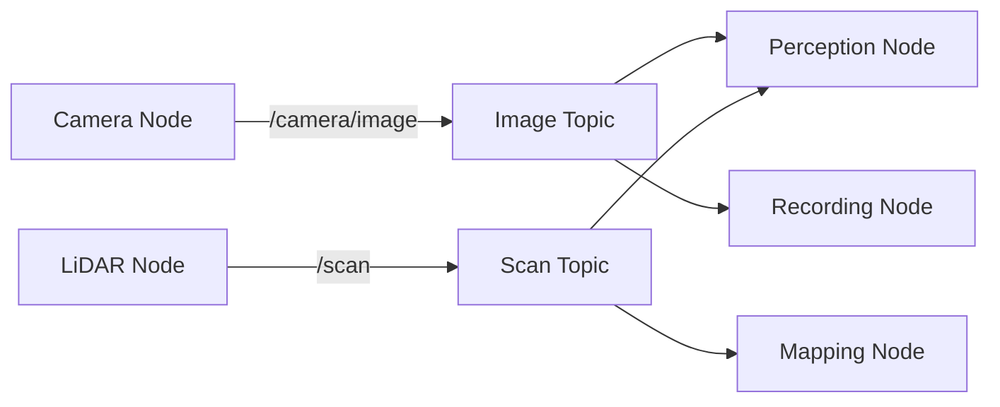
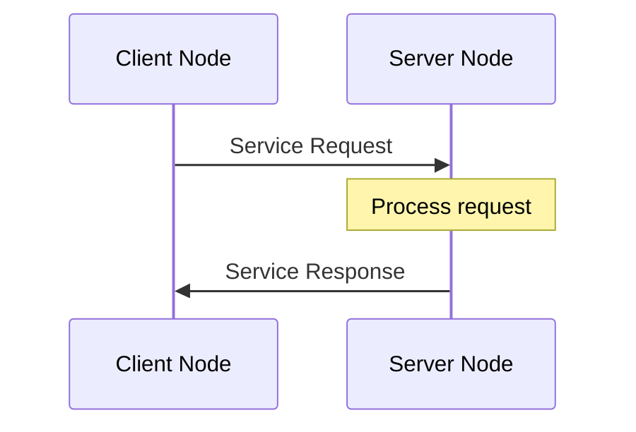
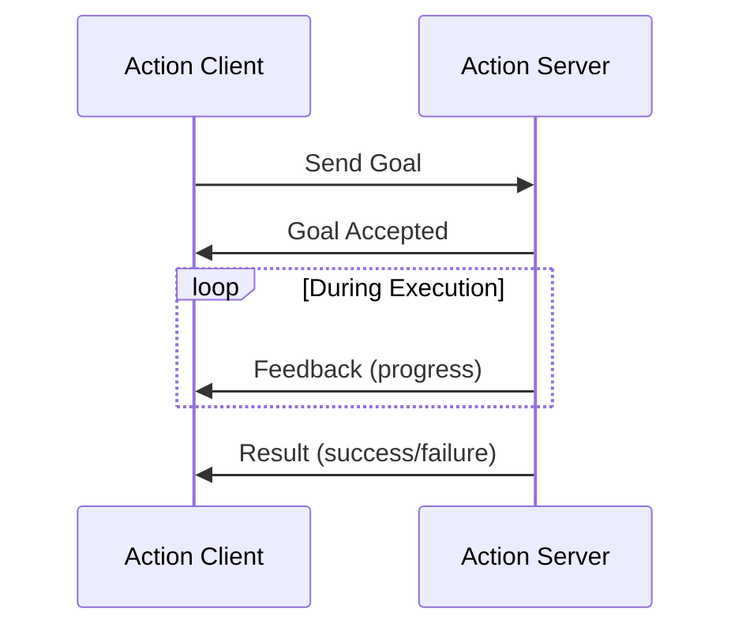
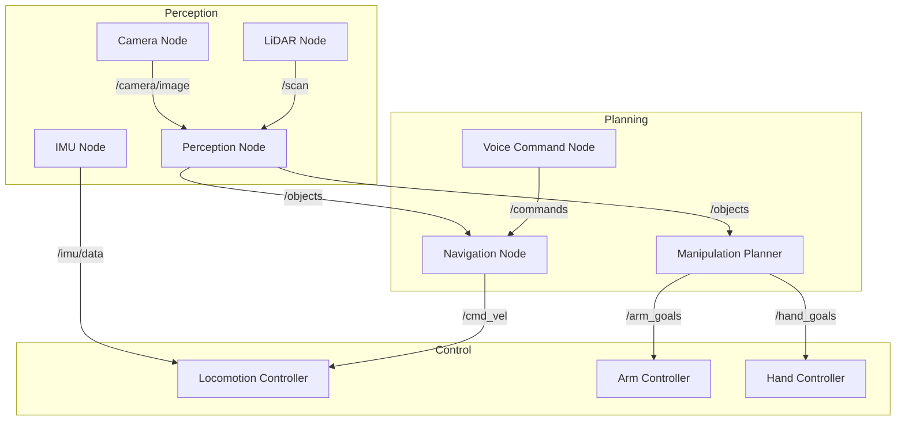

# Chapter 1: Introduction to ROS 2

## Learning Objectives

By the end of this chapter, you will be able to:

1. Understand the fundamental architecture of ROS 2 and its improvements over ROS 1
2. Explain the role of nodes, topics, services, and actions in robotic systems
3. Describe how DDS middleware enables distributed communication
4. Identify appropriate communication patterns for different robotics tasks
5. Recognize the importance of ROS 2 in humanoid robotics development

---

## 1.1 What is ROS 2?

**ROS 2 (Robot Operating System 2)** is an open-source software framework for building robot applications. Despite its name, ROS is not an operating system but rather a **middleware** and **communication framework** that provides:

- Hardware abstraction
- Device drivers and libraries
- Message passing between processes
- Package management
- Development tools and debugging utilities

:::info Key Insight
ROS 2 represents a complete redesign of ROS 1, addressing critical limitations in real-time performance, security, and multi-platform support while maintaining the core philosophy of modularity and reusability (Macenski et al., 2022).
:::

### Why ROS 2 for Humanoid Robotics?

Humanoid robots require:
- **Real-time control** for balance and locomotion
- **Distributed processing** across multiple computers and embedded systems
- **Reliable communication** for safety-critical operations
- **Sensor fusion** from cameras, IMUs, LiDAR, and tactile sensors
- **Complex behavior coordination** for perception, planning, and control

ROS 2 addresses all these requirements through its modern architecture built on DDS (Data Distribution Service).

---

## 1.2 ROS 2 Architecture

### Nodes: The Building Blocks

A **node** is an independent process that performs a specific computational task. In a humanoid robot system, you might have:

- **Camera node**: Captures and publishes RGB images
- **Perception node**: Processes images to detect objects
- **Locomotion node**: Controls leg joints for walking
- **Planning node**: Generates navigation paths
- **Speech node**: Processes voice commands

```python
# Example: Minimal ROS 2 Node in Python
import rclpy
from rclpy.node import Node

class MinimalNode(Node):
    def __init__(self):
        super().__init__('minimal_node')
        self.get_logger().info('Minimal node has been started!')

def main(args=None):
    rclpy.init(args=args)
    node = MinimalNode()
    rclpy.spin(node)
    node.destroy_node()
    rclpy.shutdown()

if __name__ == '__main__':
    main()
```

**Key Properties of Nodes**:
- Nodes are **independent processes** that can run on different machines
- Each node has a **unique name** in the ROS 2 graph
- Nodes can be written in **Python, C++, or other supported languages**
- Nodes **discover each other automatically** through DDS

---

## 1.3 Communication Patterns

ROS 2 provides three primary communication patterns, each suited for different use cases.

### 1.3.1 Topics: Publisher-Subscriber Pattern

**Topics** enable **one-way, continuous data streaming** between nodes. This is the most common communication pattern in ROS 2.

**Characteristics**:
- **Asynchronous**: Publishers don't wait for subscribers
- **Many-to-many**: Multiple publishers and subscribers can use the same topic
- **Decoupled**: Publishers and subscribers don't need to know about each other
- **Best for**: Sensor data streams, robot state information, continuous monitoring



**Example: Publishing to a Topic**

```python
import rclpy
from rclpy.node import Node
from std_msgs.msg import String

class PublisherNode(Node):
    def __init__(self):
        super().__init__('publisher_node')
        # Create publisher: topic name, message type, queue size
        self.publisher = self.create_publisher(String, 'robot_status', 10)
        # Create timer to publish every 0.5 seconds
        self.timer = self.create_timer(0.5, self.timer_callback)
        self.counter = 0

    def timer_callback(self):
        msg = String()
        msg.data = f'Robot status update {self.counter}'
        self.publisher.publish(msg)
        self.get_logger().info(f'Published: "{msg.data}"')
        self.counter += 1
```

**Example: Subscribing to a Topic**

```python
import rclpy
from rclpy.node import Node
from std_msgs.msg import String

class SubscriberNode(Node):
    def __init__(self):
        super().__init__('subscriber_node')
        # Create subscriber: topic name, message type, callback function
        self.subscription = self.create_subscription(
            String,
            'robot_status',
            self.listener_callback,
            10
        )

    def listener_callback(self, msg):
        self.get_logger().info(f'Received: "{msg.data}"')
```

---

### 1.3.2 Services: Request-Response Pattern

**Services** enable **synchronous, two-way communication** for quick computations and queries.

**Characteristics**:
- **Synchronous**: Client waits for response (blocking)
- **One-to-one**: Single client calls single server
- **Should return quickly**: Not suitable for long-running tasks
- **Best for**: Configuration changes, quick queries, triggering actions



**Example: Service Server**

```python
from example_interfaces.srv import AddTwoInts
import rclpy
from rclpy.node import Node

class AdditionServiceNode(Node):
    def __init__(self):
        super().__init__('addition_service')
        self.srv = self.create_service(
            AddTwoInts,
            'add_two_ints',
            self.add_callback
        )
        self.get_logger().info('Addition service ready')

    def add_callback(self, request, response):
        response.sum = request.a + request.b
        self.get_logger().info(f'Request: {request.a} + {request.b} = {response.sum}')
        return response
```

**Example: Service Client**

```python
from example_interfaces.srv import AddTwoInts
import rclpy
from rclpy.node import Node

class AdditionClientNode(Node):
    def __init__(self):
        super().__init__('addition_client')
        self.client = self.create_client(AddTwoInts, 'add_two_ints')

        # Wait for service to be available
        while not self.client.wait_for_service(timeout_sec=1.0):
            self.get_logger().info('Waiting for service...')

        self.request = AddTwoInts.Request()

    def send_request(self, a, b):
        self.request.a = a
        self.request.b = b
        future = self.client.call_async(self.request)
        return future
```

---

### 1.3.3 Actions: Goal-Feedback-Result Pattern

**Actions** are designed for **long-running, preemptable tasks** that provide continuous feedback.

**Characteristics**:
- **Asynchronous**: Client doesn't block waiting for completion
- **Cancellable**: Goals can be cancelled mid-execution
- **Provides feedback**: Regular progress updates
- **Best for**: Navigation, manipulation, complex behaviors

**Action Structure**:
1. **Goal**: The desired outcome (e.g., "navigate to position X, Y")
2. **Feedback**: Periodic progress updates (e.g., "distance remaining: 2.5m")
3. **Result**: Final outcome (e.g., "goal reached successfully")



**Example: Action Server (Simplified)**

```python
import rclpy
from rclpy.action import ActionServer
from rclpy.node import Node
from example_interfaces.action import Fibonacci

class FibonacciActionServer(Node):
    def __init__(self):
        super().__init__('fibonacci_action_server')
        self._action_server = ActionServer(
            self,
            Fibonacci,
            'fibonacci',
            self.execute_callback
        )

    def execute_callback(self, goal_handle):
        self.get_logger().info('Executing goal...')

        # Initialize feedback
        feedback_msg = Fibonacci.Feedback()
        feedback_msg.sequence = [0, 1]

        # Generate Fibonacci sequence
        for i in range(1, goal_handle.request.order):
            feedback_msg.sequence.append(
                feedback_msg.sequence[i] + feedback_msg.sequence[i-1]
            )
            self.get_logger().info(f'Feedback: {feedback_msg.sequence}')
            goal_handle.publish_feedback(feedback_msg)

        # Set result
        goal_handle.succeed()
        result = Fibonacci.Result()
        result.sequence = feedback_msg.sequence
        return result
```

:::tip When to Use What?
- **Topics**: Continuous sensor data, robot state (e.g., joint positions, camera images)
- **Services**: Quick queries, configuration changes (e.g., "reset odometry", "get robot name")
- **Actions**: Long tasks with feedback (e.g., navigation, grasping, complex motions)
:::

---

## 1.4 DDS Middleware

### What is DDS?

**Data Distribution Service (DDS)** is the middleware layer that powers ROS 2 communication. DDS is an **OMG (Object Management Group) standard** for real-time, distributed systems.

**Key DDS Features**:
1. **Automatic Discovery**: Nodes find each other without a central server
2. **Quality of Service (QoS)**: Fine-grained control over reliability, durability, and performance
3. **Real-time Performance**: Deterministic communication for time-critical applications
4. **Scalability**: Supports large-scale distributed systems
5. **Multiple Implementations**: CycloneDDS, FastDDS, RTI Connext DDS

**DDS vs ROS 1 Master Node**:

| ROS 1 | ROS 2 (DDS) |
|-------|-------------|
| Central master node required | Fully distributed, no master |
| Single point of failure | No single point of failure |
| Limited real-time support | Built-in real-time capabilities |
| No security by default | Authentication and encryption support |

---

## 1.5 Quality of Service (QoS)

**QoS policies** allow you to configure communication behavior for topics, services, and actions.

### Key QoS Policies

1. **Reliability**:
   - `RELIABLE`: Guarantees message delivery (TCP-like)
   - `BEST_EFFORT`: No delivery guarantee, lower latency (UDP-like)

2. **Durability**:
   - `TRANSIENT_LOCAL`: Late-joining subscribers receive historical messages
   - `VOLATILE`: Only current messages are received

3. **History**:
   - `KEEP_LAST(n)`: Keep last N messages in queue
   - `KEEP_ALL`: Keep all messages (limited by resources)

**Example: Custom QoS Profile**

```python
from rclpy.qos import QoSProfile, ReliabilityPolicy, DurabilityPolicy, HistoryPolicy

# Sensor data: Best effort, volatile, keep last 10
sensor_qos = QoSProfile(
    reliability=ReliabilityPolicy.BEST_EFFORT,
    durability=DurabilityPolicy.VOLATILE,
    history=HistoryPolicy.KEEP_LAST,
    depth=10
)

# Critical commands: Reliable, transient local
command_qos = QoSProfile(
    reliability=ReliabilityPolicy.RELIABLE,
    durability=DurabilityPolicy.TRANSIENT_LOCAL,
    history=HistoryPolicy.KEEP_LAST,
    depth=1
)

# Create publisher with custom QoS
self.publisher = self.create_publisher(
    String,
    'sensor_data',
    sensor_qos
)
```

---

## 1.6 ROS 2 for Humanoid Robots

### Communication Graph Example

A typical humanoid robot system might have this node structure:



---

## 1.7 Summary

In this chapter, we covered:

- ✅ ROS 2 as a middleware framework for robotics
- ✅ Nodes as independent computational processes
- ✅ Three communication patterns: Topics, Services, Actions
- ✅ DDS middleware for distributed, real-time communication
- ✅ Quality of Service (QoS) for fine-grained control
- ✅ Application of ROS 2 to humanoid robotics systems

### Key Takeaways

1. **ROS 2 is modular**: Each node performs a specific task
2. **Communication is flexible**: Choose the right pattern for your use case
3. **DDS enables scalability**: Distributed systems without a central master
4. **QoS matters**: Configure reliability and performance for your application
5. **Real-time capable**: Suitable for safety-critical humanoid robot control

---

## Further Reading

1. Open Robotics. (2024). *ROS 2 Documentation*. https://docs.ros.org/en/humble/
2. Macenski, S., Foote, T., Gerkey, B., Lalancette, C., & Woodall, W. (2022). Robot Operating System 2: Design, architecture, and uses in the wild. *Science Robotics, 7*(66). https://doi.org/10.1126/scirobotics.abm6074
3. Maruyama, Y., Kato, S., & Azumi, T. (2016). Exploring the performance of ROS2. *Proceedings of EMSOFT 2016*.

---

## Next Steps

In Chapter 2, we'll dive deeper into **Python Integration with ROS 2**, learning how to build complete ROS 2 packages using `rclpy` and exploring practical examples for humanoid robotics applications.

:::tip Practice Exercise
Try creating your own minimal ROS 2 node that publishes a custom message every second. Experiment with different QoS settings and observe the behavior!
:::
