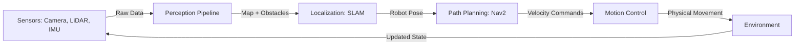
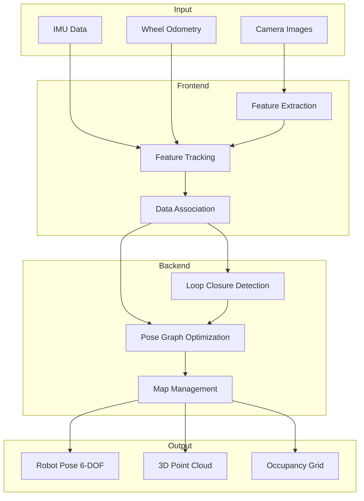
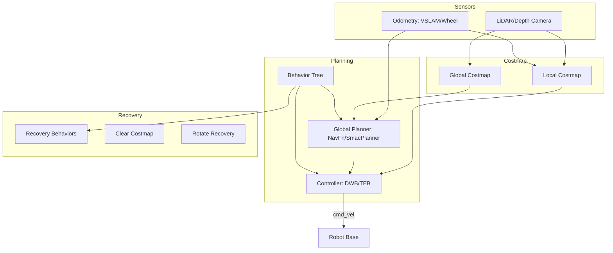

# Chapter 8: AI Perception and Navigation

## Learning Objectives

By the end of this chapter, you will be able to:

1. Understand the fundamentals of Visual SLAM (VSLAM) and its role in robotic perception
2. Implement VSLAM algorithms using NVIDIA Isaac SDK and ROS 2
3. Design and configure Nav2 navigation stacks for autonomous humanoid robots
4. Integrate perception pipelines with path planning and obstacle avoidance systems
5. Deploy perception and navigation systems on edge AI hardware (Jetson Orin)
6. Optimize SLAM and navigation performance for real-time humanoid robot applications
7. Troubleshoot common challenges in perception-based navigation

---

## 8.1 Introduction to Robot Perception and Navigation

**Robot perception** is the ability of a robot to gather, process, and interpret sensory information from its environment. For humanoid robots operating in dynamic, unstructured environments, perception systems must answer critical questions:

- **Where am I?** (Localization)
- **What's around me?** (Mapping and Object Detection)
- **How do I get there?** (Path Planning)
- **What obstacles must I avoid?** (Collision Detection)

**Navigation** combines perception, localization, and planning to enable autonomous movement from one location to another while avoiding obstacles and adapting to environmental changes.

:::info Key Insight
In humanoid robotics, perception and navigation are tightly coupled. Unlike wheeled robots with stable bases, humanoids must continuously perceive their environment while maintaining balance, making real-time, efficient algorithms essential (Kanazawa et al., 2023).
:::

### The Perception-Action Loop



### Why NVIDIA Isaac for Perception?

NVIDIA Isaac provides:
- **GPU-accelerated algorithms** for real-time SLAM and perception
- **Synthetic data generation** for training perception models
- **Pre-built perception nodes** optimized for Jetson edge devices
- **Seamless ROS 2 integration** for standard navigation stacks
- **Sim-to-real transfer** capabilities for robust deployment

---

## 8.2 Visual SLAM (VSLAM) Fundamentals

### 8.2.1 What is SLAM?

**SLAM (Simultaneous Localization and Mapping)** is the computational problem of constructing or updating a map of an unknown environment while simultaneously tracking the robot's location within that map.

**Visual SLAM (VSLAM)** uses camera inputs (monocular, stereo, or RGB-D) as the primary sensing modality, making it cost-effective and information-rich compared to LiDAR-based approaches.

**The SLAM Problem**:
- **Input**: Sequence of sensor observations (images, odometry, IMU data)
- **Output**:
  - Robot trajectory (sequence of poses)
  - Environmental map (3D point cloud, occupancy grid, or semantic map)

**Key Challenges**:
1. **Data Association**: Matching current observations to previously seen landmarks
2. **Loop Closure**: Recognizing previously visited locations to reduce drift
3. **Computational Efficiency**: Processing data in real-time on limited hardware
4. **Dynamic Environments**: Handling moving objects and changing scenes

:::tip SLAM Taxonomy
- **Monocular VSLAM**: Single camera (ORB-SLAM3, RTAB-Map)
- **Stereo VSLAM**: Two cameras for depth estimation (ZED, Intel RealSense)
- **RGB-D VSLAM**: Depth camera (Kinect, RealSense D435i)
- **Visual-Inertial SLAM**: Camera + IMU (VINS-Mono, ORBSLAM3-VI)
:::

### 8.2.2 VSLAM Pipeline Architecture



**Frontend (Tracking)**:
- Extracts visual features (ORB, SIFT, SURF, or learned features)
- Tracks features across consecutive frames
- Estimates camera motion using visual odometry

**Backend (Mapping)**:
- Optimizes robot trajectory and landmark positions
- Detects loop closures to correct accumulated drift
- Maintains a consistent global map

---

## 8.3 Implementing VSLAM with NVIDIA Isaac

### 8.3.1 Isaac Visual SLAM Overview

NVIDIA Isaac provides **Visual SLAM (cuVSLAM)**, a GPU-accelerated SLAM solution optimized for Jetson platforms and NVIDIA GPUs.

**Key Features**:
- **Real-time performance** on Jetson Orin (30+ FPS)
- **Stereo and RGB-D support** (Intel RealSense D435i/D455)
- **ROS 2 native integration** via Isaac ROS packages
- **Pose estimation** with sub-centimeter accuracy
- **Dense reconstruction** for detailed 3D mapping

**System Requirements**:
- NVIDIA Jetson Orin Nano/NX or RTX GPU
- ROS 2 Humble or later
- Intel RealSense D435i, D455, or ZED camera
- Isaac ROS packages installed

### 8.3.2 Installing Isaac ROS Visual SLAM

```bash
# Install dependencies on Jetson Orin (Ubuntu 22.04)
sudo apt update
sudo apt install -y ros-humble-isaac-ros-visual-slam

# Install RealSense ROS wrapper
sudo apt install -y ros-humble-realsense2-camera ros-humble-realsense2-description

# Create workspace
mkdir -p ~/humanoid_ws/src
cd ~/humanoid_ws/src

# Clone Isaac ROS packages
git clone https://github.com/NVIDIA-ISAAC-ROS/isaac_ros_visual_slam.git
git clone https://github.com/NVIDIA-ISAAC-ROS/isaac_ros_common.git

# Build workspace
cd ~/humanoid_ws
colcon build --symlink-install
source install/setup.bash
```

### 8.3.3 Launching Isaac Visual SLAM

**Launch File Example** (`humanoid_vslam.launch.py`):

```python
from launch import LaunchDescription
from launch.actions import DeclareLaunchArgument, IncludeLaunchDescription
from launch.substitutions import LaunchConfiguration
from launch_ros.actions import Node
from launch_ros.descriptions import ComposableNode
from launch_ros.actions import ComposableNodeContainer

def generate_launch_description():
    # RealSense camera configuration
    realsense_node = Node(
        package='realsense2_camera',
        executable='realsense2_camera_node',
        name='realsense_camera',
        parameters=[{
            'depth_module.profile': '640x480x30',
            'rgb_camera.profile': '640x480x30',
            'enable_infra1': True,
            'enable_infra2': True,
            'enable_depth': True,
            'enable_color': True,
            'align_depth.enable': True,
        }],
        remappings=[
            ('/camera/color/image_raw', '/camera/image_raw'),
            ('/camera/depth/image_rect_raw', '/camera/depth'),
        ]
    )

    # Isaac Visual SLAM node
    visual_slam_node = ComposableNode(
        package='isaac_ros_visual_slam',
        plugin='nvidia::isaac_ros::visual_slam::VisualSlamNode',
        name='visual_slam_node',
        parameters=[{
            'enable_rectified_pose': True,
            'denoise_input_images': True,
            'rectified_images': True,
            'enable_imu_fusion': False,
            'enable_debug_mode': False,
            'debug_dump_path': '/tmp/vslam',
            'map_frame': 'map',
            'odom_frame': 'odom',
            'base_frame': 'base_link',
            'input_camera_frame': 'camera_link',
            'publish_odom_to_base_tf': True,
            'publish_map_to_odom_tf': True,
        }],
        remappings=[
            ('stereo_camera/left/image', '/camera/infra1/image_rect_raw'),
            ('stereo_camera/right/image', '/camera/infra2/image_rect_raw'),
            ('stereo_camera/left/camera_info', '/camera/infra1/camera_info'),
            ('stereo_camera/right/camera_info', '/camera/infra2/camera_info'),
            ('visual_slam/tracking/odometry', '/odom'),
        ]
    )

    # Container for composable nodes (optimized performance)
    visual_slam_container = ComposableNodeContainer(
        name='visual_slam_container',
        namespace='',
        package='rclcpp_components',
        executable='component_container_mt',
        composable_node_descriptions=[visual_slam_node],
        output='screen'
    )

    return LaunchDescription([
        realsense_node,
        visual_slam_container,
    ])
```

**Running the Launch File**:

```bash
# Source workspace
source ~/humanoid_ws/install/setup.bash

# Launch Isaac VSLAM with RealSense camera
ros2 launch humanoid_navigation humanoid_vslam.launch.py

# Verify topics (in another terminal)
ros2 topic list | grep visual_slam

# Expected output:
# /visual_slam/tracking/odometry
# /visual_slam/tracking/vo_pose
# /visual_slam/tracking/slam_path
# /visual_slam/status
```

### 8.3.4 Monitoring VSLAM Performance

```python
# vslam_monitor.py - Monitor VSLAM tracking quality
import rclpy
from rclpy.node import Node
from nav_msgs.msg import Odometry
from isaac_ros_visual_slam_interfaces.msg import VisualSlamStatus
import numpy as np

class VSLAMMonitor(Node):
    def __init__(self):
        super().__init__('vslam_monitor')

        # Subscribe to VSLAM outputs
        self.odom_sub = self.create_subscription(
            Odometry,
            '/visual_slam/tracking/odometry',
            self.odom_callback,
            10
        )

        self.status_sub = self.create_subscription(
            VisualSlamStatus,
            '/visual_slam/status',
            self.status_callback,
            10
        )

        self.prev_pose = None
        self.total_distance = 0.0

    def odom_callback(self, msg):
        # Calculate traveled distance
        current_pose = msg.pose.pose.position

        if self.prev_pose is not None:
            dx = current_pose.x - self.prev_pose.x
            dy = current_pose.y - self.prev_pose.y
            dz = current_pose.z - self.prev_pose.z
            distance = np.sqrt(dx**2 + dy**2 + dz**2)
            self.total_distance += distance

            self.get_logger().info(
                f'Position: ({current_pose.x:.2f}, {current_pose.y:.2f}, {current_pose.z:.2f})'
            )

        self.prev_pose = current_pose

    def status_callback(self, msg):
        # Monitor tracking status
        tracking_states = {
            0: 'NOT_INITIALIZED',
            1: 'TRACKING',
            2: 'LOST',
        }

        state = tracking_states.get(msg.vo_state, 'UNKNOWN')

        self.get_logger().info(
            f'VSLAM Status: {state} | '
            f'Landmarks: {msg.num_observations} | '
            f'Total Distance: {self.total_distance:.2f}m'
        )

def main(args=None):
    rclpy.init(args=args)
    monitor = VSLAMMonitor()
    rclpy.spin(monitor)
    monitor.destroy_node()
    rclpy.shutdown()

if __name__ == '__main__':
    main()
```

---

## 8.4 ROS 2 Navigation Stack (Nav2)

### 8.4.1 Nav2 Architecture Overview

**Nav2 (Navigation2)** is the second-generation ROS navigation stack, redesigned for ROS 2 with improved modularity, behavior trees, and plugin architecture.

**Core Components**:



**Key Concepts**:

1. **Costmaps**: 2D occupancy grids representing obstacle costs
   - **Global Costmap**: Static map of the environment
   - **Local Costmap**: Dynamic, real-time obstacle detection

2. **Planners**: Compute collision-free paths
   - **Global Planner**: Long-term path from start to goal
   - **Local Planner (Controller)**: Short-term trajectory following

3. **Behavior Trees**: Coordinate navigation behaviors and recovery actions

4. **Recovery Behaviors**: Handle navigation failures (stuck, path blocked)

### 8.4.2 Installing Nav2

```bash
# Install Nav2 packages
sudo apt install -y ros-humble-navigation2 ros-humble-nav2-bringup

# Install additional plugins
sudo apt install -y ros-humble-nav2-smac-planner \
                     ros-humble-nav2-theta-star-planner \
                     ros-humble-nav2-dwb-controller \
                     ros-humble-teb-local-planner

# Install visualization tools
sudo apt install -y ros-humble-rviz2 ros-humble-nav2-rviz-plugins
```

### 8.4.3 Nav2 Configuration for Humanoid Robots

**Parameter File** (`humanoid_nav2_params.yaml`):

```yaml
bt_navigator:
  ros__parameters:
    use_sim_time: False
    global_frame: map
    robot_base_frame: base_link
    odom_topic: /odom
    bt_loop_duration: 10
    default_server_timeout: 20
    enable_groot_monitoring: True
    groot_zmq_publisher_port: 1666
    groot_zmq_server_port: 1667
    # Behavior tree for humanoid navigation
    default_nav_to_pose_bt_xml: "/path/to/humanoid_bt.xml"

controller_server:
  ros__parameters:
    use_sim_time: False
    controller_frequency: 20.0
    min_x_velocity_threshold: 0.001
    min_y_velocity_threshold: 0.5
    min_theta_velocity_threshold: 0.001
    failure_tolerance: 0.3
    progress_checker_plugin: "progress_checker"
    goal_checker_plugins: ["general_goal_checker"]
    controller_plugins: ["FollowPath"]

    # Progress checker parameters
    progress_checker:
      plugin: "nav2_controller::SimpleProgressChecker"
      required_movement_radius: 0.5
      movement_time_allowance: 10.0

    # Goal checker parameters
    general_goal_checker:
      stateful: True
      plugin: "nav2_controller::SimpleGoalChecker"
      xy_goal_tolerance: 0.15
      yaw_goal_tolerance: 0.15

    # DWB controller for humanoid base
    FollowPath:
      plugin: "dwb_core::DWBLocalPlanner"
      debug_trajectory_details: True
      min_vel_x: 0.0
      min_vel_y: 0.0
      max_vel_x: 0.5
      max_vel_y: 0.0
      max_vel_theta: 1.0
      min_speed_xy: 0.0
      max_speed_xy: 0.5
      min_speed_theta: 0.0
      # Acceleration limits (humanoid-specific)
      acc_lim_x: 0.3
      acc_lim_y: 0.0
      acc_lim_theta: 1.5
      decel_lim_x: -0.3
      decel_lim_y: 0.0
      decel_lim_theta: -1.5
      vx_samples: 20
      vy_samples: 5
      vtheta_samples: 20
      sim_time: 1.7
      linear_granularity: 0.05
      angular_granularity: 0.025
      transform_tolerance: 0.2
      xy_goal_tolerance: 0.15
      trans_stopped_velocity: 0.05
      short_circuit_trajectory_evaluation: True
      stateful: True
      critics: ["RotateToGoal", "Oscillation", "BaseObstacle", "GoalAlign", "PathAlign", "PathDist", "GoalDist"]
      BaseObstacle.scale: 0.02
      PathAlign.scale: 32.0
      PathAlign.forward_point_distance: 0.1
      GoalAlign.scale: 24.0
      GoalAlign.forward_point_distance: 0.1
      PathDist.scale: 32.0
      GoalDist.scale: 24.0
      RotateToGoal.scale: 32.0
      RotateToGoal.slowing_factor: 5.0
      RotateToGoal.lookahead_time: -1.0

local_costmap:
  local_costmap:
    ros__parameters:
      update_frequency: 5.0
      publish_frequency: 2.0
      global_frame: odom
      robot_base_frame: base_link
      use_sim_time: False
      rolling_window: true
      width: 3
      height: 3
      resolution: 0.05
      robot_radius: 0.3  # Humanoid footprint radius
      plugins: ["voxel_layer", "inflation_layer"]
      inflation_layer:
        plugin: "nav2_costmap_2d::InflationLayer"
        cost_scaling_factor: 3.0
        inflation_radius: 0.55
      voxel_layer:
        plugin: "nav2_costmap_2d::VoxelLayer"
        enabled: True
        publish_voxel_map: True
        origin_z: 0.0
        z_resolution: 0.05
        z_voxels: 16
        max_obstacle_height: 2.0
        mark_threshold: 0
        observation_sources: depth_camera
        depth_camera:
          topic: /camera/depth/points
          max_obstacle_height: 2.0
          clearing: True
          marking: True
          data_type: "PointCloud2"
          raytrace_max_range: 3.0
          raytrace_min_range: 0.0
          obstacle_max_range: 2.5
          obstacle_min_range: 0.0
      static_layer:
        map_subscribe_transient_local: True
      always_send_full_costmap: True

global_costmap:
  global_costmap:
    ros__parameters:
      update_frequency: 1.0
      publish_frequency: 1.0
      global_frame: map
      robot_base_frame: base_link
      use_sim_time: False
      robot_radius: 0.3
      resolution: 0.05
      track_unknown_space: true
      plugins: ["static_layer", "obstacle_layer", "inflation_layer"]
      obstacle_layer:
        plugin: "nav2_costmap_2d::ObstacleLayer"
        enabled: True
        observation_sources: depth_camera
        depth_camera:
          topic: /camera/depth/points
          max_obstacle_height: 2.0
          clearing: True
          marking: True
          data_type: "PointCloud2"
          raytrace_max_range: 3.0
          obstacle_max_range: 2.5
      static_layer:
        plugin: "nav2_costmap_2d::StaticLayer"
        map_subscribe_transient_local: True
      inflation_layer:
        plugin: "nav2_costmap_2d::InflationLayer"
        cost_scaling_factor: 3.0
        inflation_radius: 0.55
      always_send_full_costmap: True

planner_server:
  ros__parameters:
    expected_planner_frequency: 20.0
    use_sim_time: False
    planner_plugins: ["GridBased"]
    GridBased:
      plugin: "nav2_navfn_planner/NavfnPlanner"
      tolerance: 0.5
      use_astar: false
      allow_unknown: true

smoother_server:
  ros__parameters:
    use_sim_time: False
    smoother_plugins: ["simple_smoother"]
    simple_smoother:
      plugin: "nav2_smoother::SimpleSmoother"
      tolerance: 1.0e-10
      max_its: 1000
      do_refinement: True

behavior_server:
  ros__parameters:
    costmap_topic: local_costmap/costmap_raw
    footprint_topic: local_costmap/published_footprint
    cycle_frequency: 10.0
    behavior_plugins: ["spin", "backup", "wait"]
    spin:
      plugin: "nav2_behaviors/Spin"
    backup:
      plugin: "nav2_behaviors/BackUp"
    wait:
      plugin: "nav2_behaviors/Wait"
    global_frame: odom
    robot_base_frame: base_link
    transform_tolerance: 0.1
    use_sim_time: False
    simulate_ahead_time: 2.0
    max_rotational_vel: 1.0
    min_rotational_vel: 0.4
    rotational_acc_lim: 3.2

waypoint_follower:
  ros__parameters:
    use_sim_time: False
    loop_rate: 20
    stop_on_failure: false
    waypoint_task_executor_plugin: "wait_at_waypoint"
    wait_at_waypoint:
      plugin: "nav2_waypoint_follower::WaitAtWaypoint"
      enabled: True
      waypoint_pause_duration: 200
```

### 8.4.4 Launching Nav2 with VSLAM

**Complete Launch File** (`humanoid_navigation.launch.py`):

```python
import os
from launch import LaunchDescription
from launch.actions import DeclareLaunchArgument, IncludeLaunchDescription
from launch.substitutions import LaunchConfiguration, PathJoinSubstitution
from launch_ros.actions import Node
from launch_ros.substitutions import FindPackageShare
from ament_index_python.packages import get_package_share_directory

def generate_launch_description():
    # Package paths
    nav2_bringup_dir = get_package_share_directory('nav2_bringup')
    humanoid_nav_dir = get_package_share_directory('humanoid_navigation')

    # Configuration files
    nav2_params_file = os.path.join(humanoid_nav_dir, 'config', 'humanoid_nav2_params.yaml')

    # Launch arguments
    use_sim_time = LaunchConfiguration('use_sim_time', default='false')
    autostart = LaunchConfiguration('autostart', default='true')

    # Static transform: base_link to camera_link (adjust for your robot)
    static_tf_camera = Node(
        package='tf2_ros',
        executable='static_transform_publisher',
        name='camera_tf_publisher',
        arguments=['0.1', '0.0', '0.5', '0.0', '0.0', '0.0', 'base_link', 'camera_link']
    )

    # Isaac VSLAM launch
    vslam_launch = IncludeLaunchDescription(
        PathJoinSubstitution([
            FindPackageShare('humanoid_navigation'),
            'launch',
            'humanoid_vslam.launch.py'
        ])
    )

    # Nav2 bringup
    nav2_launch = IncludeLaunchDescription(
        PathJoinSubstitution([
            FindPackageShare('nav2_bringup'),
            'launch',
            'navigation_launch.py'
        ]),
        launch_arguments={
            'use_sim_time': use_sim_time,
            'autostart': autostart,
            'params_file': nav2_params_file,
        }.items()
    )

    # RViz2 for visualization
    rviz_config_file = os.path.join(humanoid_nav_dir, 'rviz', 'nav2_config.rviz')
    rviz_node = Node(
        package='rviz2',
        executable='rviz2',
        name='rviz2',
        arguments=['-d', rviz_config_file],
        parameters=[{'use_sim_time': use_sim_time}],
        output='screen'
    )

    return LaunchDescription([
        DeclareLaunchArgument('use_sim_time', default_value='false'),
        DeclareLaunchArgument('autostart', default_value='true'),
        static_tf_camera,
        vslam_launch,
        nav2_launch,
        rviz_node,
    ])
```

---

## 8.5 Autonomous Navigation Implementation

### 8.5.1 Sending Navigation Goals Programmatically

```python
# humanoid_nav_client.py - Send navigation goals via action client
import rclpy
from rclpy.node import Node
from rclpy.action import ActionClient
from nav2_msgs.action import NavigateToPose
from geometry_msgs.msg import PoseStamped
import math

class HumanoidNavClient(Node):
    def __init__(self):
        super().__init__('humanoid_nav_client')
        self._action_client = ActionClient(self, NavigateToPose, 'navigate_to_pose')

    def send_goal(self, x, y, yaw):
        """Send navigation goal to Nav2"""
        goal_msg = NavigateToPose.Goal()

        # Create pose
        goal_msg.pose = PoseStamped()
        goal_msg.pose.header.frame_id = 'map'
        goal_msg.pose.header.stamp = self.get_clock().now().to_msg()

        # Position
        goal_msg.pose.pose.position.x = x
        goal_msg.pose.pose.position.y = y
        goal_msg.pose.pose.position.z = 0.0

        # Orientation (convert yaw to quaternion)
        goal_msg.pose.pose.orientation.x = 0.0
        goal_msg.pose.pose.orientation.y = 0.0
        goal_msg.pose.pose.orientation.z = math.sin(yaw / 2.0)
        goal_msg.pose.pose.orientation.w = math.cos(yaw / 2.0)

        self.get_logger().info(f'Sending goal: x={x}, y={y}, yaw={yaw}')

        # Wait for action server
        self._action_client.wait_for_server()

        # Send goal
        self._send_goal_future = self._action_client.send_goal_async(
            goal_msg,
            feedback_callback=self.feedback_callback
        )
        self._send_goal_future.add_done_callback(self.goal_response_callback)

    def goal_response_callback(self, future):
        goal_handle = future.result()
        if not goal_handle.accepted:
            self.get_logger().info('Goal rejected')
            return

        self.get_logger().info('Goal accepted')
        self._get_result_future = goal_handle.get_result_async()
        self._get_result_future.add_done_callback(self.get_result_callback)

    def feedback_callback(self, feedback_msg):
        feedback = feedback_msg.feedback
        current_pose = feedback.current_pose.pose
        distance_remaining = feedback.distance_remaining

        self.get_logger().info(
            f'Distance remaining: {distance_remaining:.2f}m | '
            f'Position: ({current_pose.position.x:.2f}, {current_pose.position.y:.2f})'
        )

    def get_result_callback(self, future):
        result = future.result().result
        self.get_logger().info('Navigation completed!')

def main(args=None):
    rclpy.init(args=args)
    nav_client = HumanoidNavClient()

    # Example: Navigate to (2.0, 1.0) with yaw=1.57 (90 degrees)
    nav_client.send_goal(2.0, 1.0, 1.57)

    rclpy.spin(nav_client)
    nav_client.destroy_node()
    rclpy.shutdown()

if __name__ == '__main__':
    main()
```

### 8.5.2 Multi-Waypoint Navigation

```python
# waypoint_navigator.py - Navigate through multiple waypoints
import rclpy
from rclpy.node import Node
from rclpy.action import ActionClient
from nav2_msgs.action import NavigateThroughPoses
from geometry_msgs.msg import PoseStamped
import math

class WaypointNavigator(Node):
    def __init__(self):
        super().__init__('waypoint_navigator')
        self._action_client = ActionClient(
            self,
            NavigateThroughPoses,
            'navigate_through_poses'
        )

    def navigate_waypoints(self, waypoints):
        """
        Navigate through multiple waypoints
        waypoints: List of tuples [(x1, y1, yaw1), (x2, y2, yaw2), ...]
        """
        goal_msg = NavigateThroughPoses.Goal()

        for x, y, yaw in waypoints:
            pose = PoseStamped()
            pose.header.frame_id = 'map'
            pose.header.stamp = self.get_clock().now().to_msg()
            pose.pose.position.x = x
            pose.pose.position.y = y
            pose.pose.position.z = 0.0
            pose.pose.orientation.z = math.sin(yaw / 2.0)
            pose.pose.orientation.w = math.cos(yaw / 2.0)
            goal_msg.poses.append(pose)

        self.get_logger().info(f'Navigating through {len(waypoints)} waypoints')

        self._action_client.wait_for_server()
        self._send_goal_future = self._action_client.send_goal_async(
            goal_msg,
            feedback_callback=self.feedback_callback
        )
        self._send_goal_future.add_done_callback(self.goal_response_callback)

    def feedback_callback(self, feedback_msg):
        feedback = feedback_msg.feedback
        self.get_logger().info(
            f'Waypoint {feedback.current_pose} | '
            f'Distance remaining: {feedback.distance_remaining:.2f}m'
        )

    def goal_response_callback(self, future):
        goal_handle = future.result()
        if not goal_handle.accepted:
            self.get_logger().info('Waypoint navigation rejected')
            return

        self.get_logger().info('Waypoint navigation accepted')
        self._get_result_future = goal_handle.get_result_async()
        self._get_result_future.add_done_callback(self.get_result_callback)

    def get_result_callback(self, future):
        result = future.result().result
        self.get_logger().info('All waypoints reached!')

def main(args=None):
    rclpy.init(args=args)
    navigator = WaypointNavigator()

    # Define patrol waypoints
    waypoints = [
        (2.0, 1.0, 0.0),      # Waypoint 1
        (2.0, -1.0, -1.57),   # Waypoint 2
        (0.0, -1.0, 3.14),    # Waypoint 3
        (0.0, 0.0, 0.0),      # Return to origin
    ]

    navigator.navigate_waypoints(waypoints)
    rclpy.spin(navigator)
    navigator.destroy_node()
    rclpy.shutdown()

if __name__ == '__main__':
    main()
```

---

## 8.6 Advanced Perception Integration

### 8.6.1 Object Detection with Perception Pipeline

```python
# object_aware_navigation.py - Navigate while detecting objects
import rclpy
from rclpy.node import Node
from sensor_msgs.msg import Image
from vision_msgs.msg import Detection2DArray
from geometry_msgs.msg import PoseStamped
from cv_bridge import CvBridge
import cv2
import numpy as np

class ObjectAwareNavigator(Node):
    def __init__(self):
        super().__init__('object_aware_navigator')

        # CV Bridge for image conversion
        self.bridge = CvBridge()

        # Subscribe to camera and detections
        self.image_sub = self.create_subscription(
            Image,
            '/camera/color/image_raw',
            self.image_callback,
            10
        )

        self.detection_sub = self.create_subscription(
            Detection2DArray,
            '/detections',
            self.detection_callback,
            10
        )

        # Publisher for goal adjustments
        self.goal_pub = self.create_publisher(
            PoseStamped,
            '/goal_pose',
            10
        )

        self.detected_objects = []

    def image_callback(self, msg):
        """Process camera images"""
        try:
            cv_image = self.bridge.imgmsg_to_cv2(msg, "bgr8")
            # Additional image processing if needed
        except Exception as e:
            self.get_logger().error(f'Image conversion failed: {e}')

    def detection_callback(self, msg):
        """Handle object detections"""
        self.detected_objects = []

        for detection in msg.detections:
            if len(detection.results) > 0:
                result = detection.results[0]
                class_id = result.id
                confidence = result.score

                # Extract bounding box
                bbox = detection.bbox
                center_x = bbox.center.x
                center_y = bbox.center.y

                self.detected_objects.append({
                    'class_id': class_id,
                    'confidence': confidence,
                    'center': (center_x, center_y)
                })

                self.get_logger().info(
                    f'Detected object: class={class_id}, '
                    f'confidence={confidence:.2f}'
                )

        # Adjust navigation based on detections
        self.adjust_navigation_goal()

    def adjust_navigation_goal(self):
        """Modify navigation goal based on detected objects"""
        # Example: Avoid high-priority obstacles
        for obj in self.detected_objects:
            if obj['class_id'] == 'person' and obj['confidence'] > 0.8:
                self.get_logger().warn('Person detected - adjusting path')
                # Implement collision avoidance logic here
                pass

def main(args=None):
    rclpy.init(args=args)
    navigator = ObjectAwareNavigator()
    rclpy.spin(navigator)
    navigator.destroy_node()
    rclpy.shutdown()

if __name__ == '__main__':
    main()
```

### 8.6.2 Semantic Mapping

```python
# semantic_mapper.py - Build semantic maps from detections
import rclpy
from rclpy.node import Node
from nav_msgs.msg import OccupancyGrid
from vision_msgs.msg import Detection3DArray
from geometry_msgs.msg import PoseStamped
import numpy as np

class SemanticMapper(Node):
    def __init__(self):
        super().__init__('semantic_mapper')

        # Subscribe to 3D detections
        self.detection_sub = self.create_subscription(
            Detection3DArray,
            '/detections_3d',
            self.detection_callback,
            10
        )

        # Subscribe to robot pose
        self.pose_sub = self.create_subscription(
            PoseStamped,
            '/robot_pose',
            self.pose_callback,
            10
        )

        # Publish semantic map
        self.map_pub = self.create_publisher(
            OccupancyGrid,
            '/semantic_map',
            10
        )

        # Semantic map storage
        self.map_width = 100  # meters
        self.map_height = 100
        self.map_resolution = 0.1  # meters per cell
        self.semantic_map = {}

        self.robot_pose = None

    def pose_callback(self, msg):
        self.robot_pose = msg.pose

    def detection_callback(self, msg):
        """Process 3D object detections and update semantic map"""
        if self.robot_pose is None:
            return

        for detection in msg.detections:
            if len(detection.results) > 0:
                result = detection.results[0]
                class_name = result.id

                # Get 3D position
                bbox = detection.bbox
                obj_x = bbox.center.position.x
                obj_y = bbox.center.position.y
                obj_z = bbox.center.position.z

                # Convert to map coordinates
                map_x = int((obj_x + self.map_width / 2) / self.map_resolution)
                map_y = int((obj_y + self.map_height / 2) / self.map_resolution)

                # Store in semantic map
                if (map_x, map_y) not in self.semantic_map:
                    self.semantic_map[(map_x, map_y)] = []

                self.semantic_map[(map_x, map_y)].append({
                    'class': class_name,
                    'position': (obj_x, obj_y, obj_z),
                    'confidence': result.score
                })

                self.get_logger().info(
                    f'Added {class_name} to semantic map at ({map_x}, {map_y})'
                )

        self.publish_semantic_map()

    def publish_semantic_map(self):
        """Publish semantic map as OccupancyGrid"""
        map_msg = OccupancyGrid()
        map_msg.header.stamp = self.get_clock().now().to_msg()
        map_msg.header.frame_id = 'map'

        map_msg.info.resolution = self.map_resolution
        map_msg.info.width = int(self.map_width / self.map_resolution)
        map_msg.info.height = int(self.map_height / self.map_resolution)
        map_msg.info.origin.position.x = -self.map_width / 2
        map_msg.info.origin.position.y = -self.map_height / 2

        # Create occupancy grid data
        data = np.zeros(map_msg.info.width * map_msg.info.height, dtype=np.int8)

        for (x, y), objects in self.semantic_map.items():
            if 0 <= x < map_msg.info.width and 0 <= y < map_msg.info.height:
                idx = y * map_msg.info.width + x
                # Mark as occupied (customize based on semantic class)
                data[idx] = 100

        map_msg.data = data.tolist()
        self.map_pub.publish(map_msg)

def main(args=None):
    rclpy.init(args=args)
    mapper = SemanticMapper()
    rclpy.spin(mapper)
    mapper.destroy_node()
    rclpy.shutdown()

if __name__ == '__main__':
    main()
```

---

## 8.7 Performance Optimization and Troubleshooting

### 8.7.1 VSLAM Performance Tuning

**Common Issues and Solutions**:

| Issue | Cause | Solution |
|-------|-------|----------|
| Tracking lost frequently | Poor lighting, texture | Add lighting, use textured environment |
| High CPU/GPU usage | High resolution, dense mapping | Reduce image resolution, adjust mapping frequency |
| Drift over time | No loop closures | Enable loop closure detection, revisit locations |
| Initialization failure | Insufficient features | Move camera, ensure textured environment |

**Optimization Parameters** (Isaac VSLAM):

```yaml
# Optimized VSLAM parameters for Jetson Orin
visual_slam_node:
  ros__parameters:
    # Image processing
    img_width: 640
    img_height: 480
    denoise_input_images: True
    rectified_images: True

    # Performance tuning
    enable_localization_n_mapping: True
    enable_slam_visualization: False  # Disable for better performance
    enable_landmarks_view: False
    enable_observations_view: False
    path_max_size: 1024

    # Mapping parameters
    map_frame: 'map'
    odom_frame: 'odom'
    base_frame: 'base_link'

    # Loop closure
    enable_imu_fusion: True
    enable_ground_constraint_in_odometry: False
    enable_ground_constraint_in_slam: False

    # Publish settings
    publish_odom_to_base_tf: True
    publish_map_to_odom_tf: True
    invert_odom_to_base_tf: False
```

### 8.7.2 Nav2 Performance Tuning

**Critical Parameters**:

```yaml
# Optimized for real-time performance on Jetson Orin
controller_server:
  ros__parameters:
    controller_frequency: 20.0  # Hz (balance between responsiveness and CPU)

local_costmap:
  local_costmap:
    ros__parameters:
      update_frequency: 5.0  # Reduce for lower CPU usage
      publish_frequency: 2.0
      width: 3  # meters (smaller = faster)
      height: 3
      resolution: 0.05  # meters (coarser = faster)

global_costmap:
  global_costmap:
    ros__parameters:
      update_frequency: 1.0  # Update less frequently
      publish_frequency: 1.0
      resolution: 0.05
```

### 8.7.3 Monitoring and Diagnostics

```python
# nav_diagnostics.py - Monitor navigation performance
import rclpy
from rclpy.node import Node
from nav_msgs.msg import Odometry, Path
from geometry_msgs.msg import Twist
from diagnostic_msgs.msg import DiagnosticArray, DiagnosticStatus, KeyValue
import psutil

class NavDiagnostics(Node):
    def __init__(self):
        super().__init__('nav_diagnostics')

        # Subscribers
        self.odom_sub = self.create_subscription(
            Odometry, '/odom', self.odom_callback, 10
        )
        self.cmd_vel_sub = self.create_subscription(
            Twist, '/cmd_vel', self.cmd_vel_callback, 10
        )
        self.path_sub = self.create_subscription(
            Path, '/plan', self.path_callback, 10
        )

        # Diagnostics publisher
        self.diag_pub = self.create_publisher(
            DiagnosticArray, '/diagnostics', 10
        )

        # Metrics
        self.last_odom_time = None
        self.odom_frequency = 0.0
        self.cmd_vel_frequency = 0.0
        self.path_length = 0.0

        # Timer for diagnostics
        self.create_timer(1.0, self.publish_diagnostics)

    def odom_callback(self, msg):
        current_time = self.get_clock().now()
        if self.last_odom_time:
            dt = (current_time - self.last_odom_time).nanoseconds / 1e9
            self.odom_frequency = 1.0 / dt if dt > 0 else 0.0
        self.last_odom_time = current_time

    def cmd_vel_callback(self, msg):
        pass

    def path_callback(self, msg):
        # Calculate path length
        if len(msg.poses) > 1:
            total_length = 0.0
            for i in range(len(msg.poses) - 1):
                p1 = msg.poses[i].pose.position
                p2 = msg.poses[i + 1].pose.position
                dx = p2.x - p1.x
                dy = p2.y - p1.y
                total_length += (dx**2 + dy**2)**0.5
            self.path_length = total_length

    def publish_diagnostics(self):
        # System metrics
        cpu_percent = psutil.cpu_percent()
        memory_percent = psutil.virtual_memory().percent

        # Create diagnostics message
        diag_array = DiagnosticArray()
        diag_array.header.stamp = self.get_clock().now().to_msg()

        # VSLAM status
        vslam_status = DiagnosticStatus()
        vslam_status.name = 'VSLAM Odometry'
        vslam_status.level = DiagnosticStatus.OK
        vslam_status.message = f'Frequency: {self.odom_frequency:.1f} Hz'
        vslam_status.values = [
            KeyValue(key='frequency', value=str(self.odom_frequency)),
            KeyValue(key='expected_frequency', value='30.0'),
        ]

        if self.odom_frequency < 20.0:
            vslam_status.level = DiagnosticStatus.WARN
            vslam_status.message = 'Low odometry frequency'

        # System status
        system_status = DiagnosticStatus()
        system_status.name = 'System Resources'
        system_status.level = DiagnosticStatus.OK
        system_status.message = f'CPU: {cpu_percent:.1f}%, Memory: {memory_percent:.1f}%'
        system_status.values = [
            KeyValue(key='cpu_percent', value=str(cpu_percent)),
            KeyValue(key='memory_percent', value=str(memory_percent)),
        ]

        if cpu_percent > 80 or memory_percent > 80:
            system_status.level = DiagnosticStatus.WARN
            system_status.message = 'High resource usage'

        # Navigation status
        nav_status = DiagnosticStatus()
        nav_status.name = 'Navigation'
        nav_status.level = DiagnosticStatus.OK
        nav_status.message = f'Path length: {self.path_length:.2f}m'
        nav_status.values = [
            KeyValue(key='path_length', value=str(self.path_length)),
        ]

        diag_array.status = [vslam_status, system_status, nav_status]
        self.diag_pub.publish(diag_array)

        self.get_logger().info(
            f'Diagnostics: Odom={self.odom_frequency:.1f}Hz, '
            f'CPU={cpu_percent:.1f}%, Memory={memory_percent:.1f}%'
        )

def main(args=None):
    rclpy.init(args=args)
    diagnostics = NavDiagnostics()
    rclpy.spin(diagnostics)
    diagnostics.destroy_node()
    rclpy.shutdown()

if __name__ == '__main__':
    main()
```

---

## 8.8 Deployment on Jetson Orin

### 8.8.1 System Setup for Edge Deployment

```bash
#!/bin/bash
# setup_jetson_navigation.sh - Complete setup for Jetson Orin

echo "Setting up Jetson Orin for humanoid navigation..."

# System optimization
sudo nvpmodel -m 0  # Max performance mode
sudo jetson_clocks  # Max clock frequencies

# Install ROS 2 Humble (if not already installed)
sudo apt update
sudo apt install -y ros-humble-desktop

# Install Isaac ROS
sudo apt install -y ros-humble-isaac-ros-visual-slam \
                     ros-humble-isaac-ros-nvblox

# Install Nav2
sudo apt install -y ros-humble-navigation2 \
                     ros-humble-nav2-bringup

# Install camera drivers
sudo apt install -y ros-humble-realsense2-camera \
                     ros-humble-realsense2-description

# Install utilities
sudo apt install -y ros-humble-rqt-robot-steering \
                     ros-humble-teleop-twist-keyboard

# Create workspace
mkdir -p ~/humanoid_ws/src
cd ~/humanoid_ws

# Set environment variables
echo "export ROS_DOMAIN_ID=42" >> ~/.bashrc
echo "export RMW_IMPLEMENTATION=rmw_fastrtps_cpp" >> ~/.bashrc
echo "source /opt/ros/humble/setup.bash" >> ~/.bashrc
echo "source ~/humanoid_ws/install/setup.bash" >> ~/.bashrc

source ~/.bashrc

echo "Setup complete! Reboot recommended."
```

### 8.8.2 Launch Script for Production

```python
# production_navigation.launch.py - Production-ready launch
from launch import LaunchDescription
from launch.actions import DeclareLaunchArgument, IncludeLaunchDescription, TimerAction
from launch.conditions import IfCondition
from launch.substitutions import LaunchConfiguration, PathJoinSubstitution
from launch_ros.actions import Node, SetParameter
from launch_ros.substitutions import FindPackageShare
import os

def generate_launch_description():
    # Launch configurations
    enable_vslam = LaunchConfiguration('enable_vslam', default='true')
    enable_nav2 = LaunchConfiguration('enable_nav2', default='true')
    enable_rviz = LaunchConfiguration('enable_rviz', default='false')

    # Global parameters
    use_sim_time = SetParameter(name='use_sim_time', value=False)

    # Camera node
    camera_node = Node(
        package='realsense2_camera',
        executable='realsense2_camera_node',
        name='realsense',
        parameters=[{
            'align_depth.enable': True,
            'enable_color': True,
            'enable_depth': True,
            'depth_module.profile': '640x480x30',
            'rgb_camera.profile': '640x480x30',
        }],
        output='log'
    )

    # VSLAM node (delayed start)
    vslam_node = TimerAction(
        period=3.0,  # Wait for camera to initialize
        actions=[
            IncludeLaunchDescription(
                PathJoinSubstitution([
                    FindPackageShare('humanoid_navigation'),
                    'launch',
                    'humanoid_vslam.launch.py'
                ]),
                condition=IfCondition(enable_vslam)
            )
        ]
    )

    # Nav2 launch (delayed start)
    nav2_launch = TimerAction(
        period=5.0,  # Wait for VSLAM to initialize
        actions=[
            IncludeLaunchDescription(
                PathJoinSubstitution([
                    FindPackageShare('nav2_bringup'),
                    'launch',
                    'navigation_launch.py'
                ]),
                condition=IfCondition(enable_nav2)
            )
        ]
    )

    # Diagnostics node
    diagnostics_node = Node(
        package='humanoid_navigation',
        executable='nav_diagnostics',
        name='nav_diagnostics',
        output='log'
    )

    return LaunchDescription([
        DeclareLaunchArgument('enable_vslam', default_value='true'),
        DeclareLaunchArgument('enable_nav2', default_value='true'),
        DeclareLaunchArgument('enable_rviz', default_value='false'),
        use_sim_time,
        camera_node,
        vslam_node,
        nav2_launch,
        diagnostics_node,
    ])
```

---

## 8.9 Summary

In this chapter, we explored AI perception and navigation for humanoid robots:

- ✅ Visual SLAM (VSLAM) fundamentals and implementation with NVIDIA Isaac
- ✅ Nav2 navigation stack architecture and configuration
- ✅ Integration of perception pipelines with path planning
- ✅ Autonomous navigation with waypoints and goal-based control
- ✅ Advanced perception techniques including semantic mapping
- ✅ Performance optimization for edge deployment on Jetson Orin
- ✅ Production-ready deployment strategies

### Key Takeaways

1. **VSLAM is essential**: Provides real-time localization and mapping for autonomous navigation
2. **Nav2 is modular**: Customize planners, controllers, and behaviors for humanoid-specific needs
3. **Perception and navigation are coupled**: Integrate object detection and semantic understanding
4. **Edge optimization matters**: Tune parameters for real-time performance on Jetson hardware
5. **Diagnostics are critical**: Monitor system health for robust autonomous operation

---

## Further Reading

1. Mur-Artal, R., Montiel, J. M. M., & Tardos, J. D. (2015). ORB-SLAM: A versatile and accurate monocular SLAM system. *IEEE Transactions on Robotics, 31*(5), 1147-1163. https://doi.org/10.1109/TRO.2015.2463671
2. Macenski, S., Martín, F., White, R., & Clavero, J. G. (2020). The Marathon 2: A navigation system. *IEEE/RSJ International Conference on Intelligent Robots and Systems (IROS)*. https://doi.org/10.1109/IROS45743.2020.9341207
3. NVIDIA Corporation. (2024). *Isaac ROS Visual SLAM Documentation*. https://nvidia-isaac-ros.github.io/concepts/visual_slam/index.html
4. Open Navigation. (2024). *Nav2 Documentation*. https://navigation.ros.org/
5. Kanazawa, Y., Kinugawa, J., & Kosuge, K. (2023). Visual SLAM for humanoid robot navigation in dynamic environments. *Robotics and Autonomous Systems, 161*, 104342.

---

## Next Steps

In Chapter 9, we'll explore **Reinforcement Learning and Sim-to-Real Transfer**, learning how to train humanoid locomotion policies in simulation and deploy them to physical edge AI hardware.

:::tip Practice Exercise
Deploy the complete VSLAM + Nav2 stack on your Jetson Orin. Create a simple indoor map, then program the robot to navigate autonomously to multiple waypoints while avoiding obstacles. Monitor performance metrics and tune parameters for optimal real-time operation.
:::
