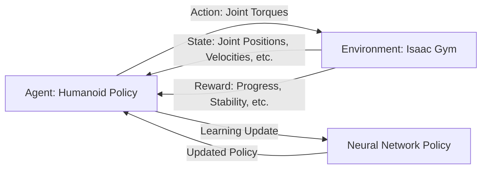

# Chapter 9: Reinforcement Learning and Sim-to-Real

## Learning Objectives

By the end of this chapter, you will be able to:

1. Understand the fundamentals of reinforcement learning (RL) and its application to humanoid robotics
2. Set up and configure NVIDIA Isaac Gym for GPU-accelerated physics simulation
3. Train locomotion policies for humanoid robots using modern RL algorithms
4. Apply domain randomization techniques for robust sim-to-real transfer
5. Deploy trained RL policies to NVIDIA Jetson edge AI hardware
6. Evaluate and optimize policy performance in simulation and real-world environments
7. Troubleshoot common challenges in RL training and deployment

---

## 9.1 Introduction to Reinforcement Learning for Robotics

**Reinforcement Learning (RL)** is a machine learning paradigm where an agent learns to make decisions by interacting with an environment to maximize cumulative rewards. Unlike supervised learning, RL does not require labeled data—instead, the agent learns from trial and error, discovering optimal behaviors through exploration.

:::info Key Insight
For humanoid robotics, RL is particularly powerful because it can discover complex locomotion and manipulation strategies that are difficult to program manually. Through simulated practice, RL agents can accumulate years of experience in hours, learning robust policies that transfer to real hardware (OpenAI, 2023).
:::

### The RL Framework



**Core Components**:

1. **Agent**: The humanoid robot controlled by a neural network policy
2. **Environment**: Physics simulation (Isaac Gym) that responds to actions
3. **State**: Observations (joint angles, velocities, orientation, contact forces)
4. **Action**: Control commands (joint torques or position targets)
5. **Reward**: Scalar feedback indicating task success (distance to goal, staying upright)
6. **Policy**: Neural network mapping states to actions (learned through RL)

### Why Reinforcement Learning for Humanoids?

**Advantages**:
- **Automated discovery**: RL finds optimal gaits and behaviors without manual tuning
- **Adaptability**: Learned policies can adapt to terrain variations and perturbations
- **Complex tasks**: Handles high-dimensional control (30+ DOF humanoids)
- **Sim-to-real**: Train safely in simulation, deploy to real robots

**Challenges**:
- **Sample efficiency**: Requires millions of environment interactions
- **Reward design**: Crafting reward functions that incentivize desired behaviors
- **Reality gap**: Ensuring simulated policies work on real hardware
- **Safety**: Preventing dangerous behaviors during exploration

---

## 9.2 Reinforcement Learning Fundamentals

### 9.2.1 Markov Decision Process (MDP)

RL problems are formalized as **Markov Decision Processes (MDPs)**:

**Mathematical Formulation**:

An MDP is defined by the tuple $(S, A, P, R, \gamma)$:

- $S$: State space (all possible robot states)
- $A$: Action space (all possible control commands)
- $P(s'|s,a)$: Transition probability (environment dynamics)
- $R(s,a)$: Reward function
- $\gamma \in [0,1]$: Discount factor for future rewards

**Objective**: Find a policy $\pi(a|s)$ that maximizes expected cumulative reward:

```math
J(\pi) = \mathbb{E}_{\tau \sim \pi} \left[ \sum_{t=0}^{\infty} \gamma^t R(s_t, a_t) \right]
```

where $\tau = (s_0, a_0, r_0, s_1, a_1, r_1, ...)$ is a trajectory.

### 9.2.2 Policy Gradient Methods

**Policy Gradient** algorithms directly optimize the policy parameters $\theta$ to maximize expected return:

```math
\nabla_\theta J(\theta) = \mathbb{E}_{\tau \sim \pi_\theta} \left[ \sum_{t=0}^{T} \nabla_\theta \log \pi_\theta(a_t|s_t) A_t \right]
```

where $A_t$ is the **advantage function** estimating how much better action $a_t$ is compared to the average.

**Key Algorithms for Robotics**:

1. **PPO (Proximal Policy Optimization)**:
   - Most popular for robot learning
   - Stable training with clipped objective
   - Good balance of sample efficiency and simplicity

2. **SAC (Soft Actor-Critic)**:
   - Off-policy algorithm (reuses past experience)
   - Maximum entropy framework encourages exploration
   - Excellent for continuous control

3. **TD3 (Twin Delayed Deep Deterministic Policy Gradient)**:
   - Deterministic policy with delayed updates
   - Addresses overestimation bias in Q-learning
   - Robust for high-dimensional action spaces

:::tip Algorithm Selection
For humanoid locomotion, **PPO** is recommended due to its stability and proven track record in robotics. For manipulation tasks with precise control, **SAC** often performs better.
:::

### 9.2.3 Reward Function Design

**Reward engineering** is critical for RL success. A well-designed reward should:

1. **Align with task objective**: Directly incentivize desired outcomes
2. **Be shaped**: Provide dense feedback, not just sparse terminal rewards
3. **Be normalized**: Keep reward scale consistent for stable training
4. **Penalize undesired behaviors**: Falling, excessive energy use, joint limits

**Example Reward for Bipedal Walking**:

```python
def compute_reward(self, state, action):
    """
    Reward function for humanoid forward walking
    """
    # Extract state components
    base_pos = state['base_position']
    base_ori = state['base_orientation']
    base_lin_vel = state['base_linear_velocity']
    base_ang_vel = state['base_angular_velocity']
    joint_pos = state['joint_positions']
    joint_vel = state['joint_velocities']
    contact_forces = state['contact_forces']

    # Forward velocity reward (primary objective)
    target_velocity = 1.0  # m/s
    forward_reward = -torch.abs(base_lin_vel[:, 0] - target_velocity)

    # Upright orientation reward (stay vertical)
    upright_reward = torch.exp(-5.0 * torch.sum(base_ori[:, :2]**2, dim=1))

    # Energy penalty (minimize torque)
    energy_penalty = -0.02 * torch.sum(action**2, dim=1)

    # Joint velocity penalty (encourage smooth motion)
    smoothness_penalty = -0.01 * torch.sum(joint_vel**2, dim=1)

    # Survival reward (timestep alive)
    survival_reward = 0.1

    # Foot contact reward (encourage alternating foot contact)
    left_contact = contact_forces[:, 0] > 1.0  # Left foot
    right_contact = contact_forces[:, 1] > 1.0  # Right foot
    contact_reward = 0.1 * (left_contact ^ right_contact).float()

    # Total reward
    total_reward = (
        forward_reward +
        upright_reward +
        energy_penalty +
        smoothness_penalty +
        survival_reward +
        contact_reward
    )

    return total_reward
```

---

## 9.3 NVIDIA Isaac Gym for RL Training

### 9.3.1 What is Isaac Gym?

**Isaac Gym** is NVIDIA's GPU-accelerated physics simulation platform designed specifically for reinforcement learning research. It enables:

- **Massively parallel simulation**: Run 1000+ environments simultaneously on a single GPU
- **End-to-end GPU pipeline**: Physics, rendering, and RL training entirely on GPU
- **High throughput**: 100,000+ FPS aggregate across parallel environments
- **PyTorch integration**: Seamless tensor operations for RL algorithms

**Architecture**:

```
┌─────────────────────────────────────────┐
│        RL Algorithm (PPO/SAC)           │
│         (PyTorch on GPU)                │
├─────────────────────────────────────────┤
│      Isaac Gym Python API               │
│   (Environment interactions)            │
├─────────────────────────────────────────┤
│    PhysX GPU Physics Engine             │
│  (Parallel rigid body dynamics)         │
├─────────────────────────────────────────┤
│         NVIDIA GPU (CUDA)               │
│   (Tensor operations + Physics)         │
└─────────────────────────────────────────┘
```

**System Requirements**:
- **GPU**: NVIDIA RTX 3070 or higher (12GB+ VRAM recommended)
- **CPU**: Intel Core i7/i9 or AMD Ryzen 7/9
- **RAM**: 32GB+ system memory
- **OS**: Ubuntu 20.04/22.04 or Windows 10/11
- **Python**: 3.7-3.10

### 9.3.2 Installing Isaac Gym

**Download and Installation**:

```bash
# Download Isaac Gym from NVIDIA Developer Portal
# https://developer.nvidia.com/isaac-gym

# Extract archive
cd ~/Downloads
tar -xvf IsaacGym_Preview_4_Package.tar.gz
cd isaacgym

# Create conda environment
conda create -n isaacgym python=3.8
conda activate isaacgym

# Install Isaac Gym
cd python
pip install -e .

# Install PyTorch (CUDA 11.8 version)
pip install torch==2.0.1 torchvision==0.15.2 --index-url https://download.pytorch.org/whl/cu118

# Install RL dependencies
pip install tensorboard stable-baselines3 wandb

# Verify installation
cd ../examples
python 1080_balls_of_solitude.py
```

**Expected Output**: You should see 1080 balls bouncing in parallel environments at high FPS.

### 9.3.3 Isaac Gym Core Concepts

**1. Gym Instance**:

```python
from isaacgym import gymapi

# Create gym instance
gym = gymapi.acquire_gym()

# Create simulator
sim_params = gymapi.SimParams()
sim_params.dt = 1.0 / 60.0  # 60 Hz simulation
sim_params.substeps = 2
sim_params.up_axis = gymapi.UP_AXIS_Z
sim_params.gravity = gymapi.Vec3(0.0, 0.0, -9.81)

# PhysX parameters
sim_params.physx.solver_type = 1  # TGS (Temporal Gauss-Seidel)
sim_params.physx.num_position_iterations = 4
sim_params.physx.num_velocity_iterations = 1
sim_params.physx.contact_offset = 0.02
sim_params.physx.rest_offset = 0.001
sim_params.physx.use_gpu = True  # GPU physics

# Create sim
sim = gym.create_sim(0, 0, gymapi.SIM_PHYSX, sim_params)
```

**2. Environments**:

```python
# Create multiple parallel environments
num_envs = 512
envs_per_row = 16
env_spacing = 2.0

envs = []
for i in range(num_envs):
    # Create environment
    env = gym.create_env(sim, gymapi.Vec3(-env_spacing, 0.0, -env_spacing),
                         gymapi.Vec3(env_spacing, env_spacing, env_spacing), envs_per_row)
    envs.append(env)
```

**3. Assets (Robot Models)**:

```python
# Load humanoid URDF
asset_root = "../../assets"
asset_file = "humanoid/humanoid.urdf"

asset_options = gymapi.AssetOptions()
asset_options.fix_base_link = False
asset_options.default_dof_drive_mode = gymapi.DOF_MODE_EFFORT
asset_options.collapse_fixed_joints = False
asset_options.flip_visual_attachments = True

humanoid_asset = gym.load_asset(sim, asset_root, asset_file, asset_options)
```

**4. Actors (Robot Instances)**:

```python
# Create actor from asset
pose = gymapi.Transform()
pose.p = gymapi.Vec3(0.0, 0.0, 1.0)  # 1m above ground
pose.r = gymapi.Quat(0.0, 0.0, 0.0, 1.0)

actor_handle = gym.create_actor(env, humanoid_asset, pose, "humanoid", i, 1)
```

**5. Tensor API (GPU-accelerated)**:

```python
# Acquire tensors for GPU operations
gym.prepare_sim(sim)

# Get state tensors
root_tensor = gymtorch.wrap_tensor(gym.acquire_actor_root_state_tensor(sim))
dof_state_tensor = gymtorch.wrap_tensor(gym.acquire_dof_state_tensor(sim))
rigid_body_tensor = gymtorch.wrap_tensor(gym.acquire_rigid_body_state_tensor(sim))
contact_force_tensor = gymtorch.wrap_tensor(gym.acquire_net_contact_force_tensor(sim))

# Refresh tensors after simulation step
gym.refresh_actor_root_state_tensor(sim)
gym.refresh_dof_state_tensor(sim)
gym.refresh_rigid_body_state_tensor(sim)
gym.refresh_net_contact_force_tensor(sim)
```

---

## 9.4 Training Humanoid Locomotion with RL

### 9.4.1 Environment Setup for Humanoid Walking

```python
# humanoid_env.py - Isaac Gym environment for humanoid locomotion
import torch
import numpy as np
from isaacgym import gymapi, gymtorch
from typing import Dict, Tuple

class HumanoidLocomotionEnv:
    """
    Isaac Gym environment for training humanoid bipedal locomotion
    """

    def __init__(self, num_envs=512, device='cuda:0'):
        self.num_envs = num_envs
        self.device = device

        # Create gym
        self.gym = gymapi.acquire_gym()

        # Simulation parameters
        self.dt = 1.0 / 60.0  # 60 Hz
        self.max_episode_length = 1000  # ~16 seconds

        # Observation and action dimensions
        self.num_obs = 48  # State observation size
        self.num_actions = 12  # 12 DOF humanoid

        # Create simulation
        self._create_sim()
        self._create_ground()
        self._create_envs()

        # Prepare tensors
        self._prepare_tensors()

        # Episode counters
        self.episode_lengths = torch.zeros(num_envs, dtype=torch.int, device=device)
        self.reset_buf = torch.ones(num_envs, dtype=torch.bool, device=device)

    def _create_sim(self):
        """Initialize simulation with PhysX GPU parameters"""
        sim_params = gymapi.SimParams()
        sim_params.dt = self.dt
        sim_params.substeps = 2
        sim_params.up_axis = gymapi.UP_AXIS_Z
        sim_params.gravity = gymapi.Vec3(0.0, 0.0, -9.81)

        # PhysX GPU settings
        sim_params.physx.solver_type = 1
        sim_params.physx.num_position_iterations = 4
        sim_params.physx.num_velocity_iterations = 1
        sim_params.physx.contact_offset = 0.02
        sim_params.physx.rest_offset = 0.001
        sim_params.physx.bounce_threshold_velocity = 0.2
        sim_params.physx.max_depenetration_velocity = 10.0
        sim_params.physx.default_buffer_size_multiplier = 5.0
        sim_params.physx.use_gpu = True

        self.sim = self.gym.create_sim(0, 0, gymapi.SIM_PHYSX, sim_params)

    def _create_ground(self):
        """Create ground plane"""
        plane_params = gymapi.PlaneParams()
        plane_params.normal = gymapi.Vec3(0, 0, 1)
        plane_params.distance = 0.0
        plane_params.static_friction = 1.0
        plane_params.dynamic_friction = 1.0
        plane_params.restitution = 0.0
        self.gym.add_ground(self.sim, plane_params)

    def _create_envs(self):
        """Create parallel environments with humanoid actors"""
        # Load humanoid asset
        asset_root = "../../assets"
        asset_file = "humanoid/humanoid.urdf"

        asset_options = gymapi.AssetOptions()
        asset_options.fix_base_link = False
        asset_options.default_dof_drive_mode = gymapi.DOF_MODE_EFFORT
        asset_options.angular_damping = 0.01
        asset_options.max_angular_velocity = 100.0

        humanoid_asset = self.gym.load_asset(self.sim, asset_root, asset_file, asset_options)

        # Get DOF properties
        self.num_dofs = self.gym.get_asset_dof_count(humanoid_asset)
        dof_props = self.gym.get_asset_dof_properties(humanoid_asset)

        # Set DOF limits and stiffness
        for i in range(self.num_dofs):
            dof_props['driveMode'][i] = gymapi.DOF_MODE_EFFORT
            dof_props['stiffness'][i] = 0.0
            dof_props['damping'][i] = 0.5

        # Create environments
        num_per_row = int(np.sqrt(self.num_envs))
        env_spacing = 2.0
        env_lower = gymapi.Vec3(-env_spacing, 0.0, -env_spacing)
        env_upper = gymapi.Vec3(env_spacing, env_spacing, env_spacing)

        self.envs = []
        self.humanoid_handles = []

        for i in range(self.num_envs):
            # Create env
            env = self.gym.create_env(self.sim, env_lower, env_upper, num_per_row)

            # Create humanoid actor
            pose = gymapi.Transform()
            pose.p = gymapi.Vec3(0.0, 0.0, 1.0)
            pose.r = gymapi.Quat(0.0, 0.0, 0.0, 1.0)

            humanoid_handle = self.gym.create_actor(
                env, humanoid_asset, pose, f"humanoid_{i}", i, 1
            )

            # Set DOF properties
            self.gym.set_actor_dof_properties(env, humanoid_handle, dof_props)

            self.envs.append(env)
            self.humanoid_handles.append(humanoid_handle)

    def _prepare_tensors(self):
        """Prepare GPU tensors for state and actions"""
        self.gym.prepare_sim(self.sim)

        # Actor root states (position, orientation, velocities)
        actor_root_state = self.gym.acquire_actor_root_state_tensor(self.sim)
        self.root_states = gymtorch.wrap_tensor(actor_root_state)

        # DOF states (position, velocity)
        dof_state_tensor = self.gym.acquire_dof_state_tensor(self.sim)
        self.dof_states = gymtorch.wrap_tensor(dof_state_tensor)
        self.dof_pos = self.dof_states.view(self.num_envs, self.num_dofs, 2)[..., 0]
        self.dof_vel = self.dof_states.view(self.num_envs, self.num_dofs, 2)[..., 1]

        # Contact forces
        net_contact_forces = self.gym.acquire_net_contact_force_tensor(self.sim)
        self.contact_forces = gymtorch.wrap_tensor(net_contact_forces)

        # Action buffer
        self.actions = torch.zeros(self.num_envs, self.num_actions, device=self.device)

    def reset(self, env_ids=None):
        """Reset specified environments (or all if None)"""
        if env_ids is None:
            env_ids = torch.arange(self.num_envs, device=self.device)

        num_resets = len(env_ids)

        # Reset root states
        self.root_states[env_ids, 0:3] = 0.0  # Position
        self.root_states[env_ids, 2] = 1.0    # Height 1m
        self.root_states[env_ids, 3:7] = torch.tensor([0.0, 0.0, 0.0, 1.0], device=self.device)  # Orientation
        self.root_states[env_ids, 7:13] = 0.0  # Velocities

        # Reset DOF states to default pose
        self.dof_pos[env_ids] = 0.0
        self.dof_vel[env_ids] = 0.0

        # Apply resets
        env_ids_int32 = env_ids.to(dtype=torch.int32)
        self.gym.set_actor_root_state_tensor_indexed(
            self.sim,
            gymtorch.unwrap_tensor(self.root_states),
            gymtorch.unwrap_tensor(env_ids_int32),
            num_resets
        )
        self.gym.set_dof_state_tensor_indexed(
            self.sim,
            gymtorch.unwrap_tensor(self.dof_states),
            gymtorch.unwrap_tensor(env_ids_int32),
            num_resets
        )

        # Reset episode tracking
        self.episode_lengths[env_ids] = 0
        self.reset_buf[env_ids] = False

        return self.get_observations()

    def get_observations(self) -> torch.Tensor:
        """
        Construct observation vector for policy

        Observation (48D):
        - Base orientation (quaternion): 4
        - Base linear velocity: 3
        - Base angular velocity: 3
        - Joint positions: 12
        - Joint velocities: 12
        - Previous actions: 12
        - Foot contacts: 2
        """
        # Refresh tensors
        self.gym.refresh_actor_root_state_tensor(self.sim)
        self.gym.refresh_dof_state_tensor(self.sim)
        self.gym.refresh_net_contact_force_tensor(self.sim)

        # Extract base state
        base_quat = self.root_states[:, 3:7]
        base_lin_vel = self.root_states[:, 7:10]
        base_ang_vel = self.root_states[:, 10:13]

        # Foot contact detection (left foot = index 0, right foot = index 1)
        left_foot_contact = (torch.norm(self.contact_forces[:, 0, :], dim=1) > 1.0).float()
        right_foot_contact = (torch.norm(self.contact_forces[:, 1, :], dim=1) > 1.0).float()

        # Concatenate observations
        obs = torch.cat([
            base_quat,              # 4
            base_lin_vel,           # 3
            base_ang_vel,           # 3
            self.dof_pos,           # 12
            self.dof_vel,           # 12
            self.actions,           # 12 (previous actions)
            left_foot_contact.unsqueeze(1),   # 1
            right_foot_contact.unsqueeze(1),  # 1
        ], dim=1)

        return obs

    def step(self, actions: torch.Tensor) -> Tuple[torch.Tensor, torch.Tensor, torch.Tensor, Dict]:
        """
        Execute actions in all environments

        Args:
            actions: Tensor of shape (num_envs, num_actions)

        Returns:
            observations, rewards, dones, info_dict
        """
        # Clip and store actions
        self.actions = torch.clip(actions, -1.0, 1.0)

        # Scale actions to torque range (e.g., ±100 Nm)
        torques = self.actions * 100.0

        # Apply torques
        self.gym.set_dof_actuation_force_tensor(
            self.sim,
            gymtorch.unwrap_tensor(torques)
        )

        # Step simulation
        self.gym.simulate(self.sim)
        self.gym.fetch_results(self.sim, True)

        # Render (optional, for visualization)
        # self.gym.step_graphics(self.sim)
        # self.gym.render_all_camera_sensors(self.sim)

        # Increment episode length
        self.episode_lengths += 1

        # Get observations
        obs = self.get_observations()

        # Compute rewards
        rewards = self.compute_rewards()

        # Check termination conditions
        dones = self.check_termination()

        # Reset terminated environments
        if dones.any():
            obs = self.reset(dones.nonzero(as_tuple=False).squeeze(-1))

        # Info dict
        info = {}

        return obs, rewards, dones, info

    def compute_rewards(self) -> torch.Tensor:
        """Compute reward for each environment"""
        # Target forward velocity
        target_vel = 1.0

        # Forward velocity reward
        forward_vel = self.root_states[:, 7]  # x-velocity
        vel_reward = -torch.abs(forward_vel - target_vel)

        # Upright reward (penalize tilting)
        up_vec = torch.tensor([0.0, 0.0, 1.0], device=self.device)
        base_quat = self.root_states[:, 3:7]
        # Compute rotation matrix z-axis from quaternion
        qw, qx, qy, qz = base_quat[:, 0], base_quat[:, 1], base_quat[:, 2], base_quat[:, 3]
        rot_z = 2.0 * (qx * qz + qw * qy)
        upright_reward = torch.exp(-5.0 * (1.0 - rot_z)**2)

        # Energy penalty
        energy_penalty = -0.01 * torch.sum(self.actions**2, dim=1)

        # Joint velocity penalty (smoothness)
        smoothness_penalty = -0.005 * torch.sum(self.dof_vel**2, dim=1)

        # Survival reward
        survival_reward = 0.1

        # Total reward
        reward = vel_reward + upright_reward + energy_penalty + smoothness_penalty + survival_reward

        return reward

    def check_termination(self) -> torch.Tensor:
        """Check which environments should terminate"""
        # Terminate if fallen (base height < 0.5m or tilted > 45 degrees)
        base_height = self.root_states[:, 2]
        fallen = base_height < 0.5

        # Terminate if max episode length reached
        timeout = self.episode_lengths >= self.max_episode_length

        dones = fallen | timeout

        return dones
```

### 9.4.2 PPO Training Loop

```python
# train_humanoid_ppo.py - Train humanoid locomotion with PPO
import torch
import torch.nn as nn
import torch.optim as optim
from torch.distributions import Normal
import numpy as np
from humanoid_env import HumanoidLocomotionEnv
from tensorboard import SummaryWriter

class ActorCritic(nn.Module):
    """Actor-Critic neural network for PPO"""

    def __init__(self, num_obs, num_actions, hidden_dim=256):
        super().__init__()

        # Shared feature extractor
        self.features = nn.Sequential(
            nn.Linear(num_obs, hidden_dim),
            nn.ELU(),
            nn.Linear(hidden_dim, hidden_dim),
            nn.ELU(),
        )

        # Actor head (policy)
        self.actor_mean = nn.Linear(hidden_dim, num_actions)
        self.actor_logstd = nn.Parameter(torch.zeros(num_actions))

        # Critic head (value function)
        self.critic = nn.Linear(hidden_dim, 1)

    def forward(self, obs):
        features = self.features(obs)
        return features

    def act(self, obs):
        """Sample action from policy"""
        features = self.forward(obs)
        action_mean = self.actor_mean(features)
        action_std = torch.exp(self.actor_logstd)

        dist = Normal(action_mean, action_std)
        action = dist.sample()
        log_prob = dist.log_prob(action).sum(dim=-1)

        return action, log_prob

    def evaluate(self, obs, action):
        """Evaluate log probability and value for given state-action"""
        features = self.forward(obs)

        # Policy evaluation
        action_mean = self.actor_mean(features)
        action_std = torch.exp(self.actor_logstd)
        dist = Normal(action_mean, action_std)
        log_prob = dist.log_prob(action).sum(dim=-1)
        entropy = dist.entropy().sum(dim=-1)

        # Value evaluation
        value = self.critic(features).squeeze(-1)

        return log_prob, value, entropy

class PPOTrainer:
    """PPO training algorithm"""

    def __init__(self, env, policy, lr=3e-4, gamma=0.99, gae_lambda=0.95,
                 clip_epsilon=0.2, epochs=4, batch_size=512):
        self.env = env
        self.policy = policy
        self.gamma = gamma
        self.gae_lambda = gae_lambda
        self.clip_epsilon = clip_epsilon
        self.epochs = epochs
        self.batch_size = batch_size

        self.optimizer = optim.Adam(policy.parameters(), lr=lr)
        self.device = env.device

    def compute_gae(self, rewards, values, dones):
        """Compute Generalized Advantage Estimation (GAE)"""
        advantages = torch.zeros_like(rewards)
        last_gae = 0.0

        for t in reversed(range(len(rewards))):
            if t == len(rewards) - 1:
                next_value = 0.0
            else:
                next_value = values[t + 1]

            delta = rewards[t] + self.gamma * next_value * (1 - dones[t]) - values[t]
            advantages[t] = last_gae = delta + self.gamma * self.gae_lambda * (1 - dones[t]) * last_gae

        returns = advantages + values

        return advantages, returns

    def update(self, rollout_buffer):
        """Perform PPO update"""
        obs, actions, log_probs_old, returns, advantages = rollout_buffer

        # Normalize advantages
        advantages = (advantages - advantages.mean()) / (advantages.std() + 1e-8)

        # Multiple epochs of updates
        for _ in range(self.epochs):
            # Shuffle data
            indices = torch.randperm(len(obs))

            # Mini-batch updates
            for start in range(0, len(obs), self.batch_size):
                end = start + self.batch_size
                batch_indices = indices[start:end]

                batch_obs = obs[batch_indices]
                batch_actions = actions[batch_indices]
                batch_log_probs_old = log_probs_old[batch_indices]
                batch_returns = returns[batch_indices]
                batch_advantages = advantages[batch_indices]

                # Evaluate current policy
                log_probs, values, entropy = self.policy.evaluate(batch_obs, batch_actions)

                # Ratio for PPO clipping
                ratio = torch.exp(log_probs - batch_log_probs_old)

                # Clipped surrogate objective
                surr1 = ratio * batch_advantages
                surr2 = torch.clamp(ratio, 1.0 - self.clip_epsilon, 1.0 + self.clip_epsilon) * batch_advantages
                actor_loss = -torch.min(surr1, surr2).mean()

                # Value loss
                value_loss = 0.5 * (batch_returns - values).pow(2).mean()

                # Entropy bonus (encourages exploration)
                entropy_loss = -0.01 * entropy.mean()

                # Total loss
                loss = actor_loss + value_loss + entropy_loss

                # Optimize
                self.optimizer.zero_grad()
                loss.backward()
                nn.utils.clip_grad_norm_(self.policy.parameters(), 1.0)
                self.optimizer.step()

        return actor_loss.item(), value_loss.item(), entropy_loss.item()

def train():
    """Main training loop"""
    # Hyperparameters
    num_envs = 512
    num_steps = 24  # Rollout length
    total_timesteps = 10_000_000

    # Create environment
    env = HumanoidLocomotionEnv(num_envs=num_envs, device='cuda:0')

    # Create policy
    policy = ActorCritic(env.num_obs, env.num_actions).to('cuda:0')

    # Create trainer
    trainer = PPOTrainer(env, policy)

    # Tensorboard logging
    writer = SummaryWriter('runs/humanoid_ppo')

    # Reset environment
    obs = env.reset()

    # Training loop
    timestep = 0
    while timestep < total_timesteps:
        # Collect rollout
        rollout_obs = []
        rollout_actions = []
        rollout_log_probs = []
        rollout_rewards = []
        rollout_dones = []
        rollout_values = []

        for step in range(num_steps):
            # Sample action
            with torch.no_grad():
                action, log_prob = policy.act(obs)
                features = policy.forward(obs)
                value = policy.critic(features).squeeze(-1)

            # Environment step
            next_obs, reward, done, info = env.step(action)

            # Store transition
            rollout_obs.append(obs)
            rollout_actions.append(action)
            rollout_log_probs.append(log_prob)
            rollout_rewards.append(reward)
            rollout_dones.append(done)
            rollout_values.append(value)

            obs = next_obs
            timestep += num_envs

        # Convert to tensors
        rollout_obs = torch.stack(rollout_obs)
        rollout_actions = torch.stack(rollout_actions)
        rollout_log_probs = torch.stack(rollout_log_probs)
        rollout_rewards = torch.stack(rollout_rewards)
        rollout_dones = torch.stack(rollout_dones)
        rollout_values = torch.stack(rollout_values)

        # Compute GAE
        advantages, returns = trainer.compute_gae(rollout_rewards, rollout_values, rollout_dones)

        # Flatten for update
        rollout_obs = rollout_obs.view(-1, env.num_obs)
        rollout_actions = rollout_actions.view(-1, env.num_actions)
        rollout_log_probs = rollout_log_probs.view(-1)
        returns = returns.view(-1)
        advantages = advantages.view(-1)

        # PPO update
        actor_loss, value_loss, entropy_loss = trainer.update(
            (rollout_obs, rollout_actions, rollout_log_probs, returns, advantages)
        )

        # Logging
        mean_reward = rollout_rewards.mean().item()
        writer.add_scalar('Train/MeanReward', mean_reward, timestep)
        writer.add_scalar('Train/ActorLoss', actor_loss, timestep)
        writer.add_scalar('Train/ValueLoss', value_loss, timestep)
        writer.add_scalar('Train/EntropyLoss', entropy_loss, timestep)

        if timestep % 10000 == 0:
            print(f"Timestep: {timestep:,} | Mean Reward: {mean_reward:.2f}")

        # Save checkpoint
        if timestep % 100000 == 0:
            torch.save(policy.state_dict(), f'checkpoints/policy_{timestep}.pth')

    # Save final policy
    torch.save(policy.state_dict(), 'checkpoints/policy_final.pth')
    writer.close()

if __name__ == '__main__':
    train()
```

**Running Training**:

```bash
# Create checkpoints directory
mkdir -p checkpoints

# Start training
python train_humanoid_ppo.py

# Monitor with Tensorboard
tensorboard --logdir=runs/humanoid_ppo
```

**Expected Training Time**:
- RTX 4090: ~4-6 hours for 10M steps
- RTX 3080: ~8-12 hours for 10M steps

:::tip Training Tips
1. **Start with simple rewards**: Focus on staying upright before optimizing for speed
2. **Monitor exploration**: If policy converges too quickly, increase entropy bonus
3. **Adjust learning rate**: If training is unstable, reduce LR to 1e-4
4. **Use curriculum learning**: Gradually increase task difficulty (flat terrain → slopes → obstacles)
:::

---

## 9.5 Domain Randomization for Sim-to-Real Transfer

### 9.5.1 The Reality Gap Challenge

**Reality Gap**: Discrepancy between simulated and real-world physics, sensors, and dynamics.

**Common Sources**:
- Simplified contact models in simulation
- Perfect state estimation (vs. noisy real sensors)
- Exact actuator models (vs. real motor dynamics)
- Ideal environment (vs. uneven terrain, lighting)

**Solution**: **Domain Randomization** — Train on diverse randomized simulations so policy learns robust features that transfer to reality.

### 9.5.2 Comprehensive Domain Randomization

```python
# domain_randomization.py - Comprehensive randomization for sim-to-real
import torch
import numpy as np
from isaacgym import gymapi

class DomainRandomizer:
    """
    Domain randomization for robust sim-to-real transfer
    """

    def __init__(self, gym, sim, envs, humanoid_handles, device='cuda:0'):
        self.gym = gym
        self.sim = sim
        self.envs = envs
        self.humanoid_handles = humanoid_handles
        self.device = device
        self.num_envs = len(envs)

    def randomize_physics(self):
        """Randomize physics parameters"""
        for i, (env, handle) in enumerate(zip(self.envs, self.humanoid_handles)):
            # Randomize mass (±20%)
            rigid_shape_props = self.gym.get_actor_rigid_shape_properties(env, handle)
            for prop in rigid_shape_props:
                mass_scale = np.random.uniform(0.8, 1.2)
                prop.mass *= mass_scale
            self.gym.set_actor_rigid_shape_properties(env, handle, rigid_shape_props)

            # Randomize friction (ground contact)
            rigid_shape_props = self.gym.get_actor_rigid_shape_properties(env, handle)
            for prop in rigid_shape_props:
                prop.friction = np.random.uniform(0.5, 1.5)
                prop.restitution = np.random.uniform(0.0, 0.2)
            self.gym.set_actor_rigid_shape_properties(env, handle, rigid_shape_props)

            # Randomize joint properties
            dof_props = self.gym.get_actor_dof_properties(env, handle)
            for j in range(len(dof_props)):
                # Damping variation (±30%)
                damping_scale = np.random.uniform(0.7, 1.3)
                dof_props['damping'][j] *= damping_scale

                # Armature (motor inertia) variation
                dof_props['armature'][j] = np.random.uniform(0.01, 0.1)
            self.gym.set_actor_dof_properties(env, handle, dof_props)

    def randomize_gravity(self):
        """Randomize gravity direction (for uneven terrain simulation)"""
        # Gravity magnitude: 9.81 ± 0.5 m/s²
        gravity_mag = np.random.uniform(9.3, 10.3)

        # Small tilt (±5 degrees) to simulate uneven ground
        tilt_x = np.random.uniform(-0.087, 0.087)  # ±5° in radians
        tilt_y = np.random.uniform(-0.087, 0.087)

        gravity_vec = gymapi.Vec3(
            gravity_mag * tilt_x,
            gravity_mag * tilt_y,
            -gravity_mag
        )

        self.gym.set_sim_params(self.sim, gymapi.SimParams(gravity=gravity_vec))

    def randomize_actuators(self, actions):
        """
        Apply actuator noise and delays to actions

        Args:
            actions: Tensor of shape (num_envs, num_actions)

        Returns:
            Perturbed actions
        """
        # Actuator noise (Gaussian, std=2% of action range)
        noise = torch.randn_like(actions) * 0.02

        # Action delay (1-3 timesteps latency simulation)
        # In practice, maintain a buffer of past actions

        # Torque saturation (±5% variation)
        torque_limit_scale = torch.rand(self.num_envs, 1, device=self.device) * 0.1 + 0.95

        perturbed_actions = torch.clamp(actions + noise, -1.0, 1.0) * torque_limit_scale

        return perturbed_actions

    def add_observation_noise(self, obs):
        """
        Add sensor noise to observations

        Args:
            obs: Clean observations from simulation

        Returns:
            Noisy observations
        """
        # IMU noise (accelerometer and gyroscope)
        imu_indices = [4, 5, 6, 7, 8, 9]  # Linear and angular velocities
        imu_noise = torch.randn(self.num_envs, len(imu_indices), device=self.device) * 0.05
        obs[:, imu_indices] += imu_noise

        # Joint encoder noise (position and velocity)
        joint_pos_indices = range(10, 22)
        joint_vel_indices = range(22, 34)

        joint_pos_noise = torch.randn(self.num_envs, 12, device=self.device) * 0.01  # 1cm position error
        joint_vel_noise = torch.randn(self.num_envs, 12, device=self.device) * 0.05  # Velocity noise

        obs[:, joint_pos_indices] += joint_pos_noise
        obs[:, joint_vel_indices] += joint_vel_noise

        return obs

    def randomize_visual(self):
        """Randomize visual appearance (for vision-based policies)"""
        for env in self.envs:
            # Randomize lighting
            light_intensity = np.random.uniform(0.3, 3.0)
            light_color = np.random.uniform(0.8, 1.0, size=3)

            # Randomize material properties
            # (This requires accessing rendering properties, simplified here)
            pass

    def randomize_all(self, obs, actions):
        """Apply all randomization techniques"""
        # Physics randomization (applied at episode reset)
        # self.randomize_physics()

        # Observation noise
        noisy_obs = self.add_observation_noise(obs)

        # Actuator perturbation
        perturbed_actions = self.randomize_actuators(actions)

        return noisy_obs, perturbed_actions
```

**Integration with Training**:

```python
# Modified training step with domain randomization
def step_with_randomization(env, policy, randomizer):
    obs = env.get_observations()

    # Add observation noise
    noisy_obs, _ = randomizer.randomize_all(obs, None)

    # Policy forward pass
    action, log_prob = policy.act(noisy_obs)

    # Add actuator noise
    _, perturbed_action = randomizer.randomize_all(obs, action)

    # Execute in environment
    next_obs, reward, done, info = env.step(perturbed_action)

    return next_obs, reward, done, info
```

:::info Domain Randomization Best Practices
1. **Start conservative**: Gradually increase randomization ranges
2. **Validate in sim**: Test that randomized policy still works in nominal simulation
3. **Monitor diversity**: Ensure randomization covers expected real-world variation
4. **Ablation studies**: Identify which randomizations are most important for transfer
:::

---

## 9.6 Deploying RL Policies to Jetson Edge AI

### 9.6.1 Policy Export and Optimization

```python
# export_policy.py - Export trained policy for deployment
import torch
import torch.nn as nn
from train_humanoid_ppo import ActorCritic

class DeploymentPolicy(nn.Module):
    """Lightweight policy for deployment (actor only)"""

    def __init__(self, num_obs, num_actions, hidden_dim=256):
        super().__init__()

        self.features = nn.Sequential(
            nn.Linear(num_obs, hidden_dim),
            nn.ELU(),
            nn.Linear(hidden_dim, hidden_dim),
            nn.ELU(),
        )

        self.actor_mean = nn.Linear(hidden_dim, num_actions)

    def forward(self, obs):
        """Deterministic policy (no sampling for deployment)"""
        features = self.features(obs)
        action = torch.tanh(self.actor_mean(features))  # Bound to [-1, 1]
        return action

def export_to_torchscript(checkpoint_path, output_path):
    """Export policy to TorchScript for efficient deployment"""
    # Load trained policy
    policy = ActorCritic(num_obs=48, num_actions=12)
    policy.load_state_dict(torch.load(checkpoint_path))
    policy.eval()

    # Create deployment policy (actor only)
    deploy_policy = DeploymentPolicy(num_obs=48, num_actions=12)

    # Copy weights
    deploy_policy.features.load_state_dict(policy.features.state_dict())
    deploy_policy.actor_mean.load_state_dict(policy.actor_mean.state_dict())

    # Convert to TorchScript
    example_input = torch.randn(1, 48)
    scripted_policy = torch.jit.trace(deploy_policy, example_input)

    # Save
    scripted_policy.save(output_path)
    print(f"Exported TorchScript policy to {output_path}")

    # Verify
    test_input = torch.randn(1, 48)
    original_output = deploy_policy(test_input)
    scripted_output = scripted_policy(test_input)

    assert torch.allclose(original_output, scripted_output, atol=1e-5)
    print("Verification passed!")

if __name__ == '__main__':
    export_to_torchscript(
        'checkpoints/policy_final.pth',
        'deployed_policy.pt'
    )
```

### 9.6.2 ROS 2 Policy Node for Jetson

```python
# policy_node.py - ROS 2 node for RL policy inference on Jetson
import rclpy
from rclpy.node import Node
from sensor_msgs.msg import JointState
from std_msgs.msg import Float64MultiArray
import torch
import numpy as np

class RLPolicyNode(Node):
    """ROS 2 node for RL policy deployment"""

    def __init__(self):
        super().__init__('rl_policy_node')

        # Load TorchScript policy
        model_path = 'deployed_policy.pt'
        self.policy = torch.jit.load(model_path)
        self.policy.eval()

        self.device = 'cuda' if torch.cuda.is_available() else 'cpu'
        self.policy = self.policy.to(self.device)

        self.get_logger().info(f'Loaded policy on device: {self.device}')

        # Robot state
        self.num_obs = 48
        self.num_actions = 12
        self.obs = torch.zeros(1, self.num_obs, device=self.device)

        # Observation indices
        self.joint_pos_indices = list(range(10, 22))
        self.joint_vel_indices = list(range(22, 34))

        # Subscribers
        self.joint_state_sub = self.create_subscription(
            JointState,
            '/joint_states',
            self.joint_state_callback,
            10
        )

        self.imu_sub = self.create_subscription(
            Float64MultiArray,
            '/imu/data',
            self.imu_callback,
            10
        )

        # Publisher for joint commands
        self.joint_cmd_pub = self.create_publisher(
            Float64MultiArray,
            '/joint_commands',
            10
        )

        # Control loop timer (60 Hz)
        self.control_frequency = 60.0
        self.timer = self.create_timer(1.0 / self.control_frequency, self.control_loop)

        self.get_logger().info('RL Policy Node initialized')

    def joint_state_callback(self, msg):
        """Update joint positions and velocities"""
        # Assuming msg.position and msg.velocity are in correct order
        joint_pos = torch.tensor(msg.position[:12], dtype=torch.float32, device=self.device)
        joint_vel = torch.tensor(msg.velocity[:12], dtype=torch.float32, device=self.device)

        self.obs[0, self.joint_pos_indices] = joint_pos
        self.obs[0, self.joint_vel_indices] = joint_vel

    def imu_callback(self, msg):
        """Update IMU data (orientation, velocities)"""
        # Assuming msg.data = [qw, qx, qy, qz, lin_vel_x, lin_vel_y, lin_vel_z, ang_vel_x, ang_vel_y, ang_vel_z]
        imu_data = torch.tensor(msg.data, dtype=torch.float32, device=self.device)

        # Orientation (quaternion)
        self.obs[0, 0:4] = imu_data[0:4]

        # Linear velocity
        self.obs[0, 4:7] = imu_data[4:7]

        # Angular velocity
        self.obs[0, 7:10] = imu_data[7:10]

    def control_loop(self):
        """Execute policy and publish commands"""
        # Run policy inference
        with torch.no_grad():
            action = self.policy(self.obs)

        # Convert to numpy and publish
        action_np = action.cpu().numpy().flatten()

        cmd_msg = Float64MultiArray()
        cmd_msg.data = action_np.tolist()

        self.joint_cmd_pub.publish(cmd_msg)

        # Update previous action in observation
        self.obs[0, 34:46] = action[0]

def main(args=None):
    rclpy.init(args=args)
    node = RLPolicyNode()

    try:
        rclpy.spin(node)
    except KeyboardInterrupt:
        pass
    finally:
        node.destroy_node()
        rclpy.shutdown()

if __name__ == '__main__':
    main()
```

### 9.6.3 Deployment Setup on Jetson Orin

```bash
#!/bin/bash
# deploy_policy_jetson.sh - Setup RL policy on Jetson Orin

echo "Setting up RL policy deployment on Jetson Orin..."

# Set Jetson to max performance
sudo nvpmodel -m 0
sudo jetson_clocks

# Install PyTorch for Jetson (pre-built wheel)
pip3 install torch-2.0.0+nv23.05-cp38-cp38-linux_aarch64.whl

# Install ROS 2 dependencies
sudo apt install -y ros-humble-sensor-msgs ros-humble-std-msgs

# Copy policy model
scp deployed_policy.pt nvidia@jetson-ip:/home/nvidia/humanoid_ws/src/policy_node/

# Build ROS 2 workspace
cd ~/humanoid_ws
colcon build --packages-select policy_node
source install/setup.bash

# Launch policy node
ros2 run policy_node policy_node

echo "Policy deployment complete!"
```

**Performance Monitoring**:

```python
# policy_monitor.py - Monitor policy performance on Jetson
import rclpy
from rclpy.node import Node
from std_msgs.msg import Float64MultiArray
import time
import psutil

class PolicyMonitor(Node):
    def __init__(self):
        super().__init__('policy_monitor')

        self.cmd_sub = self.create_subscription(
            Float64MultiArray,
            '/joint_commands',
            self.cmd_callback,
            10
        )

        self.last_time = time.time()
        self.cmd_count = 0

        # Timer for diagnostics
        self.create_timer(1.0, self.print_diagnostics)

    def cmd_callback(self, msg):
        self.cmd_count += 1

    def print_diagnostics(self):
        current_time = time.time()
        dt = current_time - self.last_time

        # Command frequency
        cmd_freq = self.cmd_count / dt

        # System resources
        cpu_percent = psutil.cpu_percent()
        memory_percent = psutil.virtual_memory().percent

        # GPU stats (Jetson-specific)
        try:
            import tegrastats
            gpu_util = tegrastats.get_gpu_usage()
        except:
            gpu_util = "N/A"

        self.get_logger().info(
            f'Policy Frequency: {cmd_freq:.1f} Hz | '
            f'CPU: {cpu_percent:.1f}% | '
            f'Memory: {memory_percent:.1f}% | '
            f'GPU: {gpu_util}'
        )

        self.last_time = current_time
        self.cmd_count = 0

def main():
    rclpy.init()
    monitor = PolicyMonitor()
    rclpy.spin(monitor)
    monitor.destroy_node()
    rclpy.shutdown()

if __name__ == '__main__':
    main()
```

:::tip Deployment Optimization
1. **TensorRT conversion**: Further optimize inference with NVIDIA TensorRT
2. **Mixed precision**: Use FP16 for 2x speedup on Jetson
3. **Batch inference**: Process multiple timesteps together if latency allows
4. **CPU offloading**: Move preprocessing to CPU to free GPU for inference
:::

---

## 9.7 Evaluation and Testing

### 9.7.1 Simulation Evaluation Metrics

```python
# evaluate_policy.py - Comprehensive policy evaluation
import torch
import numpy as np
from humanoid_env import HumanoidLocomotionEnv
from train_humanoid_ppo import ActorCritic
import matplotlib.pyplot as plt

class PolicyEvaluator:
    """Evaluate trained RL policy"""

    def __init__(self, policy_path, num_episodes=100):
        self.env = HumanoidLocomotionEnv(num_envs=1, device='cuda:0')

        # Load policy
        self.policy = ActorCritic(self.env.num_obs, self.env.num_actions).to('cuda:0')
        self.policy.load_state_dict(torch.load(policy_path))
        self.policy.eval()

        self.num_episodes = num_episodes

    def evaluate(self):
        """Run evaluation episodes"""
        episode_rewards = []
        episode_lengths = []
        forward_distances = []
        fall_count = 0

        for episode in range(self.num_episodes):
            obs = self.env.reset()
            episode_reward = 0.0
            episode_length = 0
            initial_x = self.env.root_states[0, 0].item()

            done = False
            while not done:
                # Deterministic action
                with torch.no_grad():
                    features = self.policy.forward(obs)
                    action = self.policy.actor_mean(features)

                obs, reward, done, info = self.env.step(action)

                episode_reward += reward[0].item()
                episode_length += 1

                if done[0]:
                    break

            # Record metrics
            final_x = self.env.root_states[0, 0].item()
            forward_distance = final_x - initial_x

            episode_rewards.append(episode_reward)
            episode_lengths.append(episode_length)
            forward_distances.append(forward_distance)

            # Check if fell
            if self.env.root_states[0, 2] < 0.5:
                fall_count += 1

            print(f"Episode {episode+1}: Reward={episode_reward:.2f}, "
                  f"Length={episode_length}, Distance={forward_distance:.2f}m")

        # Compute statistics
        results = {
            'mean_reward': np.mean(episode_rewards),
            'std_reward': np.std(episode_rewards),
            'mean_length': np.mean(episode_lengths),
            'mean_distance': np.mean(forward_distances),
            'success_rate': 1.0 - (fall_count / self.num_episodes),
        }

        print("\n=== Evaluation Results ===")
        for key, value in results.items():
            print(f"{key}: {value:.3f}")

        # Plot results
        self.plot_results(episode_rewards, forward_distances)

        return results

    def plot_results(self, rewards, distances):
        """Visualize evaluation results"""
        fig, (ax1, ax2) = plt.subplots(1, 2, figsize=(12, 4))

        # Rewards
        ax1.plot(rewards)
        ax1.axhline(np.mean(rewards), color='r', linestyle='--', label='Mean')
        ax1.set_xlabel('Episode')
        ax1.set_ylabel('Total Reward')
        ax1.set_title('Episode Rewards')
        ax1.legend()
        ax1.grid(True)

        # Distances
        ax2.plot(distances)
        ax2.axhline(np.mean(distances), color='r', linestyle='--', label='Mean')
        ax2.set_xlabel('Episode')
        ax2.set_ylabel('Forward Distance (m)')
        ax2.set_title('Forward Progress')
        ax2.legend()
        ax2.grid(True)

        plt.tight_layout()
        plt.savefig('evaluation_results.png')
        print("Saved evaluation plot to evaluation_results.png")

if __name__ == '__main__':
    evaluator = PolicyEvaluator('checkpoints/policy_final.pth', num_episodes=100)
    results = evaluator.evaluate()
```

### 9.7.2 Real-World Testing Protocol

**Safety Checklist**:
- [ ] Emergency stop button accessible
- [ ] Soft landing surface (foam mats)
- [ ] Battery charge > 50%
- [ ] Joint limits verified in hardware
- [ ] Initial pose stable and safe
- [ ] Observers present for safety
- [ ] Workspace clear of obstacles

**Testing Procedure**:

1. **Static Test**: Hold robot in air, verify joint commands produce expected motion
2. **Supported Test**: Support robot weight, test locomotion patterns
3. **Tethered Test**: Robot on ground with safety tether, test short walks
4. **Free Test**: Full autonomous walking with safety observers

**Data Collection**:

```python
# real_world_logger.py - Log real robot data for analysis
import rclpy
from rclpy.node import Node
from sensor_msgs.msg import JointState, Imu
from geometry_msgs.msg import PoseStamped
import csv
import time

class RealWorldLogger(Node):
    def __init__(self):
        super().__init__('real_world_logger')

        self.data_log = []
        self.start_time = time.time()

        # Subscribers
        self.joint_sub = self.create_subscription(JointState, '/joint_states', self.joint_callback, 10)
        self.imu_sub = self.create_subscription(Imu, '/imu/data', self.imu_callback, 10)
        self.pose_sub = self.create_subscription(PoseStamped, '/robot_pose', self.pose_callback, 10)

        self.current_data = {}

    def joint_callback(self, msg):
        self.current_data['joint_pos'] = msg.position
        self.current_data['joint_vel'] = msg.velocity
        self.log_data()

    def imu_callback(self, msg):
        self.current_data['imu_ori'] = [msg.orientation.w, msg.orientation.x, msg.orientation.y, msg.orientation.z]
        self.current_data['imu_acc'] = [msg.linear_acceleration.x, msg.linear_acceleration.y, msg.linear_acceleration.z]

    def pose_callback(self, msg):
        self.current_data['pose'] = [msg.pose.position.x, msg.pose.position.y, msg.pose.position.z]

    def log_data(self):
        timestamp = time.time() - self.start_time
        log_entry = {'timestamp': timestamp, **self.current_data}
        self.data_log.append(log_entry)

    def save_log(self, filename='real_world_data.csv'):
        with open(filename, 'w', newline='') as f:
            if self.data_log:
                writer = csv.DictWriter(f, fieldnames=self.data_log[0].keys())
                writer.writeheader()
                writer.writerows(self.data_log)
        self.get_logger().info(f'Saved {len(self.data_log)} records to {filename}')

def main():
    rclpy.init()
    logger = RealWorldLogger()

    try:
        rclpy.spin(logger)
    except KeyboardInterrupt:
        logger.save_log()
    finally:
        logger.destroy_node()
        rclpy.shutdown()

if __name__ == '__main__':
    main()
```

---

## 9.8 Advanced Topics

### 9.8.1 Hierarchical RL for Complex Tasks

```python
# hierarchical_policy.py - High-level skill selection + low-level control
class HierarchicalPolicy(nn.Module):
    """
    Two-level hierarchy:
    - High-level: Select locomotion mode (walk, run, turn, stop)
    - Low-level: Execute motor commands for selected mode
    """

    def __init__(self, num_obs, num_actions, num_skills=4):
        super().__init__()

        # High-level policy (skill selector)
        self.high_level = nn.Sequential(
            nn.Linear(num_obs, 128),
            nn.ReLU(),
            nn.Linear(128, num_skills),
            nn.Softmax(dim=-1)
        )

        # Low-level policies (one per skill)
        self.low_level_policies = nn.ModuleList([
            nn.Sequential(
                nn.Linear(num_obs, 256),
                nn.ELU(),
                nn.Linear(256, 256),
                nn.ELU(),
                nn.Linear(256, num_actions),
                nn.Tanh()
            ) for _ in range(num_skills)
        ])

    def forward(self, obs):
        # Select skill
        skill_probs = self.high_level(obs)
        skill_idx = torch.argmax(skill_probs, dim=-1)

        # Execute low-level policy for selected skill
        batch_size = obs.shape[0]
        actions = torch.zeros(batch_size, self.low_level_policies[0][-2].out_features, device=obs.device)

        for i in range(len(self.low_level_policies)):
            mask = (skill_idx == i)
            if mask.any():
                actions[mask] = self.low_level_policies[i](obs[mask])

        return actions, skill_idx
```

### 9.8.2 Multi-Task Learning

```python
# multi_task_policy.py - Single policy for multiple tasks
class MultiTaskPolicy(nn.Module):
    """
    Policy conditioned on task embedding
    Tasks: flat walking, stairs, slopes, obstacle avoidance
    """

    def __init__(self, num_obs, num_actions, num_tasks=4, task_embedding_dim=8):
        super().__init__()

        self.task_embeddings = nn.Embedding(num_tasks, task_embedding_dim)

        # Shared trunk
        self.shared = nn.Sequential(
            nn.Linear(num_obs + task_embedding_dim, 256),
            nn.ELU(),
            nn.Linear(256, 256),
            nn.ELU(),
        )

        # Task-specific heads
        self.heads = nn.ModuleList([
            nn.Linear(256, num_actions) for _ in range(num_tasks)
        ])

    def forward(self, obs, task_id):
        # Get task embedding
        task_emb = self.task_embeddings(task_id)

        # Concatenate observation with task embedding
        combined = torch.cat([obs, task_emb], dim=-1)

        # Shared processing
        features = self.shared(combined)

        # Task-specific output
        batch_size = obs.shape[0]
        actions = torch.zeros(batch_size, self.heads[0].out_features, device=obs.device)

        for i in range(len(self.heads)):
            mask = (task_id == i)
            if mask.any():
                actions[mask] = torch.tanh(self.heads[i](features[mask]))

        return actions
```

### 9.8.3 Sim-to-Real with Residual Policy

```python
# residual_policy.py - Combine model-based controller with learned residual
class ResidualPolicy(nn.Module):
    """
    Residual RL: Nominal controller + learned correction
    Safer and more sample-efficient for real-world deployment
    """

    def __init__(self, num_obs, num_actions, nominal_controller):
        super().__init__()

        self.nominal_controller = nominal_controller  # Hand-designed or MPC

        # Learned residual policy (small corrections)
        self.residual = nn.Sequential(
            nn.Linear(num_obs, 128),
            nn.ELU(),
            nn.Linear(128, 128),
            nn.ELU(),
            nn.Linear(128, num_actions),
            nn.Tanh()
        )

        # Residual scaling (small corrections only)
        self.residual_scale = 0.2

    def forward(self, obs):
        # Nominal action from controller
        nominal_action = self.nominal_controller(obs)

        # Learned residual
        residual_action = self.residual(obs) * self.residual_scale

        # Combined action
        total_action = nominal_action + residual_action

        return torch.clamp(total_action, -1.0, 1.0)
```

---

## 9.9 Summary

In this chapter, we explored reinforcement learning for humanoid robotics and sim-to-real transfer:

- ✅ RL fundamentals and policy gradient methods (PPO, SAC, TD3)
- ✅ NVIDIA Isaac Gym setup for massively parallel simulation
- ✅ Training humanoid locomotion policies with reward shaping
- ✅ Comprehensive domain randomization for robust sim-to-real transfer
- ✅ Policy deployment to NVIDIA Jetson edge AI hardware
- ✅ Evaluation protocols for simulation and real-world testing
- ✅ Advanced techniques: hierarchical RL, multi-task learning, residual policies

### Key Takeaways

1. **RL enables automated discovery**: Learn complex locomotion without manual programming
2. **Isaac Gym accelerates training**: 1000+ parallel environments for efficient learning
3. **Domain randomization is critical**: Bridges sim-to-real gap for real-world deployment
4. **TorchScript optimizes inference**: Efficient deployment on Jetson edge devices
5. **Safety protocols are essential**: Gradual testing from simulation to real hardware

---

## Further Reading

1. Schulman, J., Wolski, F., Dhariwal, P., Radford, A., & Klimov, O. (2017). Proximal Policy Optimization Algorithms. *arXiv:1707.06347*. https://arxiv.org/abs/1707.06347
2. Haarnoja, T., Zhou, A., Abbeel, P., & Levine, S. (2018). Soft Actor-Critic: Off-Policy Maximum Entropy Deep Reinforcement Learning with a Stochastic Actor. *ICML 2018*. https://arxiv.org/abs/1801.01290
3. Tobin, J., et al. (2017). Domain Randomization for Transferring Deep Neural Networks from Simulation to the Real World. *IEEE/RSJ IROS*. https://arxiv.org/abs/1703.06907
4. Lee, J., et al. (2020). Learning Quadrupedal Locomotion over Challenging Terrain. *Science Robotics, 5*(47). https://doi.org/10.1126/scirobotics.abc5986
5. NVIDIA Corporation. (2024). *Isaac Gym Documentation*. https://developer.nvidia.com/isaac-gym
6. Rudin, N., et al. (2022). Learning to Walk in Minutes Using Massively Parallel Deep Reinforcement Learning. *CoRL 2022*. https://arxiv.org/abs/2109.11978

---

## Next Steps

In Chapter 10, we'll explore **Advanced Manipulation and Dexterous Control**, learning how to train humanoid robots for complex manipulation tasks using vision-guided RL and tactile sensing.

:::tip Practice Exercise
Train a humanoid locomotion policy in Isaac Gym with increasing task difficulty: start with flat terrain walking, then progress to slopes, stairs, and dynamic obstacle avoidance. Export the best policy and deploy it to a simulated Jetson environment. Measure policy inference latency and optimize for real-time control (60 Hz target).
:::
