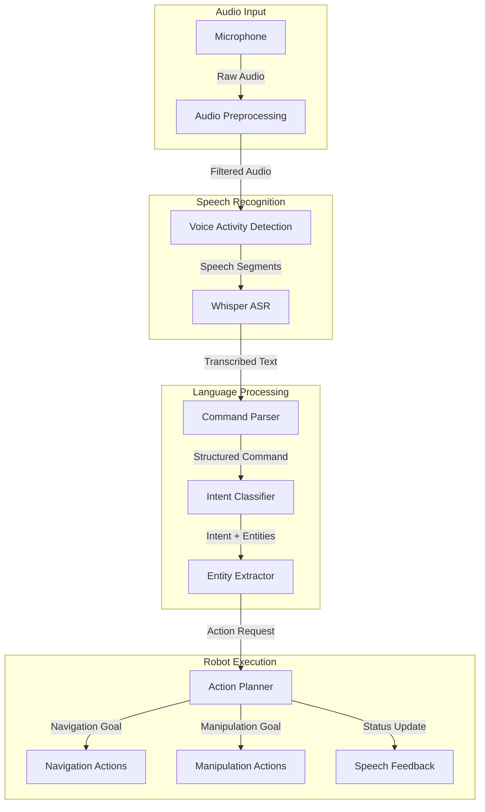

# Chapter 10: Voice-to-Action

## Learning Objectives

By the end of this chapter, you will be able to:

1. Understand the architecture of voice-to-action systems for humanoid robotics
2. Integrate OpenAI Whisper for robust speech recognition in ROS 2
3. Design and implement command parsing pipelines for natural language processing
4. Execute robot actions from voice commands using ROS 2 actions
5. Handle real-time audio streaming and processing constraints
6. Build a complete voice-controlled humanoid robot system with error handling and safety considerations

---

## 10.1 Introduction to Voice-to-Action Systems

**Voice-to-Action (V2A)** systems enable humanoid robots to understand spoken commands and translate them into physical actions. This capability is essential for natural human-robot interaction, allowing non-technical users to communicate with robots using everyday language.

:::info Key Insight
Voice-to-Action represents the first stage of the Vision-Language-Action (VLA) pipeline, bridging the gap between human communication and robotic execution. Modern V2A systems combine automatic speech recognition (ASR), natural language understanding (NLU), and action planning to create intuitive robot interfaces (Thomason et al., 2020).
:::

### Why Voice Commands for Humanoid Robots?

Voice interfaces offer several advantages:
- **Accessibility**: No technical expertise required
- **Hands-free operation**: Users can interact while performing other tasks
- **Natural interaction**: Mimics human-to-human communication
- **Multi-modal integration**: Combines with gestures and visual cues
- **Context awareness**: Voice can convey urgency, emotion, and intent

**Example Use Cases**:
- "Pick up the red cup on the table"
- "Navigate to the kitchen and open the refrigerator"
- "Follow me and carry this box"
- "Stop immediately" (emergency command)

---

## 10.2 Voice-to-Action Architecture

A complete V2A system consists of multiple integrated components:



### System Components

1. **Audio Capture**: Microphone interface with noise reduction
2. **Voice Activity Detection (VAD)**: Distinguishes speech from silence
3. **Automatic Speech Recognition (ASR)**: Converts audio to text (Whisper)
4. **Natural Language Understanding (NLU)**: Extracts intent and entities
5. **Action Planning**: Translates commands to robot actions
6. **Execution Layer**: ROS 2 actions for robot control
7. **Feedback System**: Audio/visual confirmation to user

---

## 10.3 OpenAI Whisper Integration

### What is Whisper?

**OpenAI Whisper** is a state-of-the-art automatic speech recognition (ASR) model trained on 680,000 hours of multilingual data. It provides:

- **High accuracy**: Near-human performance on clean speech
- **Robustness**: Handles accents, background noise, and technical jargon
- **Multilingual support**: 99 languages supported
- **Multiple model sizes**: Tiny (39M params) to Large (1550M params)
- **Open source**: Free for commercial and research use

**Model Size Trade-offs**:

| Model | Parameters | Speed | Accuracy | Use Case |
|-------|-----------|-------|----------|----------|
| Tiny | 39M | ~10x realtime | Good | Edge devices, real-time |
| Base | 74M | ~7x realtime | Better | Balanced performance |
| Small | 244M | ~4x realtime | Very Good | Most robotics applications |
| Medium | 769M | ~2x realtime | Excellent | High accuracy needed |
| Large | 1550M | ~1x realtime | Best | Offline processing |

:::tip Recommendation for Robotics
For humanoid robots running on Jetson Orin Nano/NX, the **Small** or **Base** model provides the best balance of speed and accuracy. Use **Tiny** for real-time applications with strict latency requirements (&lt;500ms).
:::

---

## 10.4 Setting Up Whisper with ROS 2

### Installation and Dependencies

First, install the required packages on your robot or development machine:

```bash
# Install Whisper and dependencies
pip3 install openai-whisper torch torchaudio

# Install audio processing libraries
sudo apt-get install -y portaudio19-dev python3-pyaudio
pip3 install pyaudio webrtcvad

# Install ROS 2 audio packages
sudo apt-get install -y ros-humble-audio-common
```

### ROS 2 Package Structure

Create a new ROS 2 package for voice commands:

```bash
cd ~/ros2_ws/src
ros2 pkg create --build-type ament_python voice_to_action \
    --dependencies rclpy std_msgs geometry_msgs action_msgs
```

**Package Structure**:
```
voice_to_action/
├── voice_to_action/
│   ├── __init__.py
│   ├── whisper_node.py          # Whisper ASR node
│   ├── command_parser.py        # Command parsing logic
│   ├── action_executor.py       # Robot action execution
│   └── audio_utils.py           # Audio processing utilities
├── config/
│   ├── voice_config.yaml        # Configuration parameters
│   └── command_grammar.yaml     # Supported commands
├── launch/
│   └── voice_to_action.launch.py
├── package.xml
└── setup.py
```

---

## 10.5 Implementing the Whisper ASR Node

### Basic Whisper Node

```python
# whisper_node.py
import rclpy
from rclpy.node import Node
from std_msgs.msg import String
import whisper
import pyaudio
import numpy as np
import threading
import queue

class WhisperNode(Node):
    def __init__(self):
        super().__init__('whisper_node')

        # Declare parameters
        self.declare_parameter('model_size', 'base')
        self.declare_parameter('language', 'en')
        self.declare_parameter('sample_rate', 16000)
        self.declare_parameter('chunk_duration', 5.0)  # seconds

        # Get parameters
        model_size = self.get_parameter('model_size').value
        self.language = self.get_parameter('language').value
        self.sample_rate = self.get_parameter('sample_rate').value
        self.chunk_duration = self.get_parameter('chunk_duration').value

        # Load Whisper model
        self.get_logger().info(f'Loading Whisper {model_size} model...')
        self.model = whisper.load_model(model_size)
        self.get_logger().info('Whisper model loaded successfully')

        # Create publisher for transcribed text
        self.transcription_pub = self.create_publisher(
            String,
            'voice/transcription',
            10
        )

        # Audio queue for processing
        self.audio_queue = queue.Queue()

        # Start audio capture thread
        self.is_running = True
        self.capture_thread = threading.Thread(target=self._audio_capture_loop)
        self.capture_thread.start()

        # Start transcription timer
        self.timer = self.create_timer(0.1, self._process_audio)

        self.get_logger().info('Whisper node initialized and listening...')

    def _audio_capture_loop(self):
        """Capture audio from microphone in separate thread"""
        audio = pyaudio.PyAudio()

        stream = audio.open(
            format=pyaudio.paInt16,
            channels=1,
            rate=self.sample_rate,
            input=True,
            frames_per_buffer=1024
        )

        chunk_samples = int(self.sample_rate * self.chunk_duration)
        audio_buffer = []

        while self.is_running:
            try:
                data = stream.read(1024, exception_on_overflow=False)
                audio_data = np.frombuffer(data, dtype=np.int16)
                audio_buffer.extend(audio_data)

                # When we have enough samples, queue for processing
                if len(audio_buffer) >= chunk_samples:
                    self.audio_queue.put(np.array(audio_buffer, dtype=np.float32))
                    audio_buffer = []

            except Exception as e:
                self.get_logger().error(f'Audio capture error: {e}')

        stream.stop_stream()
        stream.close()
        audio.terminate()

    def _process_audio(self):
        """Process queued audio chunks"""
        if not self.audio_queue.empty():
            audio_data = self.audio_queue.get()

            # Normalize audio to [-1, 1]
            audio_data = audio_data / 32768.0

            try:
                # Transcribe with Whisper
                result = self.model.transcribe(
                    audio_data,
                    language=self.language,
                    fp16=False  # Set to True for GPU acceleration
                )

                text = result['text'].strip()

                if text:
                    self.get_logger().info(f'Transcribed: "{text}"')

                    # Publish transcription
                    msg = String()
                    msg.data = text
                    self.transcription_pub.publish(msg)

            except Exception as e:
                self.get_logger().error(f'Transcription error: {e}')

    def destroy_node(self):
        """Clean shutdown"""
        self.is_running = False
        if self.capture_thread.is_alive():
            self.capture_thread.join(timeout=2.0)
        super().destroy_node()

def main(args=None):
    rclpy.init(args=args)
    node = WhisperNode()

    try:
        rclpy.spin(node)
    except KeyboardInterrupt:
        pass
    finally:
        node.destroy_node()
        rclpy.shutdown()

if __name__ == '__main__':
    main()
```

---

## 10.6 Voice Activity Detection (VAD)

To improve efficiency and reduce false transcriptions, implement Voice Activity Detection to only process audio segments containing speech:

```python
# audio_utils.py
import webrtcvad
import collections
import numpy as np

class VoiceActivityDetector:
    """WebRTC-based Voice Activity Detection"""

    def __init__(self, sample_rate=16000, frame_duration_ms=30,
                 padding_duration_ms=300, aggressiveness=3):
        """
        Args:
            sample_rate: Audio sample rate (8000, 16000, 32000, or 48000)
            frame_duration_ms: Frame duration in ms (10, 20, or 30)
            padding_duration_ms: Duration of padding before/after speech
            aggressiveness: VAD aggressiveness (0-3, higher = more aggressive)
        """
        self.sample_rate = sample_rate
        self.frame_duration_ms = frame_duration_ms
        self.padding_duration_ms = padding_duration_ms

        self.vad = webrtcvad.Vad(aggressiveness)

        # Calculate number of padding frames
        self.num_padding_frames = int(padding_duration_ms / frame_duration_ms)

        # Ring buffer for padding frames
        self.ring_buffer = collections.deque(maxlen=self.num_padding_frames)

        self.triggered = False

    def frame_generator(self, audio, frame_duration_ms):
        """Generate audio frames from PCM audio data"""
        frame_size = int(self.sample_rate * frame_duration_ms / 1000)
        offset = 0

        while offset + frame_size <= len(audio):
            yield audio[offset:offset + frame_size]
            offset += frame_size

    def detect_speech_segments(self, audio_data):
        """
        Detect speech segments in audio data

        Args:
            audio_data: numpy array of int16 audio samples

        Returns:
            List of (start_idx, end_idx) tuples for speech segments
        """
        segments = []
        voiced_frames = []

        for frame in self.frame_generator(audio_data, self.frame_duration_ms):
            # Convert to bytes for webrtcvad
            frame_bytes = frame.tobytes()
            is_speech = self.vad.is_speech(frame_bytes, self.sample_rate)

            if not self.triggered:
                # Not in speech segment
                self.ring_buffer.append((frame, is_speech))
                num_voiced = len([f for f, speech in self.ring_buffer if speech])

                if num_voiced > 0.9 * self.ring_buffer.maxlen:
                    # Start of speech detected
                    self.triggered = True
                    voiced_frames.extend([f for f, s in self.ring_buffer])
                    self.ring_buffer.clear()
            else:
                # In speech segment
                voiced_frames.append(frame)
                self.ring_buffer.append((frame, is_speech))
                num_unvoiced = len([f for f, speech in self.ring_buffer if not speech])

                if num_unvoiced > 0.9 * self.ring_buffer.maxlen:
                    # End of speech detected
                    self.triggered = False
                    segments.append(np.concatenate(voiced_frames))
                    self.ring_buffer.clear()
                    voiced_frames = []

        # Handle trailing speech segment
        if voiced_frames:
            segments.append(np.concatenate(voiced_frames))

        return segments
```

### Enhanced Whisper Node with VAD

```python
# Modified WhisperNode with VAD
class WhisperNodeWithVAD(Node):
    def __init__(self):
        super().__init__('whisper_node_vad')

        # ... (previous initialization code) ...

        # Initialize VAD
        self.vad = VoiceActivityDetector(
            sample_rate=self.sample_rate,
            aggressiveness=3
        )

        self.get_logger().info('Whisper node with VAD initialized')

    def _process_audio(self):
        """Process queued audio chunks with VAD"""
        if not self.audio_queue.empty():
            audio_data = self.audio_queue.get()

            # Convert to int16 for VAD
            audio_int16 = (audio_data * 32768.0).astype(np.int16)

            # Detect speech segments
            speech_segments = self.vad.detect_speech_segments(audio_int16)

            if speech_segments:
                self.get_logger().info(f'Detected {len(speech_segments)} speech segment(s)')

                for segment in speech_segments:
                    # Normalize to float32 for Whisper
                    segment_float = segment.astype(np.float32) / 32768.0

                    try:
                        result = self.model.transcribe(
                            segment_float,
                            language=self.language,
                            fp16=False
                        )

                        text = result['text'].strip()

                        if text:
                            self.get_logger().info(f'Transcribed: "{text}"')
                            msg = String()
                            msg.data = text
                            self.transcription_pub.publish(msg)

                    except Exception as e:
                        self.get_logger().error(f'Transcription error: {e}')
```

---

## 10.7 Command Parsing and Intent Recognition

Once we have transcribed text, we need to parse it into actionable robot commands.

### Command Grammar Definition

```yaml
# config/command_grammar.yaml
commands:
  navigation:
    - intent: "navigate"
      patterns:
        - "go to {location}"
        - "move to {location}"
        - "navigate to {location}"
        - "walk to {location}"
      entities:
        location: ["kitchen", "bedroom", "living room", "door", "table"]
      action: "nav2_navigate"

    - intent: "follow"
      patterns:
        - "follow me"
        - "follow {target}"
        - "come with me"
      entities:
        target: ["me", "person", "user"]
      action: "follow_person"

  manipulation:
    - intent: "pick"
      patterns:
        - "pick up {object}"
        - "grab {object}"
        - "pick the {object}"
        - "get {object}"
      entities:
        object: ["cup", "bottle", "box", "ball", "book"]
      action: "pick_object"

    - intent: "place"
      patterns:
        - "place {object} on {surface}"
        - "put {object} on {surface}"
        - "set {object} down on {surface}"
      entities:
        object: ["cup", "bottle", "box", "ball", "book"]
        surface: ["table", "counter", "shelf", "floor"]
      action: "place_object"

  control:
    - intent: "stop"
      patterns:
        - "stop"
        - "halt"
        - "freeze"
        - "emergency stop"
      action: "emergency_stop"

    - intent: "cancel"
      patterns:
        - "cancel"
        - "abort"
        - "never mind"
      action: "cancel_action"
```

### Command Parser Implementation

```python
# command_parser.py
import re
import yaml
from typing import Dict, List, Optional, Tuple
from dataclasses import dataclass

@dataclass
class ParsedCommand:
    """Structured representation of a parsed command"""
    intent: str
    action: str
    entities: Dict[str, str]
    confidence: float
    original_text: str

class CommandParser:
    """Parse natural language commands into structured robot actions"""

    def __init__(self, grammar_file: str):
        """Load command grammar from YAML file"""
        with open(grammar_file, 'r') as f:
            self.grammar = yaml.safe_load(f)

        # Compile patterns for efficiency
        self.compiled_patterns = self._compile_patterns()

    def _compile_patterns(self) -> Dict[str, List[Tuple]]:
        """Compile regex patterns from grammar"""
        compiled = {}

        for category, commands in self.grammar['commands'].items():
            compiled[category] = []

            for command in commands:
                intent = command['intent']
                action = command['action']

                for pattern in command['patterns']:
                    # Convert pattern to regex
                    regex_pattern = self._pattern_to_regex(
                        pattern,
                        command.get('entities', {})
                    )
                    compiled[category].append({
                        'intent': intent,
                        'action': action,
                        'pattern': re.compile(regex_pattern, re.IGNORECASE),
                        'entities': command.get('entities', {})
                    })

        return compiled

    def _pattern_to_regex(self, pattern: str, entities: Dict[str, List[str]]) -> str:
        """Convert grammar pattern to regex"""
        regex = pattern

        # Replace entity placeholders with regex groups
        for entity_name, entity_values in entities.items():
            placeholder = f"{{{entity_name}}}"
            if placeholder in regex:
                # Create alternation group for entity values
                values_regex = "|".join(re.escape(v) for v in entity_values)
                regex = regex.replace(
                    placeholder,
                    f"(?P<{entity_name}>{values_regex})"
                )

        # Handle optional words
        regex = regex.replace(" the ", " (the )?")

        return f"^{regex}$"

    def parse(self, text: str) -> Optional[ParsedCommand]:
        """
        Parse input text into a structured command

        Args:
            text: Transcribed voice command

        Returns:
            ParsedCommand object or None if no match found
        """
        text = text.lower().strip()

        # Try to match against all patterns
        best_match = None
        best_confidence = 0.0

        for category, patterns in self.compiled_patterns.items():
            for pattern_info in patterns:
                match = pattern_info['pattern'].match(text)

                if match:
                    # Extract entities from regex groups
                    entities = match.groupdict()

                    # Calculate confidence (simple: 1.0 for exact match)
                    confidence = 1.0

                    if confidence > best_confidence:
                        best_confidence = confidence
                        best_match = ParsedCommand(
                            intent=pattern_info['intent'],
                            action=pattern_info['action'],
                            entities=entities,
                            confidence=confidence,
                            original_text=text
                        )

        return best_match

    def parse_with_fuzzy_matching(self, text: str,
                                   threshold: float = 0.7) -> Optional[ParsedCommand]:
        """Parse with fuzzy string matching for robustness"""
        from difflib import SequenceMatcher

        text = text.lower().strip()
        best_match = None
        best_score = 0.0

        for category, patterns in self.compiled_patterns.items():
            for pattern_info in patterns:
                # Try exact regex match first
                match = pattern_info['pattern'].match(text)

                if match:
                    entities = match.groupdict()
                    return ParsedCommand(
                        intent=pattern_info['intent'],
                        action=pattern_info['action'],
                        entities=entities,
                        confidence=1.0,
                        original_text=text
                    )

                # Try fuzzy matching
                for pattern_str in pattern_info.get('original_patterns', []):
                    similarity = SequenceMatcher(None, text, pattern_str).ratio()

                    if similarity > best_score and similarity >= threshold:
                        best_score = similarity
                        best_match = ParsedCommand(
                            intent=pattern_info['intent'],
                            action=pattern_info['action'],
                            entities={},  # No entity extraction for fuzzy match
                            confidence=similarity,
                            original_text=text
                        )

        return best_match
```

### Command Parser Node

```python
# command_parser_node.py
import rclpy
from rclpy.node import Node
from std_msgs.msg import String
from voice_to_action_interfaces.msg import VoiceCommand  # Custom message type

class CommandParserNode(Node):
    def __init__(self):
        super().__init__('command_parser_node')

        # Declare parameters
        self.declare_parameter('grammar_file', 'config/command_grammar.yaml')
        grammar_file = self.get_parameter('grammar_file').value

        # Initialize parser
        self.parser = CommandParser(grammar_file)
        self.get_logger().info(f'Loaded command grammar from {grammar_file}')

        # Subscriber for transcriptions
        self.transcription_sub = self.create_subscription(
            String,
            'voice/transcription',
            self.transcription_callback,
            10
        )

        # Publisher for parsed commands
        self.command_pub = self.create_publisher(
            VoiceCommand,
            'voice/command',
            10
        )

        self.get_logger().info('Command parser node initialized')

    def transcription_callback(self, msg: String):
        """Process incoming transcriptions"""
        text = msg.data
        self.get_logger().info(f'Parsing: "{text}"')

        # Parse command
        parsed = self.parser.parse(text)

        if parsed:
            self.get_logger().info(
                f'Parsed - Intent: {parsed.intent}, '
                f'Action: {parsed.action}, '
                f'Entities: {parsed.entities}, '
                f'Confidence: {parsed.confidence:.2f}'
            )

            # Publish parsed command
            cmd_msg = VoiceCommand()
            cmd_msg.original_text = text
            cmd_msg.intent = parsed.intent
            cmd_msg.action = parsed.action
            cmd_msg.entities = str(parsed.entities)  # Serialize dict
            cmd_msg.confidence = parsed.confidence

            self.command_pub.publish(cmd_msg)
        else:
            self.get_logger().warn(f'Could not parse command: "{text}"')
```

---

## 10.8 Action Execution with ROS 2

Now that we have parsed commands, we need to execute them using ROS 2 actions.

### Custom Voice Command Message

```python
# voice_to_action_interfaces/msg/VoiceCommand.msg
string original_text
string intent
string action
string entities  # JSON string
float32 confidence
```

### Action Executor Node

```python
# action_executor.py
import rclpy
from rclpy.node import Node
from rclpy.action import ActionClient
from geometry_msgs.msg import PoseStamped
from nav2_msgs.action import NavigateToPose
from voice_to_action_interfaces.msg import VoiceCommand
import json

class ActionExecutorNode(Node):
    def __init__(self):
        super().__init__('action_executor_node')

        # Subscribe to parsed commands
        self.command_sub = self.create_subscription(
            VoiceCommand,
            'voice/command',
            self.command_callback,
            10
        )

        # Action clients for different robot capabilities
        self.nav_client = ActionClient(self, NavigateToPose, 'navigate_to_pose')

        # Predefined locations (in real system, load from map/database)
        self.locations = {
            'kitchen': {'x': 5.0, 'y': 2.0, 'theta': 0.0},
            'bedroom': {'x': -3.0, 'y': 4.0, 'theta': 1.57},
            'living room': {'x': 0.0, 'y': 0.0, 'theta': 0.0},
            'door': {'x': 1.0, 'y': -2.0, 'theta': 3.14}
        }

        self.current_goal_handle = None

        self.get_logger().info('Action executor node initialized')

    def command_callback(self, msg: VoiceCommand):
        """Execute action based on parsed command"""
        self.get_logger().info(f'Executing action: {msg.action}')

        # Parse entities
        try:
            entities = json.loads(msg.entities.replace("'", '"'))
        except:
            entities = {}

        # Route to appropriate action handler
        if msg.action == 'nav2_navigate':
            self.execute_navigation(entities)
        elif msg.action == 'emergency_stop':
            self.execute_emergency_stop()
        elif msg.action == 'cancel_action':
            self.execute_cancel()
        elif msg.action == 'pick_object':
            self.execute_pick(entities)
        elif msg.action == 'place_object':
            self.execute_place(entities)
        else:
            self.get_logger().warn(f'Unknown action: {msg.action}')

    def execute_navigation(self, entities: dict):
        """Execute navigation to specified location"""
        location_name = entities.get('location')

        if not location_name:
            self.get_logger().error('No location specified')
            return

        if location_name not in self.locations:
            self.get_logger().error(f'Unknown location: {location_name}')
            return

        # Get location coordinates
        loc = self.locations[location_name]

        # Wait for action server
        if not self.nav_client.wait_for_server(timeout_sec=5.0):
            self.get_logger().error('Navigation action server not available')
            return

        # Create navigation goal
        goal_msg = NavigateToPose.Goal()
        goal_msg.pose.header.frame_id = 'map'
        goal_msg.pose.header.stamp = self.get_clock().now().to_msg()
        goal_msg.pose.pose.position.x = loc['x']
        goal_msg.pose.pose.position.y = loc['y']
        goal_msg.pose.pose.position.z = 0.0

        # Convert theta to quaternion (simplified for 2D)
        from math import cos, sin
        theta = loc['theta']
        goal_msg.pose.pose.orientation.z = sin(theta / 2.0)
        goal_msg.pose.pose.orientation.w = cos(theta / 2.0)

        self.get_logger().info(f'Navigating to {location_name}...')

        # Send goal
        send_goal_future = self.nav_client.send_goal_async(
            goal_msg,
            feedback_callback=self.navigation_feedback_callback
        )
        send_goal_future.add_done_callback(self.navigation_goal_response_callback)

    def navigation_goal_response_callback(self, future):
        """Handle navigation goal acceptance"""
        goal_handle = future.result()

        if not goal_handle.accepted:
            self.get_logger().error('Navigation goal rejected')
            return

        self.get_logger().info('Navigation goal accepted')
        self.current_goal_handle = goal_handle

        # Get result
        result_future = goal_handle.get_result_async()
        result_future.add_done_callback(self.navigation_result_callback)

    def navigation_feedback_callback(self, feedback_msg):
        """Handle navigation feedback"""
        feedback = feedback_msg.feedback
        # Log progress (distance remaining, etc.)
        # self.get_logger().info(f'Distance remaining: {feedback.distance_remaining:.2f}m')

    def navigation_result_callback(self, future):
        """Handle navigation result"""
        result = future.result().result
        status = future.result().status

        if status == 4:  # SUCCEEDED
            self.get_logger().info('Navigation succeeded!')
        elif status == 5:  # CANCELED
            self.get_logger().warn('Navigation was cancelled')
        else:
            self.get_logger().error(f'Navigation failed with status: {status}')

        self.current_goal_handle = None

    def execute_emergency_stop(self):
        """Emergency stop - cancel all actions and halt"""
        self.get_logger().warn('EMERGENCY STOP TRIGGERED')

        # Cancel current navigation
        if self.current_goal_handle:
            self.get_logger().info('Cancelling current navigation goal')
            self.current_goal_handle.cancel_goal_async()

        # Publish zero velocity (requires cmd_vel publisher)
        # In a complete implementation, this would be handled here

    def execute_cancel(self):
        """Cancel current action"""
        if self.current_goal_handle:
            self.get_logger().info('Cancelling current goal')
            self.current_goal_handle.cancel_goal_async()
        else:
            self.get_logger().info('No active goal to cancel')

    def execute_pick(self, entities: dict):
        """Execute pick action (placeholder for manipulation)"""
        object_name = entities.get('object', 'unknown')
        self.get_logger().info(f'Picking up {object_name}...')
        # In complete implementation, this would use MoveIt2 or similar

    def execute_place(self, entities: dict):
        """Execute place action (placeholder for manipulation)"""
        object_name = entities.get('object', 'unknown')
        surface = entities.get('surface', 'unknown')
        self.get_logger().info(f'Placing {object_name} on {surface}...')
        # In complete implementation, this would use MoveIt2 or similar

def main(args=None):
    rclpy.init(args=args)
    node = ActionExecutorNode()

    try:
        rclpy.spin(node)
    except KeyboardInterrupt:
        pass
    finally:
        node.destroy_node()
        rclpy.shutdown()

if __name__ == '__main__':
    main()
```

---

## 10.9 Complete System Integration

### Launch File

```python
# launch/voice_to_action.launch.py
from launch import LaunchDescription
from launch_ros.actions import Node
from launch.actions import DeclareLaunchArgument
from launch.substitutions import LaunchConfiguration
import os
from ament_index_python.packages import get_package_share_directory

def generate_launch_description():
    # Get package directory
    pkg_dir = get_package_share_directory('voice_to_action')

    # Declare launch arguments
    model_size_arg = DeclareLaunchArgument(
        'model_size',
        default_value='base',
        description='Whisper model size (tiny, base, small, medium, large)'
    )

    language_arg = DeclareLaunchArgument(
        'language',
        default_value='en',
        description='Language for speech recognition'
    )

    grammar_file_arg = DeclareLaunchArgument(
        'grammar_file',
        default_value=os.path.join(pkg_dir, 'config', 'command_grammar.yaml'),
        description='Path to command grammar file'
    )

    # Whisper ASR node
    whisper_node = Node(
        package='voice_to_action',
        executable='whisper_node',
        name='whisper_node',
        parameters=[{
            'model_size': LaunchConfiguration('model_size'),
            'language': LaunchConfiguration('language'),
            'sample_rate': 16000,
            'chunk_duration': 5.0
        }],
        output='screen'
    )

    # Command parser node
    parser_node = Node(
        package='voice_to_action',
        executable='command_parser_node',
        name='command_parser_node',
        parameters=[{
            'grammar_file': LaunchConfiguration('grammar_file')
        }],
        output='screen'
    )

    # Action executor node
    executor_node = Node(
        package='voice_to_action',
        executable='action_executor_node',
        name='action_executor_node',
        output='screen'
    )

    return LaunchDescription([
        model_size_arg,
        language_arg,
        grammar_file_arg,
        whisper_node,
        parser_node,
        executor_node
    ])
```

### Running the Complete System

```bash
# Build the package
cd ~/ros2_ws
colcon build --packages-select voice_to_action

# Source the workspace
source install/setup.bash

# Launch the voice-to-action system
ros2 launch voice_to_action voice_to_action.launch.py

# In another terminal, monitor transcriptions
ros2 topic echo /voice/transcription

# Monitor parsed commands
ros2 topic echo /voice/command
```

---

## 10.10 Real-Time Performance Optimization

### GPU Acceleration

For Jetson devices, enable GPU acceleration:

```python
# In WhisperNode.__init__()
import torch

# Check for CUDA availability
self.device = 'cuda' if torch.cuda.is_available() else 'cpu'
self.get_logger().info(f'Using device: {self.device}')

# Load model with GPU support
self.model = whisper.load_model(model_size, device=self.device)

# In transcription
result = self.model.transcribe(
    audio_data,
    language=self.language,
    fp16=True if self.device == 'cuda' else False  # FP16 for GPU
)
```

### Streaming Transcription

For lower latency, implement streaming transcription:

```python
class StreamingWhisperNode(Node):
    """Streaming Whisper ASR with overlapping windows"""

    def __init__(self):
        super().__init__('streaming_whisper_node')

        # ... initialization ...

        # Streaming configuration
        self.window_duration = 3.0  # seconds
        self.overlap_duration = 1.0  # seconds
        self.stride = self.window_duration - self.overlap_duration

        self.audio_buffer = []
        self.last_transcription = ""

    def _process_streaming(self, audio_data):
        """Process audio with sliding window"""
        window_samples = int(self.sample_rate * self.window_duration)
        stride_samples = int(self.sample_rate * self.stride)

        # Add to buffer
        self.audio_buffer.extend(audio_data)

        # Process windows
        while len(self.audio_buffer) >= window_samples:
            window = np.array(self.audio_buffer[:window_samples])

            # Transcribe window
            result = self.model.transcribe(
                window / 32768.0,
                language=self.language,
                fp16=True
            )

            text = result['text'].strip()

            # Only publish if different from last
            if text and text != self.last_transcription:
                self.publish_transcription(text)
                self.last_transcription = text

            # Slide window
            self.audio_buffer = self.audio_buffer[stride_samples:]
```

---

## 10.11 Error Handling and Safety

### Confidence Thresholding

```python
class SafeCommandParser(CommandParser):
    """Command parser with confidence thresholds for safety"""

    def __init__(self, grammar_file: str, min_confidence: float = 0.7):
        super().__init__(grammar_file)
        self.min_confidence = min_confidence

        # Define safety-critical commands that require higher confidence
        self.critical_actions = ['emergency_stop']
        self.critical_confidence = 0.95

    def parse_safe(self, text: str) -> Optional[ParsedCommand]:
        """Parse with safety checks"""
        parsed = self.parse(text)

        if not parsed:
            return None

        # Check confidence threshold
        required_confidence = (
            self.critical_confidence
            if parsed.action in self.critical_actions
            else self.min_confidence
        )

        if parsed.confidence < required_confidence:
            # Log low confidence
            print(f'Low confidence ({parsed.confidence:.2f}) for "{text}"')
            return None

        return parsed
```

### Confirmation for Critical Actions

```python
class ConfirmationExecutor(ActionExecutorNode):
    """Action executor with confirmation for critical actions"""

    def __init__(self):
        super().__init__()

        # Actions requiring confirmation
        self.requires_confirmation = ['emergency_stop', 'place_object']
        self.pending_action = None

        # TTS for confirmation (requires ros2 audio_common)
        # self.tts_publisher = ...

    def command_callback(self, msg: VoiceCommand):
        """Process command with confirmation if needed"""
        if msg.action in self.requires_confirmation:
            # Store pending action
            self.pending_action = msg

            # Request confirmation
            confirmation_text = f"Confirm: {msg.original_text}. Say 'yes' or 'no'."
            self.get_logger().info(confirmation_text)
            # self.speak(confirmation_text)  # TTS

        elif msg.intent in ['yes', 'confirm', 'okay']:
            # Execute pending action
            if self.pending_action:
                self.execute_action(self.pending_action)
                self.pending_action = None

        elif msg.intent in ['no', 'cancel', 'nevermind']:
            # Cancel pending action
            self.pending_action = None
            self.get_logger().info('Action cancelled by user')
        else:
            # Execute immediately
            self.execute_action(msg)
```

---

## 10.12 Testing and Validation

### Unit Tests

```python
# test/test_command_parser.py
import unittest
from voice_to_action.command_parser import CommandParser

class TestCommandParser(unittest.TestCase):
    def setUp(self):
        self.parser = CommandParser('config/command_grammar.yaml')

    def test_navigation_command(self):
        """Test navigation command parsing"""
        text = "go to kitchen"
        parsed = self.parser.parse(text)

        self.assertIsNotNone(parsed)
        self.assertEqual(parsed.intent, 'navigate')
        self.assertEqual(parsed.action, 'nav2_navigate')
        self.assertEqual(parsed.entities['location'], 'kitchen')
        self.assertAlmostEqual(parsed.confidence, 1.0)

    def test_pick_command(self):
        """Test pick command parsing"""
        text = "pick up the red cup"
        parsed = self.parser.parse(text)

        self.assertIsNotNone(parsed)
        self.assertEqual(parsed.intent, 'pick')
        self.assertEqual(parsed.entities['object'], 'cup')

    def test_emergency_stop(self):
        """Test emergency stop command"""
        text = "emergency stop"
        parsed = self.parser.parse(text)

        self.assertIsNotNone(parsed)
        self.assertEqual(parsed.intent, 'stop')
        self.assertEqual(parsed.action, 'emergency_stop')

    def test_unknown_command(self):
        """Test handling of unknown commands"""
        text = "do a backflip"
        parsed = self.parser.parse(text)

        self.assertIsNone(parsed)

if __name__ == '__main__':
    unittest.main()
```

### Integration Test

```bash
# Test transcription pipeline
ros2 topic pub /voice/transcription std_msgs/msg/String "data: 'go to kitchen'" --once

# Verify command parsing
ros2 topic echo /voice/command

# Test with real voice (requires microphone)
ros2 run voice_to_action whisper_node
# Speak: "navigate to kitchen"
```

---

## 10.13 Advanced Topics

### Multi-turn Dialogue

For complex interactions, maintain conversation context:

```python
class DialogueManager:
    """Manage multi-turn conversations"""

    def __init__(self):
        self.context = {}
        self.conversation_history = []

    def process_utterance(self, text: str, parsed: ParsedCommand) -> ParsedCommand:
        """Process utterance with context"""

        # Handle anaphora resolution
        if 'it' in text.lower() and 'object' in self.context:
            parsed.entities['object'] = self.context['object']

        # Handle follow-up commands
        if parsed.intent == 'place' and 'object' not in parsed.entities:
            if 'last_picked' in self.context:
                parsed.entities['object'] = self.context['last_picked']

        # Update context
        if parsed.intent == 'pick' and 'object' in parsed.entities:
            self.context['last_picked'] = parsed.entities['object']

        self.conversation_history.append(text)

        return parsed
```

### Language Model Integration

For more flexible parsing, integrate a language model:

```python
from transformers import pipeline

class LLMCommandParser:
    """Use LLM for robust command parsing"""

    def __init__(self):
        # Load zero-shot classification model
        self.classifier = pipeline(
            "zero-shot-classification",
            model="facebook/bart-large-mnli"
        )

        self.candidate_labels = [
            "navigate to location",
            "pick up object",
            "place object",
            "follow person",
            "stop movement",
            "cancel action"
        ]

    def parse(self, text: str) -> ParsedCommand:
        """Parse using zero-shot classification"""
        result = self.classifier(text, self.candidate_labels)

        top_label = result['labels'][0]
        confidence = result['scores'][0]

        # Map to action
        action_map = {
            "navigate to location": "nav2_navigate",
            "pick up object": "pick_object",
            "place object": "place_object",
            "follow person": "follow_person",
            "stop movement": "emergency_stop",
            "cancel action": "cancel_action"
        }

        # Extract entities with NER
        entities = self._extract_entities(text)

        return ParsedCommand(
            intent=top_label,
            action=action_map[top_label],
            entities=entities,
            confidence=confidence,
            original_text=text
        )
```

---

## 10.14 Summary

In this chapter, we covered:

- ✅ Voice-to-Action system architecture and components
- ✅ OpenAI Whisper integration for robust speech recognition
- ✅ Voice Activity Detection for efficient processing
- ✅ Command parsing with grammar-based and LLM approaches
- ✅ ROS 2 action execution from voice commands
- ✅ Real-time performance optimization with GPU acceleration
- ✅ Safety considerations and error handling
- ✅ Complete system integration and testing

### Key Takeaways

1. **Modular Design**: Separate ASR, parsing, and execution for flexibility
2. **Model Selection**: Balance accuracy and speed based on hardware
3. **Robustness**: Use VAD, confidence thresholds, and error handling
4. **Safety First**: Require confirmation for critical actions
5. **Real-time Processing**: Optimize for low latency on edge devices
6. **Extensibility**: Design for easy addition of new commands and actions

:::tip Best Practices
- Start with a limited command set and expand gradually
- Test extensively with different speakers and accents
- Implement graceful degradation for low confidence
- Provide audio/visual feedback for all actions
- Log all interactions for debugging and improvement
:::

---

## Further Reading

1. Radford, A., Kim, J. W., Xu, T., Brockman, G., McLeavey, C., & Sutskever, I. (2022). Robust Speech Recognition via Large-Scale Weak Supervision. *arXiv preprint arXiv:2212.04356*.
2. Thomason, J., Padmakumar, A., Sinapov, J., Hart, J., & Stone, P. (2020). Improving Grounded Natural Language Understanding through Human-Robot Dialog. *IEEE International Conference on Robotics and Automation (ICRA)*.
3. Tellex, S., Kollar, T., Dickerson, S., Walter, M., Banerjee, A., Teller, S., & Roy, N. (2011). Understanding Natural Language Commands for Robotic Navigation and Mobile Manipulation. *AAAI Conference on Artificial Intelligence*.
4. Open Robotics. (2024). *ROS 2 Actions Documentation*. https://docs.ros.org/en/humble/Tutorials/Intermediate/Writing-an-Action-Server-Client/Py.html
5. OpenAI. (2023). *Whisper: Robust Speech Recognition*. https://github.com/openai/whisper

---

## Next Steps

In Chapter 11, we'll explore **Cognitive Planning with LLMs**, learning how to use large language models to translate complex natural language instructions into multi-step robot action sequences, enabling sophisticated task planning and reasoning.

:::tip Practice Exercise
Extend the voice-to-action system with these challenges:
1. Add support for spatial references: "pick up the cup on the left"
2. Implement multi-step commands: "go to the kitchen and pick up the cup"
3. Add context awareness: "put it on the table" (referring to previously picked object)
4. Create a voice-based help system: "what can you do?"
:::
