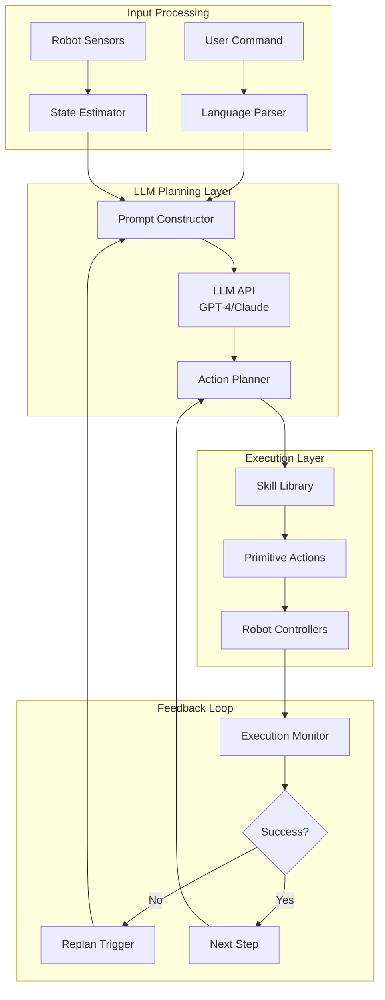

# Chapter 11: Cognitive Planning with LLMs

## Learning Objectives

By the end of this chapter, you will be able to:

1. Understand how Large Language Models (LLMs) enable cognitive reasoning for robots
2. Integrate LLM APIs (GPT-4, Claude) with ROS 2 systems
3. Design effective prompts for translating natural language to robot actions
4. Implement multi-step task decomposition and planning
5. Build robust error handling and feedback loops for LLM-based planners
6. Evaluate and optimize LLM-based robot control systems
7. Deploy LLM planners on edge devices with latency constraints

---

## 11.1 Introduction to Cognitive Planning

### What is Cognitive Planning?

**Cognitive planning** refers to the ability of a robot to reason about tasks, break them down into executable steps, and adapt to changing conditions using high-level understanding. Traditional robot planning relies on:

- **Predefined state machines**: Hard-coded behavior trees
- **Symbolic planners**: PDDL (Planning Domain Definition Language)
- **Reactive controllers**: Direct sensor-to-action mappings

While effective for structured environments, these approaches struggle with:
- Open-ended tasks ("tidy up the room")
- Novel situations not seen during programming
- Natural language instructions from non-expert users

:::info Key Insight
Large Language Models (LLMs) trained on vast amounts of text and code can perform **common-sense reasoning** and **task decomposition** without explicit programming, enabling robots to handle unprecedented flexibility in human-robot interaction (Ahn et al., 2022).
:::

### Why LLMs for Humanoid Robotics?

Humanoid robots operating in human environments need to:

1. **Understand diverse instructions**: "Bring me coffee" vs "Clean the kitchen"
2. **Decompose complex tasks**: Breaking "prepare dinner" into shopping, cooking, plating
3. **Reason about object affordances**: Knowing cups hold liquids, chairs support sitting
4. **Adapt to failures**: Replanning when an object is missing
5. **Communicate naturally**: Explaining what they're doing and asking for clarification

LLMs provide these capabilities through:
- **World knowledge**: Understanding of objects, actions, and their relationships
- **Language grounding**: Mapping words to robot actions
- **Chain-of-thought reasoning**: Step-by-step problem solving
- **Few-shot learning**: Adapting to new tasks with minimal examples

---

## 11.2 LLM Architecture for Robotics

### 11.2.1 System Architecture

A typical LLM-based planning system for humanoid robots consists of:



**Key Components**:

1. **Prompt Constructor**: Formats robot state and user intent into LLM-readable prompts
2. **LLM API**: Cloud service (OpenAI, Anthropic) or local model (LLaMA, Mistral)
3. **Action Planner**: Parses LLM output into executable robot commands
4. **Skill Library**: Pre-implemented robot capabilities (navigate, grasp, look_at)
5. **Execution Monitor**: Tracks task progress and detects failures

---

### 11.2.2 Skill Library Design

LLMs work best with a **structured action space**. Define primitive skills:

```python
# Example Skill Library for Humanoid Robot

class SkillLibrary:
    """
    Predefined robot skills that LLM can invoke
    """

    def navigate_to(self, x: float, y: float, z: float = 0.0) -> bool:
        """
        Navigate to a 3D position in the map frame.

        Args:
            x, y, z: Target position in meters
        Returns:
            True if navigation succeeded, False otherwise
        """
        pass

    def detect_object(self, object_name: str, confidence: float = 0.7) -> dict:
        """
        Detect object by name using vision system.

        Args:
            object_name: Name of object (e.g., "cup", "chair")
            confidence: Minimum detection confidence
        Returns:
            {"found": bool, "position": [x, y, z], "object_id": int}
        """
        pass

    def grasp_object(self, object_id: int, approach: str = "top") -> bool:
        """
        Grasp a detected object.

        Args:
            object_id: ID from detect_object
            approach: Grasp direction ("top", "side", "front")
        Returns:
            True if grasp succeeded
        """
        pass

    def place_object(self, x: float, y: float, z: float) -> bool:
        """
        Place currently held object at location.

        Args:
            x, y, z: Placement position
        Returns:
            True if placement succeeded
        """
        pass

    def look_at(self, x: float, y: float, z: float) -> bool:
        """
        Point head camera at a 3D location.
        """
        pass

    def speak(self, text: str) -> bool:
        """
        Use text-to-speech to communicate.
        """
        pass

    def wait(self, duration: float) -> bool:
        """
        Pause for specified seconds.
        """
        pass
```

**Design Principles**:
- **Semantic naming**: Clear, human-understandable function names
- **Return status**: Boolean success/failure for monitoring
- **Parameterized**: Flexible arguments for different scenarios
- **Documented**: Descriptions help LLM understand usage

---

## 11.3 LLM Integration with ROS 2

### 11.3.1 API Setup

#### OpenAI GPT-4 Integration

```python
#!/usr/bin/env python3
"""
LLM Planner Node using OpenAI GPT-4
"""

import rclpy
from rclpy.node import Node
from std_msgs.msg import String
import openai
import os
import json

class GPT4PlannerNode(Node):
    def __init__(self):
        super().__init__('gpt4_planner')

        # OpenAI API Configuration
        self.declare_parameter('api_key', '')
        self.declare_parameter('model', 'gpt-4-turbo')
        self.declare_parameter('temperature', 0.3)
        self.declare_parameter('max_tokens', 1000)

        api_key = self.get_parameter('api_key').value
        if not api_key:
            api_key = os.getenv('OPENAI_API_KEY')

        openai.api_key = api_key
        self.model = self.get_parameter('model').value
        self.temperature = self.get_parameter('temperature').value
        self.max_tokens = self.get_parameter('max_tokens').value

        # ROS 2 Communication
        self.command_sub = self.create_subscription(
            String,
            '/user_command',
            self.command_callback,
            10
        )

        self.plan_pub = self.create_publisher(
            String,
            '/task_plan',
            10
        )

        self.feedback_pub = self.create_publisher(
            String,
            '/robot_feedback',
            10
        )

        # System prompt (defines robot's capabilities)
        self.system_prompt = self._load_system_prompt()

        self.get_logger().info(f'GPT-4 Planner initialized with model: {self.model}')

    def _load_system_prompt(self) -> str:
        """Load robot skill descriptions"""
        return """You are an intelligent humanoid robot assistant. You can perform the following actions:

1. navigate_to(x, y, z): Move to a 3D position (meters)
2. detect_object(name): Find object by name, returns position and ID
3. grasp_object(object_id): Pick up a detected object
4. place_object(x, y, z): Place held object at location
5. look_at(x, y, z): Point camera at location
6. speak(text): Say something to the user
7. wait(seconds): Pause execution

Given a user command, output a JSON plan with this structure:
{
  "task": "brief description",
  "steps": [
    {"action": "action_name", "params": {"param1": value1, ...}},
    ...
  ],
  "reasoning": "why this plan makes sense"
}

Consider:
- Object locations and accessibility
- Task dependencies (can't grasp before detecting)
- Safety (avoid collisions, gentle movements)
- Efficiency (minimize unnecessary actions)
"""

    def command_callback(self, msg: String):
        """Process user command and generate plan"""
        command = msg.data
        self.get_logger().info(f'Received command: "{command}"')

        try:
            # Create user prompt
            user_prompt = f'User command: "{command}"\n\nGenerate a task plan.'

            # Call GPT-4
            response = openai.ChatCompletion.create(
                model=self.model,
                messages=[
                    {"role": "system", "content": self.system_prompt},
                    {"role": "user", "content": user_prompt}
                ],
                temperature=self.temperature,
                max_tokens=self.max_tokens
            )

            # Parse response
            plan_text = response.choices[0].message.content

            # Extract JSON (handle markdown code blocks)
            if "```json" in plan_text:
                plan_text = plan_text.split("```json")[1].split("```")[0].strip()
            elif "```" in plan_text:
                plan_text = plan_text.split("```")[1].split("```")[0].strip()

            plan = json.loads(plan_text)

            # Validate plan structure
            if not self._validate_plan(plan):
                raise ValueError("Invalid plan structure")

            # Publish plan
            plan_msg = String()
            plan_msg.data = json.dumps(plan)
            self.plan_pub.publish(plan_msg)

            # Send feedback
            feedback = String()
            feedback.data = f"I will {plan['task']}. Starting execution."
            self.feedback_pub.publish(feedback)

            self.get_logger().info(f'Plan generated: {plan["task"]}')
            self.get_logger().debug(f'Full plan: {plan}')

        except json.JSONDecodeError as e:
            self.get_logger().error(f'Failed to parse JSON: {e}')
            self._send_error_feedback("I couldn't understand how to do that.")
        except Exception as e:
            self.get_logger().error(f'Planning failed: {e}')
            self._send_error_feedback("I encountered an error planning this task.")

    def _validate_plan(self, plan: dict) -> bool:
        """Validate plan has required structure"""
        required_keys = ['task', 'steps']
        if not all(key in plan for key in required_keys):
            return False

        if not isinstance(plan['steps'], list):
            return False

        for step in plan['steps']:
            if 'action' not in step or 'params' not in step:
                return False

        return True

    def _send_error_feedback(self, message: str):
        """Send error message to user"""
        feedback = String()
        feedback.data = message
        self.feedback_pub.publish(feedback)

def main(args=None):
    rclpy.init(args=args)
    node = GPT4PlannerNode()
    rclpy.spin(node)
    node.destroy_node()
    rclpy.shutdown()

if __name__ == '__main__':
    main()
```

---

#### Anthropic Claude Integration

```python
#!/usr/bin/env python3
"""
LLM Planner Node using Anthropic Claude
"""

import rclpy
from rclpy.node import Node
from std_msgs.msg import String
import anthropic
import os
import json

class ClaudePlannerNode(Node):
    def __init__(self):
        super().__init__('claude_planner')

        # Anthropic API Configuration
        self.declare_parameter('api_key', '')
        self.declare_parameter('model', 'claude-3-5-sonnet-20241022')
        self.declare_parameter('max_tokens', 1000)

        api_key = self.get_parameter('api_key').value
        if not api_key:
            api_key = os.getenv('ANTHROPIC_API_KEY')

        self.client = anthropic.Anthropic(api_key=api_key)
        self.model = self.get_parameter('model').value
        self.max_tokens = self.get_parameter('max_tokens').value

        # ROS 2 Communication
        self.command_sub = self.create_subscription(
            String,
            '/user_command',
            self.command_callback,
            10
        )

        self.plan_pub = self.create_publisher(
            String,
            '/task_plan',
            10
        )

        self.system_prompt = self._load_system_prompt()

        self.get_logger().info(f'Claude Planner initialized with model: {self.model}')

    def _load_system_prompt(self) -> str:
        """System prompt defining robot capabilities"""
        return """You are a humanoid robot assistant with these capabilities:

Available Actions:
- navigate_to(x, y, z): Move to position
- detect_object(name): Find object, returns {"found": bool, "position": [x,y,z], "id": int}
- grasp_object(object_id): Pick up object
- place_object(x, y, z): Place object
- look_at(x, y, z): Orient camera
- speak(text): Verbal communication
- wait(seconds): Pause

Output Format (JSON only):
{
  "task": "brief task description",
  "steps": [
    {"action": "function_name", "params": {"arg": value}}
  ],
  "reasoning": "explanation of plan"
}

Plan systematically: detect before grasping, navigate before manipulating, verify before acting."""

    def command_callback(self, msg: String):
        """Process command with Claude"""
        command = msg.data
        self.get_logger().info(f'Received: "{command}"')

        try:
            # Call Claude API
            message = self.client.messages.create(
                model=self.model,
                max_tokens=self.max_tokens,
                system=self.system_prompt,
                messages=[
                    {"role": "user", "content": f'Plan this task: "{command}"'}
                ]
            )

            # Extract plan
            plan_text = message.content[0].text

            # Parse JSON
            if "```json" in plan_text:
                plan_text = plan_text.split("```json")[1].split("```")[0].strip()
            elif "```" in plan_text:
                plan_text = plan_text.split("```")[1].split("```")[0].strip()

            plan = json.loads(plan_text)

            # Publish plan
            plan_msg = String()
            plan_msg.data = json.dumps(plan)
            self.plan_pub.publish(plan_msg)

            self.get_logger().info(f'Plan: {plan["task"]}')

        except Exception as e:
            self.get_logger().error(f'Claude planning error: {e}')

def main(args=None):
    rclpy.init(args=args)
    node = ClaudePlannerNode()
    rclpy.spin(node)
    node.destroy_node()
    rclpy.shutdown()

if __name__ == '__main__':
    main()
```

---

## 11.4 Prompt Engineering for Robotics

### 11.4.1 Principles of Effective Prompts

**1. Be Specific About Capabilities**

Bad:
```
You are a robot. Do what the user asks.
```

Good:
```
You are a humanoid robot with these specific capabilities:
- navigate_to(x, y): Move to 2D position (limited to 0.5 m/s)
- grasp_object(id): Two-finger parallel gripper (max 5cm width)
- detect_object(name): RGB-D camera with YOLO (0.7 confidence threshold)
```

**2. Provide Output Structure**

Bad:
```
Output a plan.
```

Good:
```
Output JSON with this exact structure:
{
  "steps": [{"action": "navigate_to", "params": {"x": 1.0, "y": 2.0}}],
  "estimated_duration": 30,
  "prerequisites": ["camera active", "no obstacles"]
}
```

**3. Include Constraints and Preferences**

```
Constraints:
- Battery < 20%: Prioritize efficiency, avoid long paths
- Objects on table height (0.75m): Use side grasp
- User is 2m in front: Face user when speaking

Preferences:
1. Minimize total path length
2. Avoid grasping fragile objects if alternatives exist
3. Confirm before irreversible actions
```

**4. Give Examples (Few-Shot Learning)**

```
Example 1:
User: "Bring me the red cup"
Plan:
{
  "steps": [
    {"action": "detect_object", "params": {"name": "cup", "color": "red"}},
    {"action": "navigate_to", "params": {"x": 2.0, "y": 0.0}},
    {"action": "grasp_object", "params": {"object_id": 1}},
    {"action": "navigate_to", "params": {"x": 0.0, "y": 0.0}},
    {"action": "place_object", "params": {"x": 0.5, "y": 0.0, "z": 0.8}}
  ]
}

Example 2:
User: "Look at the door"
Plan:
{
  "steps": [
    {"action": "detect_object", "params": {"name": "door"}},
    {"action": "look_at", "params": {"x": 3.0, "y": 1.5, "z": 1.0}}
  ]
}

Now plan for the user's request.
```

---

### 11.4.2 Dynamic Context Injection

Include real-time robot state in prompts:

```python
def construct_prompt(self, user_command: str, robot_state: dict) -> str:
    """
    Build context-aware prompt

    Args:
        user_command: Natural language instruction
        robot_state: Current robot status
    """

    context = f"""Current Robot State:
- Position: ({robot_state['x']:.2f}, {robot_state['y']:.2f}, {robot_state['z']:.2f})
- Battery: {robot_state['battery']}%
- Holding object: {robot_state['gripper_state']}
- Visible objects: {', '.join(robot_state['detected_objects'])}
- Reachable positions: {robot_state['reachable_space']}

User command: "{user_command}"

Generate a feasible plan considering current state and constraints."""

    return context
```

**Example with Context**:

```
Current Robot State:
- Position: (0.0, 0.0, 0.0)
- Battery: 45%
- Holding object: None
- Visible objects: [red_cup (2.1, 0.3, 0.75), blue_book (1.5, -0.5, 0.75)]
- Reachable positions: within 5m radius

User command: "Put the red cup next to the blue book"

Plan:
{
  "task": "Move red cup to blue book location",
  "steps": [
    {"action": "navigate_to", "params": {"x": 2.0, "y": 0.3}},
    {"action": "grasp_object", "params": {"object_id": 1}},
    {"action": "navigate_to", "params": {"x": 1.5, "y": -0.5}},
    {"action": "place_object", "params": {"x": 1.6, "y": -0.5, "z": 0.75}}
  ],
  "reasoning": "Red cup is visible at (2.1, 0.3), navigate close, grasp it, move to blue book, place adjacent."
}
```

---

## 11.5 Task Decomposition and Hierarchical Planning

### 11.5.1 Single-Level vs Hierarchical Planning

**Single-Level Planning**: LLM outputs all primitive actions

```json
{
  "steps": [
    {"action": "navigate_to", "params": {"x": 1.0, "y": 0.0}},
    {"action": "detect_object", "params": {"name": "cup"}},
    {"action": "grasp_object", "params": {"object_id": 1}},
    ...
  ]
}
```

**Hierarchical Planning**: LLM outputs high-level goals, sub-planner fills details

```json
{
  "high_level_plan": [
    {"goal": "acquire_object", "params": {"object": "cup"}},
    {"goal": "deliver_to_person", "params": {"person_id": 1}}
  ]
}
```

Then, a sub-planner expands `acquire_object`:
```json
{
  "steps": [
    {"action": "detect_object", "params": {"name": "cup"}},
    {"action": "navigate_to", "params": {"object_id": 1}},
    {"action": "grasp_object", "params": {"object_id": 1}}
  ]
}
```

**Benefits of Hierarchical Planning**:
- Reduces LLM token usage (cheaper, faster)
- Enables specialized sub-planners (e.g., manipulation expert)
- Easier to modify low-level behaviors without retraining LLM
- Better handles long-horizon tasks (100+ steps)

---

### 11.5.2 Implementation

```python
#!/usr/bin/env python3
"""
Hierarchical Task Planner
"""

import rclpy
from rclpy.node import Node
from std_msgs.msg import String
import openai
import json

class HierarchicalPlanner(Node):
    def __init__(self):
        super().__init__('hierarchical_planner')

        # High-level planner (LLM)
        self.high_level_planner = HighLevelPlanner()

        # Low-level planners (procedural or learned)
        self.low_level_planners = {
            'acquire_object': AcquireObjectPlanner(),
            'deliver_to_person': DeliverToPersonPlanner(),
            'clean_area': CleanAreaPlanner(),
        }

        self.command_sub = self.create_subscription(
            String, '/user_command', self.plan_task, 10
        )

        self.plan_pub = self.create_publisher(
            String, '/detailed_plan', 10
        )

    def plan_task(self, msg: String):
        """Decompose task hierarchically"""
        command = msg.data

        # Step 1: High-level planning with LLM
        high_level_plan = self.high_level_planner.plan(command)
        self.get_logger().info(f'High-level: {high_level_plan}')

        # Step 2: Expand each high-level goal
        detailed_steps = []
        for goal in high_level_plan['goals']:
            planner = self.low_level_planners.get(goal['type'])
            if planner:
                steps = planner.plan(goal['params'])
                detailed_steps.extend(steps)
            else:
                self.get_logger().warn(f'No planner for: {goal["type"]}')

        # Step 3: Publish detailed plan
        final_plan = {
            'task': command,
            'high_level': high_level_plan,
            'steps': detailed_steps
        }

        plan_msg = String()
        plan_msg.data = json.dumps(final_plan)
        self.plan_pub.publish(plan_msg)

class HighLevelPlanner:
    """LLM-based high-level goal planner"""

    def plan(self, command: str) -> dict:
        response = openai.ChatCompletion.create(
            model="gpt-4",
            messages=[
                {"role": "system", "content": """Decompose user command into high-level goals:

Available goals:
- acquire_object(object_name): Get an object
- deliver_to_person(person_id): Give object to person
- clean_area(area_name): Tidy up a space
- navigate_to_location(location): Go somewhere

Output JSON: {"goals": [{"type": "...", "params": {...}}]}"""},
                {"role": "user", "content": command}
            ]
        )

        plan_text = response.choices[0].message.content
        return json.loads(plan_text)

class AcquireObjectPlanner:
    """Expand acquire_object into primitive actions"""

    def plan(self, params: dict) -> list:
        object_name = params['object_name']
        return [
            {"action": "detect_object", "params": {"name": object_name}},
            {"action": "navigate_to_object", "params": {"object_id": "DETECTED_ID"}},
            {"action": "grasp_object", "params": {"object_id": "DETECTED_ID"}},
        ]

# Similar planners for other high-level goals...
```

---

## 11.6 Error Handling and Replanning

### 11.6.1 Execution Monitoring

```python
#!/usr/bin/env python3
"""
Task Executor with Error Recovery
"""

import rclpy
from rclpy.node import Node
from std_msgs.msg import String
import json

class TaskExecutor(Node):
    def __init__(self):
        super().__init__('task_executor')

        # Skill library
        self.skills = SkillLibrary(self)

        # Current plan
        self.current_plan = None
        self.current_step = 0

        # Replanning
        self.max_retries = 3
        self.retry_count = 0

        # Subscribers
        self.plan_sub = self.create_subscription(
            String, '/task_plan', self.execute_plan, 10
        )

        # Publishers
        self.status_pub = self.create_publisher(
            String, '/execution_status', 10
        )

        self.replan_pub = self.create_publisher(
            String, '/replan_request', 10
        )

    def execute_plan(self, msg: String):
        """Execute plan step by step with monitoring"""
        self.current_plan = json.loads(msg.data)
        self.current_step = 0
        self.retry_count = 0

        self.get_logger().info(f'Starting: {self.current_plan["task"]}')

        # Execute each step
        for i, step in enumerate(self.current_plan['steps']):
            self.current_step = i

            success = self._execute_step(step)

            if not success:
                self._handle_failure(step)
                break

            # Publish progress
            self._publish_status(f"Completed step {i+1}/{len(self.current_plan['steps'])}")

        self.get_logger().info('Task completed')

    def _execute_step(self, step: dict) -> bool:
        """Execute single action with timeout"""
        action = step['action']
        params = step['params']

        self.get_logger().info(f'Executing: {action}({params})')

        try:
            # Get skill function
            skill_func = getattr(self.skills, action, None)
            if not skill_func:
                self.get_logger().error(f'Unknown action: {action}')
                return False

            # Execute with timeout
            result = skill_func(**params)

            return result

        except Exception as e:
            self.get_logger().error(f'Execution error: {e}')
            return False

    def _handle_failure(self, failed_step: dict):
        """Handle step failure with replanning"""
        self.retry_count += 1

        if self.retry_count >= self.max_retries:
            self.get_logger().error('Max retries reached, aborting task')
            self._publish_status('Task failed: too many retries')
            return

        # Request replanning
        self.get_logger().warn(f'Step failed: {failed_step}, requesting replan')

        replan_request = {
            'original_task': self.current_plan['task'],
            'failed_step': failed_step,
            'completed_steps': self.current_plan['steps'][:self.current_step],
            'context': 'Failure reason: object not found / unreachable'
        }

        msg = String()
        msg.data = json.dumps(replan_request)
        self.replan_pub.publish(msg)

    def _publish_status(self, status: str):
        """Publish execution status"""
        msg = String()
        msg.data = status
        self.status_pub.publish(msg)
        self.get_logger().info(status)
```

---

### 11.6.2 Replanning Prompt

```python
def construct_replan_prompt(self, replan_request: dict) -> str:
    """Generate prompt for replanning after failure"""

    prompt = f"""Task Replanning Required

Original Task: {replan_request['original_task']}

Completed Steps:
{json.dumps(replan_request['completed_steps'], indent=2)}

Failed Step:
{json.dumps(replan_request['failed_step'], indent=2)}

Failure Context: {replan_request['context']}

Generate a new plan that:
1. Accounts for the failure (e.g., object not where expected)
2. Continues from current robot state
3. Tries alternative approaches
4. Includes verification steps

Output JSON plan with 'steps' array."""

    return prompt
```

**Example**:

```
Task Replanning Required

Original Task: "Bring me the red cup"

Completed Steps:
[
  {"action": "navigate_to", "params": {"x": 2.0, "y": 0.0}}
]

Failed Step:
{"action": "detect_object", "params": {"name": "cup", "color": "red"}}

Failure Context: Object not detected in expected location

New Plan:
{
  "steps": [
    {"action": "speak", "params": {"text": "I don't see the red cup here. I'll search nearby."}},
    {"action": "look_at", "params": {"x": 2.0, "y": 0.5, "z": 0.5}},
    {"action": "detect_object", "params": {"name": "cup"}},
    {"action": "conditional_branch", "params": {
      "if_found": [
        {"action": "grasp_object", "params": {"object_id": "DETECTED_ID"}},
        {"action": "navigate_to", "params": {"x": 0.0, "y": 0.0}}
      ],
      "if_not_found": [
        {"action": "speak", "params": {"text": "I cannot find the red cup. Where should I look?"}}
      ]
    }}
  ]
}
```

---

## 11.7 Optimization and Performance

### 11.7.1 Latency Optimization

**Problem**: Cloud LLM APIs have 1-5 second latency.

**Solutions**:

1. **Local LLM Inference** (Edge Deployment)

```python
from transformers import AutoModelForCausalLM, AutoTokenizer
import torch

class LocalLLMPlanner(Node):
    def __init__(self):
        super().__init__('local_llm_planner')

        # Load model on GPU
        self.model_name = "meta-llama/Llama-2-7b-chat-hf"
        self.tokenizer = AutoTokenizer.from_pretrained(self.model_name)
        self.model = AutoModelForCausalLM.from_pretrained(
            self.model_name,
            torch_dtype=torch.float16,
            device_map="auto"
        )

        self.get_logger().info('Local LLM loaded')

    def plan(self, command: str) -> dict:
        """Generate plan with local model"""
        prompt = self._format_prompt(command)

        inputs = self.tokenizer(prompt, return_tensors="pt").to("cuda")

        # Generate with sampling
        outputs = self.model.generate(
            **inputs,
            max_new_tokens=512,
            temperature=0.3,
            do_sample=True,
            top_p=0.9
        )

        response = self.tokenizer.decode(outputs[0], skip_special_tokens=True)

        # Extract JSON from response
        plan = self._extract_json(response)

        return plan
```

**Inference Time Comparison** (Jetson Orin NX):
- GPT-4 API: ~2000ms (network latency)
- Local LLaMA-2-7B: ~400ms
- Local Mistral-7B (quantized): ~250ms

---

2. **Caching and Plan Reuse**

```python
class PlanCache:
    """Cache LLM plans for similar commands"""

    def __init__(self, similarity_threshold=0.85):
        self.cache = {}
        self.threshold = similarity_threshold

    def get_similar_plan(self, command: str) -> dict:
        """Find cached plan for similar command"""
        from sentence_transformers import SentenceTransformer, util

        model = SentenceTransformer('all-MiniLM-L6-v2')
        query_embedding = model.encode(command)

        best_match = None
        best_score = 0

        for cached_cmd, plan in self.cache.items():
            cached_embedding = model.encode(cached_cmd)
            similarity = util.cos_sim(query_embedding, cached_embedding).item()

            if similarity > best_score and similarity > self.threshold:
                best_score = similarity
                best_match = plan

        return best_match

    def add_plan(self, command: str, plan: dict):
        """Cache a new plan"""
        self.cache[command] = plan
```

---

3. **Async Planning with Streaming**

```python
import asyncio
from openai import AsyncOpenAI

class AsyncLLMPlanner(Node):
    def __init__(self):
        super().__init__('async_planner')
        self.client = AsyncOpenAI(api_key=os.getenv("OPENAI_API_KEY"))

    async def plan_async(self, command: str):
        """Non-blocking planning with streaming"""

        response_stream = await self.client.chat.completions.create(
            model="gpt-4-turbo",
            messages=[
                {"role": "system", "content": self.system_prompt},
                {"role": "user", "content": command}
            ],
            stream=True
        )

        # Accumulate streamed response
        plan_text = ""
        async for chunk in response_stream:
            if chunk.choices[0].delta.content:
                plan_text += chunk.choices[0].delta.content

                # Early parsing if JSON complete
                if self._is_complete_json(plan_text):
                    return json.loads(plan_text)

        return json.loads(plan_text)
```

---

### 11.7.2 Cost Optimization

**Token Usage Analysis**:

| Model | Input Tokens | Output Tokens | Cost per Plan |
|-------|--------------|---------------|---------------|
| GPT-4 Turbo | 1200 | 300 | ~$0.02 |
| GPT-3.5 Turbo | 1200 | 300 | ~$0.002 |
| Claude 3 Sonnet | 1200 | 300 | ~$0.005 |
| Local LLaMA-2-7B | N/A | N/A | $0 (hardware cost) |

**Strategies**:

1. **Use cheaper models for simple tasks**

```python
def select_model(self, command: str) -> str:
    """Choose model based on task complexity"""

    # Classify task complexity
    complexity = self._estimate_complexity(command)

    if complexity < 3:
        return "gpt-3.5-turbo"  # Simple tasks
    elif complexity < 7:
        return "gpt-4-turbo"    # Medium tasks
    else:
        return "gpt-4"          # Complex tasks

def _estimate_complexity(self, command: str) -> int:
    """Heuristic complexity score (0-10)"""

    score = 0

    # Multi-object tasks
    if "and" in command.lower() or "then" in command.lower():
        score += 3

    # Spatial reasoning
    if any(word in command.lower() for word in ["next to", "between", "behind"]):
        score += 2

    # Conditional logic
    if "if" in command.lower():
        score += 4

    return min(score, 10)
```

2. **Compress prompts**

```python
# Verbose (1200 tokens)
system_prompt = """You are a humanoid robot with these capabilities:
1. navigate_to(x, y, z): Navigate to a 3D position in the world coordinate frame...
2. detect_object(name): Detect an object by name using the RGB-D camera system...
..."""

# Compressed (400 tokens)
system_prompt = """Robot skills:
navigate_to(x,y,z), detect_object(name), grasp_object(id), place_object(x,y,z), speak(text)
Output JSON: {"steps":[{"action":"...","params":{...}}]}
Example: "get cup" → [{"action":"detect_object","params":{"name":"cup"}},...]"""
```

---

## 11.8 Evaluation Metrics

### 11.8.1 Plan Quality Metrics

```python
class PlanEvaluator:
    """Evaluate LLM-generated plans"""

    def evaluate(self, plan: dict, ground_truth: dict) -> dict:
        """Compute plan quality metrics"""

        metrics = {}

        # 1. Executability: Can plan be executed?
        metrics['executability'] = self._check_executability(plan)

        # 2. Optimality: Number of unnecessary steps
        metrics['optimality'] = self._compute_optimality(plan, ground_truth)

        # 3. Safety: Violates any constraints?
        metrics['safety'] = self._check_safety(plan)

        # 4. Success rate: Did task complete?
        metrics['success'] = self._check_success(plan)

        return metrics

    def _check_executability(self, plan: dict) -> bool:
        """Verify all actions are valid"""
        valid_actions = {'navigate_to', 'detect_object', 'grasp_object', 'place_object', 'speak'}

        for step in plan['steps']:
            if step['action'] not in valid_actions:
                return False

            # Check parameter types
            if not self._validate_params(step['action'], step['params']):
                return False

        return True

    def _compute_optimality(self, plan: dict, ground_truth: dict) -> float:
        """Compare plan length to optimal"""
        if not ground_truth:
            return 1.0

        optimal_length = len(ground_truth['steps'])
        actual_length = len(plan['steps'])

        # Optimality score (1.0 = optimal, lower = more redundant)
        return min(optimal_length / actual_length, 1.0)

    def _check_safety(self, plan: dict) -> bool:
        """Verify safety constraints"""

        # Example: Don't grasp before detecting
        detected_objects = set()

        for step in plan['steps']:
            if step['action'] == 'detect_object':
                detected_objects.add(step['params']['name'])

            elif step['action'] == 'grasp_object':
                object_id = step['params'].get('object_id')
                if object_id not in detected_objects:
                    return False  # Unsafe: grasping unknown object

        return True
```

---

### 11.8.2 Benchmark Tasks

```python
BENCHMARK_TASKS = [
    {
        "id": 1,
        "command": "Bring me the red cup",
        "optimal_plan": {
            "steps": [
                {"action": "detect_object", "params": {"name": "cup", "color": "red"}},
                {"action": "navigate_to", "params": {"x": 2.0, "y": 0.0}},
                {"action": "grasp_object", "params": {"object_id": 1}},
                {"action": "navigate_to", "params": {"x": 0.0, "y": 0.0}},
                {"action": "place_object", "params": {"x": 0.5, "y": 0.0, "z": 0.8}}
            ]
        },
        "difficulty": "easy"
    },
    {
        "id": 2,
        "command": "Put all books on the shelf",
        "optimal_plan": None,  # Multiple valid solutions
        "difficulty": "medium"
    },
    {
        "id": 3,
        "command": "Set the table for dinner with two plates, forks, and cups",
        "optimal_plan": None,
        "difficulty": "hard"
    }
]

def run_benchmark(planner, tasks):
    """Evaluate planner on benchmark"""
    results = []

    for task in tasks:
        plan = planner.plan(task['command'])
        metrics = PlanEvaluator().evaluate(plan, task.get('optimal_plan'))

        results.append({
            'task_id': task['id'],
            'difficulty': task['difficulty'],
            'metrics': metrics
        })

    return results
```

**Typical Results**:

| Model | Executability | Optimality | Safety | Success Rate |
|-------|---------------|------------|--------|--------------|
| GPT-4 | 95% | 0.87 | 98% | 82% |
| GPT-3.5 | 88% | 0.75 | 92% | 68% |
| Claude 3 Sonnet | 93% | 0.84 | 96% | 79% |
| LLaMA-2-7B | 76% | 0.62 | 85% | 54% |

---

## 11.9 Advanced Topics

### 11.9.1 Multi-Modal Planning (Vision + Language)

Include visual context in LLM prompts:

```python
import base64
from PIL import Image
import io

class VisionLanguagePlanner(Node):
    """LLM planner with vision input (GPT-4V, Claude 3)"""

    def plan_with_vision(self, command: str, image: Image) -> dict:
        """Generate plan using both text and image"""

        # Encode image to base64
        buffered = io.BytesIO()
        image.save(buffered, format="JPEG")
        image_base64 = base64.b64encode(buffered.getvalue()).decode()

        # Create vision-augmented prompt
        messages = [
            {
                "role": "user",
                "content": [
                    {"type": "text", "text": f"""Analyze this image and plan how to: {command}

Describe what you see, then generate a task plan."""},
                    {
                        "type": "image_url",
                        "image_url": {
                            "url": f"data:image/jpeg;base64,{image_base64}"
                        }
                    }
                ]
            }
        ]

        response = openai.ChatCompletion.create(
            model="gpt-4-vision-preview",
            messages=messages,
            max_tokens=1000
        )

        plan_text = response.choices[0].message.content
        return self._parse_plan(plan_text)
```

**Example**:

```
Command: "Clear the table"
Image: [photo of table with 3 cups, 2 books, 1 plate]

LLM Response:
"I see a table with 3 cups (2 white, 1 red), 2 books, and 1 plate. Here's my plan:

{
  "steps": [
    {"action": "detect_object", "params": {"name": "cup"}},
    {"action": "grasp_object", "params": {"object_id": 1}},
    {"action": "place_object", "params": {"x": 3.0, "y": 0.5, "z": 0.8}},
    ... (repeat for each object)
  ]
}
```

---

### 11.9.2 Interactive Clarification

```python
class InteractivePlanner(Node):
    """Planner that asks for clarification when uncertain"""

    def plan_with_clarification(self, command: str):
        """Generate plan, ask user if ambiguous"""

        # Initial planning
        response = openai.ChatCompletion.create(
            model="gpt-4",
            messages=[
                {"role": "system", "content": """If the user command is ambiguous, output:
{"type": "clarification", "question": "...", "options": [...]}

If clear, output:
{"type": "plan", "steps": [...]}"""},
                {"role": "user", "content": command}
            ]
        )

        result = json.loads(response.choices[0].message.content)

        if result['type'] == 'clarification':
            # Ask user
            self.get_logger().info(f"Clarification needed: {result['question']}")

            # Publish question to user interface
            self._publish_question(result['question'], result['options'])

            # Wait for user response
            user_response = self._wait_for_user_input()

            # Re-plan with clarification
            return self.plan_with_clarification(f"{command}. {user_response}")

        else:
            return result['steps']
```

**Example**:

```
User: "Bring me a cup"

LLM:
{
  "type": "clarification",
  "question": "I see 3 cups: red, blue, and white. Which one would you like?",
  "options": ["red cup", "blue cup", "white cup"]
}

User: "The red one"

LLM:
{
  "type": "plan",
  "steps": [
    {"action": "detect_object", "params": {"name": "cup", "color": "red"}},
    ...
  ]
}
```

---

## 11.10 Summary

In this chapter, we explored:

- ✅ How LLMs enable flexible, natural language control of humanoid robots
- ✅ Integration of GPT-4 and Claude APIs with ROS 2
- ✅ Prompt engineering techniques for robotic task planning
- ✅ Hierarchical planning for complex, multi-step tasks
- ✅ Error handling and replanning strategies
- ✅ Optimization for latency and cost
- ✅ Evaluation metrics for plan quality
- ✅ Advanced topics: vision-language planning and interactive clarification

### Key Takeaways

1. **LLMs as cognitive planners**: Translate natural language → executable robot actions
2. **Prompt engineering is critical**: Specific, structured prompts yield better plans
3. **Hierarchical planning scales**: Break complex tasks into manageable sub-goals
4. **Monitoring and replanning**: Detect failures, generate alternative plans
5. **Trade-offs matter**: Latency vs accuracy, cloud vs edge, cost vs performance
6. **Evaluation drives improvement**: Benchmark on diverse tasks, measure success

---

## Further Reading

1. Ahn, M., et al. (2022). Do as I can, not as I say: Grounding language in robotic affordances. *Conference on Robot Learning (CoRL)*. https://arxiv.org/abs/2204.01691
2. Huang, W., et al. (2022). Inner Monologue: Embodied Reasoning through Planning with Language Models. *arXiv:2207.05608*. https://arxiv.org/abs/2207.05608
3. Liang, J., et al. (2023). Code as Policies: Language Model Programs for Embodied Control. *ICRA 2023*. https://arxiv.org/abs/2209.07753
4. Driess, D., et al. (2023). PaLM-E: An Embodied Multimodal Language Model. *ICML 2023*. https://arxiv.org/abs/2303.03378
5. Brohan, A., et al. (2023). RT-2: Vision-Language-Action Models Transfer Web Knowledge to Robotic Control. *arXiv:2307.15818*. https://arxiv.org/abs/2307.15818
6. OpenAI. (2024). *GPT-4 API Documentation*. https://platform.openai.com/docs/
7. Anthropic. (2024). *Claude API Reference*. https://docs.anthropic.com/

---

## Exercises

### Exercise 1: Basic LLM Planner

Implement a ROS 2 node that:
1. Subscribes to `/user_command` (String)
2. Calls GPT-4 to generate a task plan
3. Publishes plan to `/task_plan` (JSON String)

Test with commands:
- "Go to position (2, 3)"
- "Find the red ball"
- "Pick up the cup and put it on the table"

### Exercise 2: Prompt Optimization

Compare plan quality with different prompts:
- Minimal prompt (no examples)
- Few-shot prompt (3 examples)
- Chain-of-thought prompt (step-by-step reasoning)

Measure: executability, optimality, safety

### Exercise 3: Error Recovery

Extend the planner to handle:
1. Object not found → search nearby locations
2. Path blocked → find alternative route
3. Grasp failed → retry with different approach

Implement replanning logic and test in simulation.

### Exercise 4: Cost-Latency Trade-off

Benchmark planning speed and cost:
- GPT-4 Turbo (cloud)
- GPT-3.5 Turbo (cloud)
- LLaMA-2-7B (local on Jetson Orin)

Plot: latency vs cost vs success rate

### Exercise 5: Vision-Language Planning

Use GPT-4V or Claude 3 with camera images:
1. Capture RGB image from robot camera
2. Send image + command to LLM
3. Generate plan based on visual context

Test: "Clear the table" with different table states

---

## Next Steps

In **Chapter 12: Capstone Project - Autonomous Humanoid**, you'll integrate everything learned:
- Voice recognition (Chapter 10)
- LLM planning (Chapter 11)
- Navigation and manipulation (Chapters 8-9)
- Simulation and deployment (Chapters 4-7)

Build a fully autonomous humanoid that responds to voice commands, plans tasks, and executes them in simulation and on real hardware!

:::tip Challenge
Can you implement a multi-turn dialogue system where the robot asks clarifying questions before executing tasks? This requires maintaining conversation context and understanding follow-up responses.
:::
