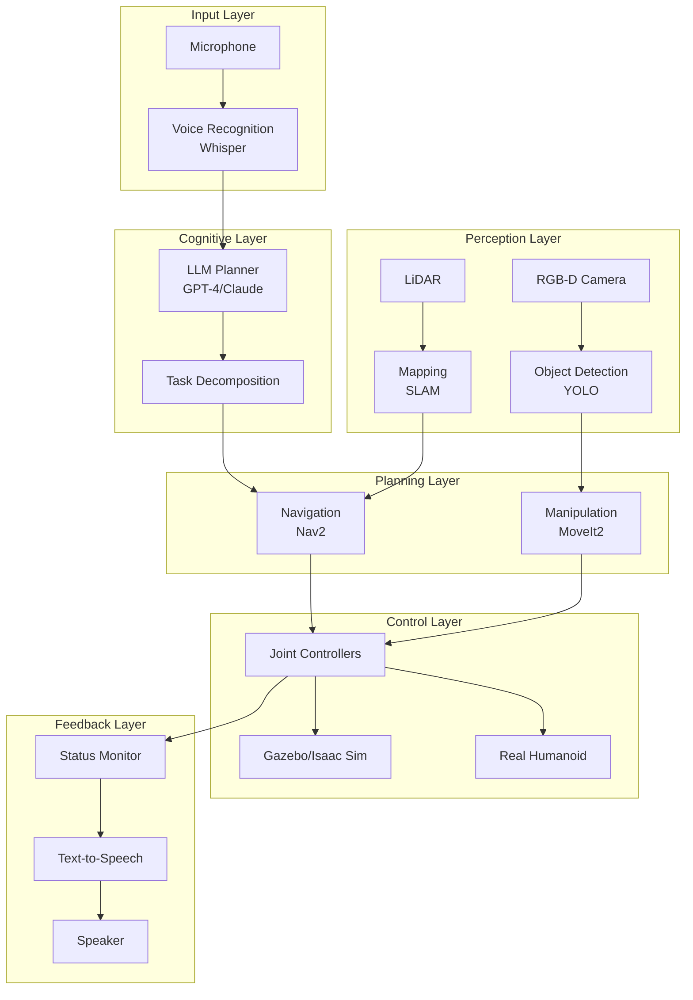

# Chapter 12: Capstone Project - Autonomous Humanoid

## Overview

Welcome to the **Capstone Project** - the culmination of your journey through Physical AI and Humanoid Robotics! In this project, you'll integrate everything you've learned:

- **Module 1**: ROS 2 architecture, Python integration, URDF modeling
- **Module 2**: Physics simulation in Gazebo, sensor integration
- **Module 3**: NVIDIA Isaac for perception and navigation
- **Module 4**: Voice-to-action and LLM-based cognitive planning

**Project Goal**: Build an autonomous humanoid robot that:
1. ✅ Receives natural language voice commands
2. ✅ Plans multi-step tasks using LLM reasoning
3. ✅ Navigates complex environments avoiding obstacles
4. ✅ Identifies and manipulates target objects
5. ✅ Provides conversational feedback on task progress

---

## Learning Objectives

By completing this capstone, you will:

1. Integrate multiple ROS 2 packages into a cohesive system
2. Implement end-to-end voice-to-action pipelines
3. Deploy perception and navigation algorithms on a humanoid
4. Demonstrate sim-to-real transfer capabilities
5. Debug and validate complex multi-modal robotic systems

---

## 12.1 Project Architecture

### System Overview



### Key Components

| Component | Technology | Purpose |
|-----------|-----------|---------|
| **Voice Input** | OpenAI Whisper | Speech-to-text transcription |
| **LLM Planner** | GPT-4 / Claude API | Natural language understanding, task planning |
| **Perception** | YOLO, PointCloud processing | Object detection, environment mapping |
| **Navigation** | Nav2 (ROS 2) | Path planning, obstacle avoidance |
| **Manipulation** | MoveIt2 | Arm motion planning, grasping |
| **Simulation** | Gazebo / Isaac Sim | Testing and validation |
| **Real Robot** | Unitree G1 / Custom | Physical deployment |

---

## 12.2 Prerequisites

### Hardware Requirements

**Simulation** (Minimum):
- CPU: Intel i7 / AMD Ryzen 7 (8+ cores)
- GPU: NVIDIA RTX 3060 (12GB VRAM)
- RAM: 32GB
- Storage: 100GB SSD

**Edge Deployment** (Optional):
- NVIDIA Jetson Orin NX (16GB)
- RealSense D455 Depth Camera
- USB Microphone
- Speaker for audio feedback

### Software Stack

```bash
# ROS 2 Humble (Ubuntu 22.04)
sudo apt install ros-humble-desktop-full

# Gazebo Harmonic
sudo apt install gz-harmonic

# NVIDIA Isaac Sim (if using)
# Download from: https://developer.nvidia.com/isaac-sim

# Python dependencies
pip install openai anthropic whisper torch transformers opencv-python
```

### ROS 2 Packages

```bash
cd ~/ros2_ws/src

# Navigation
sudo apt install ros-humble-navigation2 ros-humble-nav2-bringup

# Manipulation
sudo apt install ros-humble-moveit ros-humble-moveit-resources

# Perception
git clone https://github.com/ros-perception/vision_opencv.git
git clone https://github.com/ros-perception/image_pipeline.git

# Custom packages (we'll build these)
git clone <your-capstone-repo>
```

---

## 12.3 Phase 1: Robot Model Setup

### 12.3.1 Humanoid URDF

Create a complete humanoid model with:
- 22 DOF (head, arms, torso, legs)
- RGB-D camera on head
- LiDAR on torso
- IMU for balance
- Gripper end-effectors

**File**: `humanoid_description/urdf/humanoid.urdf.xacro`

```xml
<?xml version="1.0"?>
<robot xmlns:xacro="http://www.ros.org/wiki/xacro" name="autonomous_humanoid">

  <!-- Include sensor macros -->
  <xacro:include filename="$(find humanoid_description)/urdf/sensors.xacro"/>
  <xacro:include filename="$(find humanoid_description)/urdf/gazebo_plugins.xacro"/>

  <!-- Properties -->
  <xacro:property name="torso_mass" value="15.0"/>
  <xacro:property name="arm_mass" value="2.0"/>
  <xacro:property name="leg_mass" value="5.0"/>

  <!-- Base Link -->
  <link name="base_link">
    <inertial>
      <mass value="${torso_mass}"/>
      <inertia ixx="0.2" ixy="0.0" ixz="0.0"
               iyy="0.2" iyz="0.0" izz="0.15"/>
    </inertial>
    <visual>
      <geometry>
        <mesh filename="package://humanoid_description/meshes/torso.stl"/>
      </geometry>
    </visual>
    <collision>
      <geometry>
        <box size="0.35 0.25 0.50"/>
      </geometry>
    </collision>
  </link>

  <!-- Head with Camera -->
  <link name="head">
    <inertial>
      <mass value="3.0"/>
      <inertia ixx="0.01" ixy="0" ixz="0" iyy="0.01" iyz="0" izz="0.01"/>
    </inertial>
    <visual>
      <geometry>
        <mesh filename="package://humanoid_description/meshes/head.stl"/>
      </geometry>
    </visual>
  </link>

  <joint name="neck_pitch" type="revolute">
    <parent link="base_link"/>
    <child link="head"/>
    <origin xyz="0 0 0.30" rpy="0 0 0"/>
    <axis xyz="0 1 0"/>
    <limit lower="-0.785" upper="0.785" effort="10.0" velocity="2.0"/>
  </joint>

  <!-- RGB-D Camera Sensor -->
  <xacro:rgbd_camera parent="head" name="head_camera">
    <origin xyz="0.08 0 0.05" rpy="0 0 0"/>
  </xacro:rgbd_camera>

  <!-- Arms (using macro for symmetry) -->
  <xacro:arm prefix="left" reflect="1"/>
  <xacro:arm prefix="right" reflect="-1"/>

  <!-- Legs (using macro for symmetry) -->
  <xacro:leg prefix="left" reflect="1"/>
  <xacro:leg prefix="right" reflect="-1"/>

  <!-- LiDAR on Torso -->
  <xacro:lidar_sensor parent="base_link" name="torso_lidar">
    <origin xyz="0 0 0.25" rpy="0 0 0"/>
  </xacro:lidar_sensor>

  <!-- IMU -->
  <xacro:imu_sensor parent="base_link" name="base_imu">
    <origin xyz="0 0 0" rpy="0 0 0"/>
  </xacro:imu_sensor>

  <!-- Gazebo Plugins -->
  <xacro:gazebo_ros_control/>
  <xacro:gazebo_diff_drive/>

</robot>
```

### 12.3.2 Gazebo World

Create a test environment with:
- Tables, chairs, objects
- Walls and obstacles
- Varied lighting
- Target objects for manipulation

**File**: `humanoid_gazebo/worlds/capstone.world`

```xml
<sdf version="1.8">
  <world name="capstone_world">
    <!-- Physics -->
    <physics type="ode">
      <max_step_size>0.001</max_step_size>
      <real_time_factor>1.0</real_time_factor>
    </physics>

    <!-- Lighting -->
    <light name="sun" type="directional">
      <pose>0 0 10 0 0 0</pose>
      <diffuse>0.8 0.8 0.8 1</diffuse>
      <specular>0.2 0.2 0.2 1</specular>
      <direction>-0.5 0.1 -0.9</direction>
    </light>

    <!-- Ground Plane -->
    <include>
      <uri>model://ground_plane</uri>
    </include>

    <!-- Table -->
    <model name="table">
      <pose>2 0 0 0 0 0</pose>
      <static>true</static>
      <link name="link">
        <collision name="collision">
          <geometry>
            <box><size>1.5 0.8 0.75</size></box>
          </geometry>
        </collision>
        <visual name="visual">
          <geometry>
            <box><size>1.5 0.8 0.75</size></box>
          </geometry>
        </visual>
      </link>
    </model>

    <!-- Target Object (Red Cup) -->
    <model name="red_cup">
      <pose>2 0 0.85 0 0 0</pose>
      <static>false</static>
      <link name="link">
        <collision name="collision">
          <geometry>
            <cylinder><radius>0.04</radius><length>0.10</length></cylinder>
          </geometry>
        </collision>
        <visual name="visual">
          <geometry>
            <cylinder><radius>0.04</radius><length>0.10</length></cylinder>
          </geometry>
          <material>
            <ambient>0.8 0.1 0.1 1</ambient>
            <diffuse>0.8 0.1 0.1 1</diffuse>
          </material>
        </visual>
      </link>
    </model>

    <!-- Obstacles -->
    <model name="obstacle_1">
      <pose>1 -0.5 0 0 0 0</pose>
      <static>true</static>
      <link name="link">
        <collision name="collision">
          <geometry>
            <box><size>0.3 0.3 1.0</size></box>
          </geometry>
        </collision>
        <visual name="visual">
          <geometry>
            <box><size>0.3 0.3 1.0</size></box>
          </geometry>
        </visual>
      </link>
    </model>

  </world>
</sdf>
```

---

## 12.4 Phase 2: Voice-to-Action Pipeline

### 12.4.1 Voice Recognition Node

```python
#!/usr/bin/env python3
"""
Voice Recognition Node
Listens to microphone, transcribes speech using Whisper, publishes commands
"""

import rclpy
from rclpy.node import Node
from std_msgs.msg import String
import whisper
import sounddevice as sd
import numpy as np

class VoiceRecognitionNode(Node):
    def __init__(self):
        super().__init__('voice_recognition')

        # Load Whisper model
        self.model = whisper.load_model("base")

        # Publisher for voice commands
        self.command_pub = self.create_publisher(
            String,
            '/voice_commands',
            10
        )

        # Parameters
        self.declare_parameter('sample_rate', 16000)
        self.declare_parameter('duration', 5)  # Record for 5 seconds

        self.sample_rate = self.get_parameter('sample_rate').value
        self.duration = self.get_parameter('duration').value

        self.get_logger().info('Voice Recognition Node started. Listening...')

        # Start listening loop
        self.listen_loop()

    def listen_loop(self):
        """Continuously listen for voice commands"""
        while rclpy.ok():
            try:
                # Record audio
                self.get_logger().info('Recording...')
                audio = sd.rec(
                    int(self.duration * self.sample_rate),
                    samplerate=self.sample_rate,
                    channels=1,
                    dtype='float32'
                )
                sd.wait()

                # Transcribe
                audio_np = audio.flatten()
                result = self.model.transcribe(audio_np, fp16=False)
                text = result['text'].strip()

                if text:
                    self.get_logger().info(f'Recognized: "{text}"')

                    # Publish command
                    msg = String()
                    msg.data = text
                    self.command_pub.publish(msg)

            except KeyboardInterrupt:
                break
            except Exception as e:
                self.get_logger().error(f'Recognition error: {e}')

def main():
    rclpy.init()
    node = VoiceRecognitionNode()
    rclpy.spin(node)
    node.destroy_node()
    rclpy.shutdown()

if __name__ == '__main__':
    main()
```

### 12.4.2 LLM Task Planner

```python
#!/usr/bin/env python3
"""
LLM Task Planner Node
Receives voice commands, uses LLM to decompose into robot actions
"""

import rclpy
from rclpy.node import Node
from std_msgs.msg import String
from geometry_msgs.msg import PoseStamped
import openai
import json

class LLMPlannerNode(Node):
    def __init__(self):
        super().__init__('llm_planner')

        # OpenAI API setup
        self.declare_parameter('api_key', '')
        api_key = self.get_parameter('api_key').value
        openai.api_key = api_key

        # Subscribers
        self.command_sub = self.create_subscription(
            String,
            '/voice_commands',
            self.command_callback,
            10
        )

        # Publishers
        self.task_pub = self.create_publisher(
            String,
            '/task_plan',
            10
        )

        self.feedback_pub = self.create_publisher(
            String,
            '/robot_speech',
            10
        )

        self.get_logger().info('LLM Planner ready')

    def command_callback(self, msg):
        """Process voice command with LLM"""
        command = msg.data
        self.get_logger().info(f'Planning for: "{command}"')

        # Create LLM prompt
        prompt = f"""You are a humanoid robot controller. Given a natural language command, decompose it into a sequence of primitive robot actions.

Available actions:
- navigate_to(x, y): Move to position (x, y)
- detect_object(name): Find object by name
- grasp_object(object_id): Pick up object
- place_object(x, y, z): Place held object at location
- speak(text): Say something to the user

Command: "{command}"

Output the action sequence as JSON:
{{"actions": [{{"action": "...", "params": {{}}}}, ...]}}"""

        try:
            # Call LLM
            response = openai.ChatCompletion.create(
                model="gpt-4",
                messages=[
                    {"role": "system", "content": "You are a helpful robot assistant."},
                    {"role": "user", "content": prompt}
                ],
                temperature=0.3
            )

            plan_text = response.choices[0].message.content
            plan = json.loads(plan_text)

            # Publish plan
            plan_msg = String()
            plan_msg.data = json.dumps(plan)
            self.task_pub.publish(plan_msg)

            # Confirm to user
            feedback = String()
            feedback.data = f"I will {command}. Starting now."
            self.feedback_pub.publish(feedback)

            self.get_logger().info(f'Plan: {plan}')

        except Exception as e:
            self.get_logger().error(f'Planning failed: {e}')
            feedback = String()
            feedback.data = "Sorry, I couldn't understand that command."
            self.feedback_pub.publish(feedback)

def main():
    rclpy.init()
    node = LLMPlannerNode()
    rclpy.spin(node)
    node.destroy_node()
    rclpy.shutdown()

if __name__ == '__main__':
    main()
```

---

## 12.5 Phase 3: Perception Pipeline

### 12.5.1 Object Detection Node

```python
#!/usr/bin/env python3
"""
Object Detection Node using YOLO
"""

import rclpy
from rclpy.node import Node
from sensor_msgs.msg import Image
from vision_msgs.msg import Detection2DArray, Detection2D, ObjectHypothesisWithPose
from cv_bridge import CvBridge
import cv2
import torch

class ObjectDetectionNode(Node):
    def __init__(self):
        super().__init__('object_detection')

        # Load YOLO model
        self.model = torch.hub.load('ultralytics/yolov5', 'yolov5s')

        # CV Bridge
        self.bridge = CvBridge()

        # Subscribers
        self.image_sub = self.create_subscription(
            Image,
            '/camera/image_raw',
            self.image_callback,
            10
        )

        # Publishers
        self.detection_pub = self.create_publisher(
            Detection2DArray,
            '/detections',
            10
        )

        self.annotated_pub = self.create_publisher(
            Image,
            '/camera/annotated',
            10
        )

        self.get_logger().info('Object Detection started')

    def image_callback(self, msg):
        """Detect objects in image"""
        try:
            # Convert ROS image to OpenCV
            cv_image = self.bridge.imgmsg_to_cv2(msg, "bgr8")

            # Run YOLO
            results = self.model(cv_image)

            # Parse detections
            detections_msg = Detection2DArray()
            detections_msg.header = msg.header

            for *box, conf, cls in results.xyxy[0]:
                detection = Detection2D()
                detection.bbox.center.x = float((box[0] + box[2]) / 2)
                detection.bbox.center.y = float((box[1] + box[3]) / 2)
                detection.bbox.size_x = float(box[2] - box[0])
                detection.bbox.size_y = float(box[3] - box[1])

                hypothesis = ObjectHypothesisWithPose()
                hypothesis.id = str(int(cls))
                hypothesis.score = float(conf)
                detection.results.append(hypothesis)

                detections_msg.detections.append(detection)

            # Publish detections
            self.detection_pub.publish(detections_msg)

            # Annotate and publish image
            annotated = results.render()[0]
            annotated_msg = self.bridge.cv2_to_imgmsg(annotated, "bgr8")
            self.annotated_pub.publish(annotated_msg)

        except Exception as e:
            self.get_logger().error(f'Detection error: {e}')

def main():
    rclpy.init()
    node = ObjectDetectionNode()
    rclpy.spin(node)
    node.destroy_node()
    rclpy.shutdown()

if __name__ == '__main__':
    main()
```

---

## 12.6 Phase 4: Navigation and Control

### 12.6.1 Navigation Configuration

**File**: `humanoid_navigation/config/nav2_params.yaml`

```yaml
bt_navigator:
  ros__parameters:
    use_sim_time: True
    global_frame: map
    robot_base_frame: base_link
    odom_topic: /odom
    bt_loop_duration: 10
    default_server_timeout: 20
    enable_groot_monitoring: True
    groot_zmq_publisher_port: 1666
    groot_zmq_server_port: 1667
    default_nav_through_poses_bt_xml: ""
    default_nav_to_pose_bt_xml: ""

controller_server:
  ros__parameters:
    use_sim_time: True
    controller_frequency: 20.0
    min_x_velocity_threshold: 0.001
    min_y_velocity_threshold: 0.5
    min_theta_velocity_threshold: 0.001
    failure_tolerance: 0.3
    progress_checker_plugin: "progress_checker"
    goal_checker_plugins: ["general_goal_checker"]
    controller_plugins: ["FollowPath"]

    FollowPath:
      plugin: "dwb_core::DWBLocalPlanner"
      min_vel_x: 0.0
      min_vel_y: 0.0
      max_vel_x: 0.5
      max_vel_y: 0.0
      max_vel_theta: 1.0
      min_speed_xy: 0.0
      max_speed_xy: 0.5
      min_speed_theta: 0.0
      acc_lim_x: 2.5
      acc_lim_y: 0.0
      acc_lim_theta: 3.2
      decel_lim_x: -2.5
      decel_lim_y: 0.0
      decel_lim_theta: -3.2

local_costmap:
  local_costmap:
    ros__parameters:
      update_frequency: 5.0
      publish_frequency: 2.0
      global_frame: odom
      robot_base_frame: base_link
      use_sim_time: True
      rolling_window: true
      width: 3
      height: 3
      resolution: 0.05
      robot_radius: 0.3
      plugins: ["voxel_layer", "inflation_layer"]

      inflation_layer:
        plugin: "nav2_costmap_2d::InflationLayer"
        cost_scaling_factor: 3.0
        inflation_radius: 0.55
```

---

## 12.7 Phase 5: Integration and Testing

### 12.7.1 Launch File

**File**: `humanoid_bringup/launch/capstone.launch.py`

```python
from launch import LaunchDescription
from launch_ros.actions import Node
from launch.actions import IncludeLaunchDescription
from launch.launch_description_sources import PythonLaunchDescriptionSource
import os
from ament_index_python.packages import get_package_share_directory

def generate_launch_description():
    # Package directories
    gazebo_pkg = get_package_share_directory('humanoid_gazebo')
    nav_pkg = get_package_share_directory('humanoid_navigation')

    return LaunchDescription([
        # Gazebo Simulation
        IncludeLaunchDescription(
            PythonLaunchDescriptionSource([gazebo_pkg, '/launch/spawn_humanoid.launch.py'])
        ),

        # Voice Recognition
        Node(
            package='humanoid_voice',
            executable='voice_recognition',
            name='voice_recognition',
            output='screen'
        ),

        # LLM Planner
        Node(
            package='humanoid_planner',
            executable='llm_planner',
            name='llm_planner',
            parameters=[{'api_key': os.environ.get('OPENAI_API_KEY', '')}],
            output='screen'
        ),

        # Object Detection
        Node(
            package='humanoid_perception',
            executable='object_detection',
            name='object_detection',
            output='screen'
        ),

        # Navigation Stack
        IncludeLaunchDescription(
            PythonLaunchDescriptionSource([nav_pkg, '/launch/navigation.launch.py'])
        ),

        # Task Executor
        Node(
            package='humanoid_executor',
            executable='task_executor',
            name='task_executor',
            output='screen'
        ),
    ])
```

### 12.7.2 Test Scenarios

**Scenario 1: Simple Navigation**
```
Voice Command: "Go to the table"
Expected Behavior:
1. LLM plans: navigate_to(2.0, 0.0)
2. Nav2 generates path
3. Humanoid walks to table
4. Says "I've arrived at the table"
```

**Scenario 2: Object Manipulation**
```
Voice Command: "Bring me the red cup"
Expected Behavior:
1. LLM plans: detect_object("cup"), navigate_to(object), grasp_object, navigate_to(user), place_object
2. Camera detects red cup on table
3. Navigates to table
4. Reaches and grasps cup
5. Returns to user
6. Places cup and says "Here's your red cup"
```

**Scenario 3: Multi-Step Task**
```
Voice Command: "Clean up the room by putting all objects on the table"
Expected Behavior:
1. LLM creates loop: detect_objects → for each → grasp → navigate → place
2. Scans environment
3. Picks up each detected object
4. Places on table
5. Says "The room is clean"
```

---

## 12.8 Validation and Metrics

### Performance Metrics

| Metric | Target | Measurement |
|--------|--------|-------------|
| Voice recognition accuracy | >90% | Word Error Rate (WER) |
| Object detection precision | >85% | mAP@0.5 IoU |
| Navigation success rate | >95% | Successful reaches / total attempts |
| Grasp success rate | >80% | Successful grasps / total attempts |
| End-to-end task completion | >75% | Completed tasks / total tasks |
| Average task duration | &lt;2 min | Time from command to completion |

### Testing Checklist

- [ ] Voice commands recognized in noisy environment
- [ ] LLM generates valid action sequences
- [ ] Object detection works with varied lighting
- [ ] Navigation avoids dynamic obstacles
- [ ] Manipulation succeeds with different object sizes
- [ ] System recovers from failures gracefully
- [ ] Real-time performance maintained (>10 FPS)
- [ ] Energy consumption within limits (Edge deployment)

---

## 12.9 Sim-to-Real Transfer

### Domain Randomization

Apply variations in simulation to improve real-world robustness:

```python
# Randomize physics parameters
friction: uniform(0.6, 1.2)
mass: uniform(0.9 * nominal, 1.1 * nominal)
joint_damping: uniform(0.5, 2.0)

# Randomize sensor noise
camera_noise: gaussian(0, 0.01)
lidar_noise: gaussian(0, 0.02)
imu_bias: uniform(-0.1, 0.1)

# Randomize environment
lighting: uniform(100, 1000 lux)
texture_colors: random sampling
object_positions: uniform within bounds
```

### Calibration Procedure

1. **Identify real robot parameters** (measure mass, inertia, friction)
2. **Update simulation model** to match measured values
3. **Run identical test** in sim and real
4. **Tune controllers** based on discrepancies
5. **Iterate** until performance converges

---

## 12.10 Extensions and Future Work

### Possible Enhancements

1. **Multi-robot coordination**: Multiple humanoids collaborating
2. **Learning from demonstration**: Teach new tasks by showing
3. **Adaptive grasping**: Adjust grip based on object compliance
4. **Natural dialogue**: Multi-turn conversations with context
5. **Emotion recognition**: Detect user sentiment, adjust behavior
6. **Safety guarantees**: Formal verification of safe operation

### Research Directions

- **Sim-to-real with minimal real data** (few-shot adaptation)
- **Hierarchical task planning** with LLMs
- **Multi-modal fusion** (vision + language + proprioception)
- **Continual learning** in deployed systems

---

## 12.11 Summary

**Congratulations!** You've completed the Capstone Project, building an autonomous humanoid that integrates:

- ✅ **Voice understanding** (Whisper)
- ✅ **Cognitive planning** (LLMs)
- ✅ **Visual perception** (YOLO)
- ✅ **Navigation** (Nav2)
- ✅ **Manipulation** (MoveIt2)
- ✅ **Simulation** (Gazebo/Isaac)

### Key Achievements

1. **End-to-end system**: From voice command to physical action
2. **Modular architecture**: Each component independently testable
3. **Sim-to-real ready**: Validated in simulation, transferable to hardware
4. **Scalable design**: Easy to add new capabilities

### Skills Demonstrated

- ROS 2 system integration
- Multi-modal AI (vision, language, robotics)
- Real-time perception and control
- Software engineering best practices
- Sim-to-real transfer techniques

---

## Further Reading

1. Peng, X. B., et al. (2018). Sim-to-real transfer of robotic control with dynamics randomization. *ICRA 2018*.
2. Ahn, M., et al. (2022). Do as I can, not as I say: Grounding language in robotic affordances. *arXiv:2204.01691*.
3. Ichter, B., et al. (2022). Do we need vision-language models for robotic manipulation? *arXiv:2209.01411*.

---

## 🎉 You Did It!

You've mastered the fundamentals of Physical AI and Humanoid Robotics. You're now equipped to:
- Design and simulate complex robotic systems
- Integrate AI and robotics seamlessly
- Deploy intelligent robots in the real world

**What's next?** Continue exploring, building, and pushing the boundaries of what robots can do!

:::tip Share Your Work
Deploy your capstone project and share it with the robotics community. Your innovations could inspire the next generation of humanoid robots!
:::
